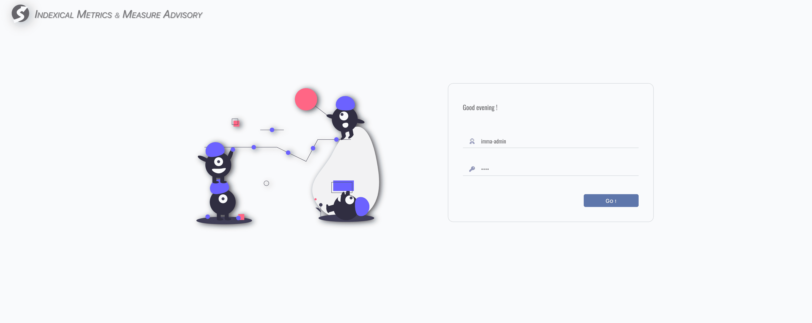
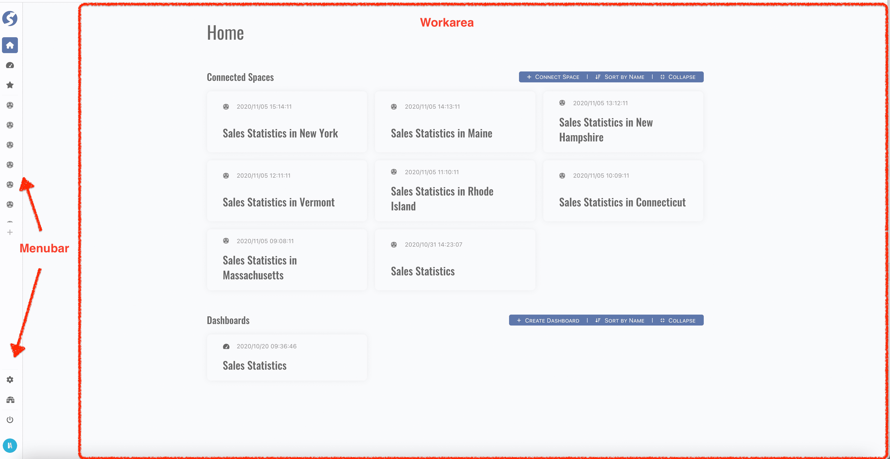
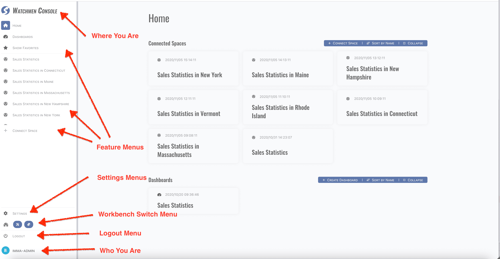
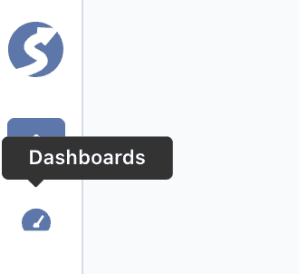
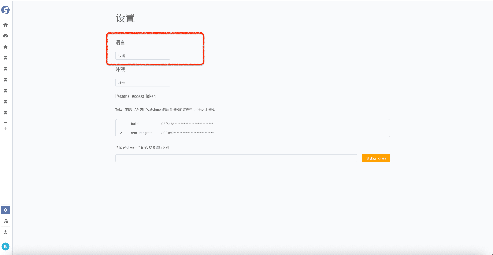
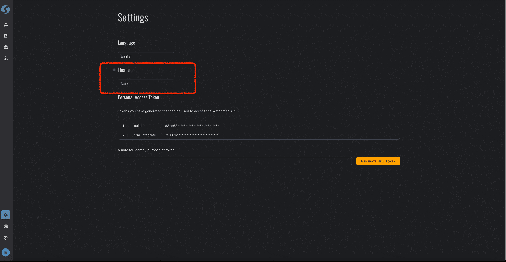
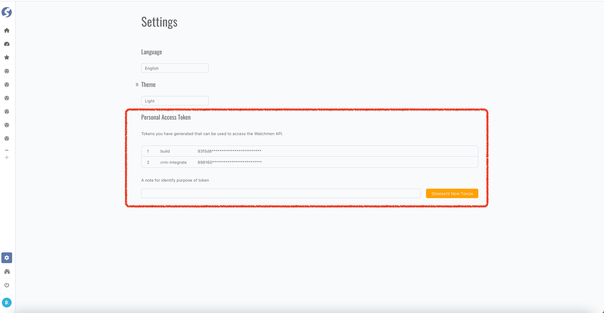

# Overview

**_Watchmen_** Web Client is a browser based client, built on [CRA](https://create-react-app.dev/).

:::tip   
We highly recommend using the latest version of Google Chrome to have the best experience.
:::

## Roles

There are 3 roles,

- Super Admin
- Admin
- Business User

Role-based authorization is built-in.

## Login

First, open web client in browser, and login,

:::tip   
Ask an account from your administrator if you don't have one yet.
:::

After login successfully, web client redirects to workbench homepage automatically according to the role of your account.

## Workbenches

**_Watchmen_** web client provides different workbenches for different roles,

- [Admin Workbench](admin/admin-wb-index) for IT developers,
- [Console Workbench](console/console-wb-index) for business users,
- [DQC Workbench](dqc/dqc-wb-index) for IT maintainers.

In **_Watchmen_**, IT developers and maintainers are treated as administrators. Typically, it's recommend that maintainers also acquire
basic knowledge of the topics and pipelines which are developed by developers, should be helpful on monitoring, finding and locating
problems. Therefore, if you are an IT, let's start from [Admin Workbench](admin/admin-wb-index). Or if you are a business user, let's
start from [Console Workbench](console/console-wb-index).

## Workbench Layout

Workbench includes 2 parts, menubar and work area, work area can be switched via menubar.

Menubar is expandable, simply move mouse to the splitter, expand it with drag and drop, you will find more information of each menu.

There are several parts in menu bar from top to bottom,

- Current workbench name, aka `Where You Are`,
- Workbench feature menus,
- Settings, switch to settings page,
- Workbench switcher, will be invisible when only one workbench is available for login account,
- Logout,
- Current account name, aka `Who You Are`.

For more width of work area, a tooltip of menu is shown when menu bar is collapsed and mouse hover the menu icon:

We will introduce the features in following chapters, before we start it, let's start from some common features.

## Language

English/Simplified Chinese/Japanese are built-in. Click `Settings` menu, find `Language` part, choose another language, such as `汉语`,
workbench will be rendered as,

:::caution Welcome to Contribute!
PR of correction and contribution for i18n supporting are always welcome!  
Find our language source
files **[here](https://github.com/Indexical-Metrics-Measure-Advisory/watchmen-web-client/tree/main/src/widgets/langs)**.
:::

## Theme

Built-in themes are provided, light and dark. Click `Settings` menu, find `Theme` part, choose `Dark` theme, workbench will be rendered as,

## Personal Access Token (PAT for short)

`PAT` is designed for visiting data via API, there is no need to login for each visit. Click `Settings` menu, find `Personal Access Token`
part, generate a new `PAT` or remove existing one,

- Multiple `PAT`s are allowed,
- A human reading label for each `PAT` is recommended.

:::tip  
Ask your administrator for more information if you want to visit data via API.
:::
