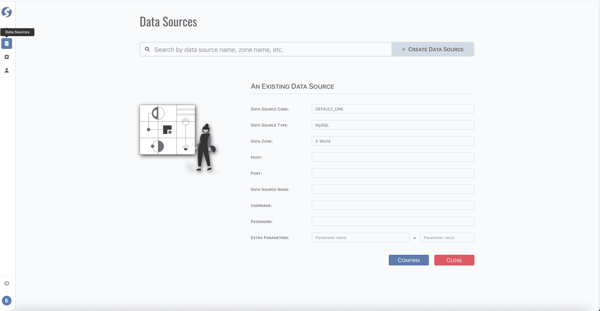

# Data Source

Data sources are defined in data zone, it's a logical concept.  
Topics are stored in appointed data source.

:::info  
Data source is available for `Super Admin` only.
:::

:::caution  
Centralized definition data source should be configured in deployment, not here.
:::

## Standard Tuple Page

Data source use [standard tuple page](../standard-tuple-page).

Extra parameter pair is added automatically, and will not be removed when name and value are cleared, empty pairs are dropped on saving.

## Form Validation

- Data Source Code: required,
- Data Source Type: required. Currently, 3 types are built-in:
  - `Oracle`,
  - `MySQL`,
  - `MongoDB`,
- Data Zone: required,
- Host: optional,
- Port: optional,
- Data Source Name: optional,
- Username: optional,
- Password: optional,
- Extra Parameter Name: required when value existed.

## Model

Find data source model **[here](../../tuples/data-source)**.

## Extend Data Source Supporting

**[Here](../../doll/extend/extend-data-source)** for more details on supporting other data sources.
