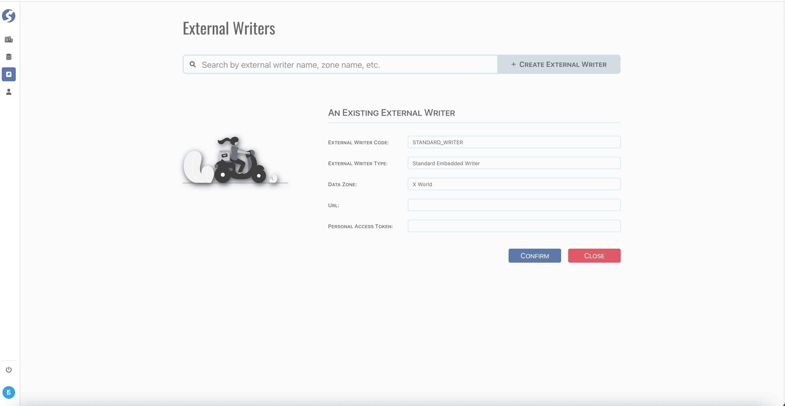

# External Writer

External writer is used in pipeline, write data to external.

:::info  
External writer is available for `Super Admin` only.
:::

:::caution  
Implementation external writer must be packaged and deployed with doll instance.
:::

## Standard Tuple Page

External writer use [standard tuple page](../standard-tuple-page).

## Form Validation

- External Writer Code: required,
- External Writer Type: required. Currently, 2 types are built-in:
	- Standard Embedded Writer,
	- Standard ElasticSearch Writer **_`(under construction)`_**,
- Data Zone: required,
- Url: optional,
- Personal Access Token: optional. Signed by another system.

## Model

Find external writer model **[here](../../tuples/external-writer)**.

## Built-in Writers
**[Here](../../doll/built-in/built-in-external-writers)** for more details on using built-in external writers.

## Extend External Writer Supporting

**[Here](../../doll/extend/extend-external-writer)** for more details to extend your own external writers.
