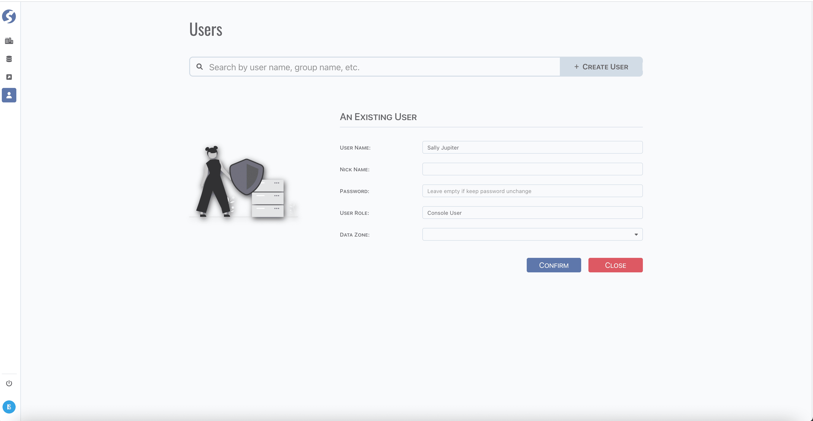
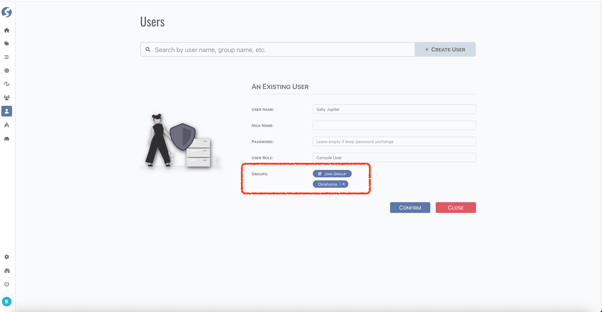

# User

User is account to access **_watchmen_**.

:::tip  
We recommend creating the first data zone administrator user by `Super Admin` only, and create other users in this data zone by this
administrator.
:::

## Standard Tuple Page

User use [standard tuple page](../standard-tuple-page).

When logged in with `Admin` role, page should be as following,

- A `Groups` field is visible, current user can be added to user groups or remove from them.
- `Data Zone` field is invisible, which means creating/editing user should be in same data zone with current user.

## Form Validation

- Username: required,
- Nick Name: optional,
- Password: optional. Leave empty if you DO NOT want to change password of this user,
- User Role: required. Only 2 options are available:
    - Console User, aka Business User,
    - Administrator, aka Data Zone Admin,
- Data Zone: required. Only visible when logged in with `Super Admin` role,
- Groups: optional. Only visible when logged in with `Admin` role.

:::caution  
`Super Admin` is configured on backend, cannot do create/edit on web client.
:::

## Model

Find user model **[here](../../tuples/user)**.

