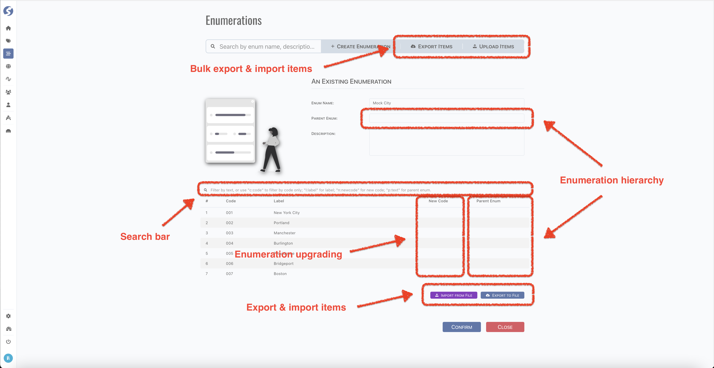

# Enumeration

Enumeration is code table for topic factors, such as country, city, etc.

:::info  
Enumeration is available for `Admin` only.
:::

## Standard Tuple Page

Enumeration use [standard tuple page](../standard-tuple-page).



### Import & Export

There is no online editing for enumeration items, follow steps as below to modify them,

- Export the existing data to a CSV file,
- Modify data by Excel or your favorite tool,
- Import the modified file.

Here is a CSV sample:
```csv
code,label,replaceCode,parentCode
001,New York City,,
002,Portland,,
003,Manchester,,
004,Burlington,,
005,Providence,,
006,Bridgeport,,
007,Boston,,
```

:::danger DON'T
- DO NOT change the header line,
- DO NOT import the change part only, because items will be replaced by items from file.
:::

### Search Bar
There is no pagination of enumeration items, but sometimes there are too many items to find and locate. Use search bar to find them,
- A text: try to match all fields of item,
- `c:code`: match code only, such as `c:01`,
- `l:label`: match label only, such as `l:new`,
- `n:newcode`: match new code only, such as `n:01`,
- `p:text`: match parent enumeration item code and label, such as `p:usa`,
- All matches are case-insensitive and fuzzy,
- Multiple words splitting by whitespace is not supported.

### Hierarchy

Enumeration can be hierarchical, by set an enumeration to be parent enumeration of another one.  
When an enumeration has a parent, use parent enumeration item code to set the parent-child relationship.

For example, city belongs to province,

- Define a province enumeration,
- Define a city enumeration,
- Set province as parent enumeration of city,
- Use province item code as parent enumeration item code for each enumeration item of city.

:::caution  
Lack of parent enumeration item code is not recommended.
:::

:::danger  
Hierarchy of enumerations stays on definition phase, we haven't started to use it in runtime yet.
:::

### Upgrade

Sometimes, enumeration has to be upgraded for some reason, but because of the existing data, the original code has to be kept.  
In this case, use new code to describe the upgrading.

:::danger  
Upgrading of enumerations stays on definition phase, we haven't started to use it in runtime yet.
:::

## Form Validation

- Enum Name: required,
- Parent Enum: optional. Hierarchy of enumerations,
- Description: optional,
- Codes: optional,
	- Code: required,
	- Label: optional,
	- New Code: optional,
	- Parent Enum: optional.

## Model

Find user model **[here](../../tuples/enumeration)**.

