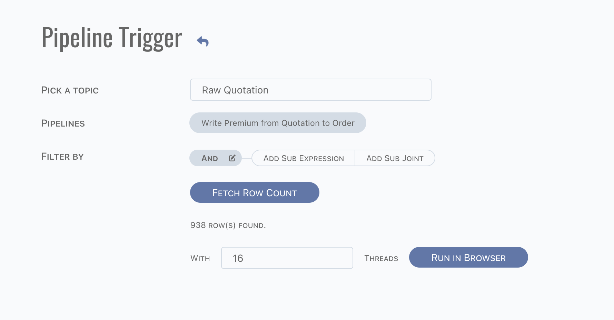

# Toolbox

Tools for admin purpose.

## Topic Snapshot

For catching topic data snapshot frequently, embedded schedulers could be defined here.

Here is an empty scheduler, define target topic name and filter.

:::tip
Multiple schedulers for one source topic are allowed, they might have different frequencies, different filters.
:::

### Inside Story

When a snapshot scheduler is defined, the following topics will be created,

- A task data topic, which is prefixed by `ss_`
- A target data topic, which named manually.

#### Filter

A set of variables are available for filter data,

- `processStartDate`: process start date,
- `processStartYear`/`processStartMonth`/`processStartDay`: process start year/month/day, numeric value,
- `processEndDate`: process end date,
- `processEndYear`/`processEndMonth`/`processEndDay`: process end year/month/day, numeric value.

For different frequency, the start and end date are different,

- Daily:
	- Start date: yesterday of job run date,
	- End date: yesterday of job run date,
- Weekly:
	- Start date: last Sunday,
	- End date: last Saturday,
- Monthly:
	- Start date: first day of last month,
	- End date: last day of last month.

:::caution  
Process start date is logged into `snapshot_job_locks` as process date, which means the `process_date` is not the physical date of job
running. Use `created_at` instead to aware the exact job run date.
:::

:::tip  
Time of start date is 0 and time of end date is last millisecond of day.
:::

#### Logic

- Once scheduler triggered, data from source topic are loaded by scheduler (filter applied), and write into task topic. Copy is executed at
  the node which grabbed the job. Plus, to void instantaneous memory cost, copy to task is row by row.
- Each row of task topic will be treated as an insert row action, and trigger a pipeline to copy data to target topic. Pipeline is
  triggerred on all doll nodes. Once task is grabbed, status of task will be changed to processed.

#### Task Data Topic

Task data topic is a raw topic, which contains factors as below,

- factors from source topic,
- `originaldataid`: to identify the original `id_` value of source data row,
- `status`: status of data row,
	- `ready` when task created,
	- `processed` when task processed,
- `snapshottag`: a tag for filter data,
	- for daily, format is `d%Y%m%d`,
	- for weekly, format is `w%Y%U`,
	- for monthly, format is `m%Y%m`
- `targettopicname`: target topic name. Multiple schedulers are allowed for snapshot catching.
- `jobid` and `schedulerid`: to identify the scheduler definition and job instance. `jobid` is `lock_id` in `snapshot_job_locks`.

#### Target Data Topic

Target data topic is a distinct topic, which contains factors as below,

- factors from source topic,
- `snapshottag`: a tag for filter data.

## Pipeline Trigger

Use the existing data to re-trigger pipeline.

- Choose topic,
- Pick pipelines want to trigger,
- Fill filter of topic.

Fetch and trigger pipelines. Note if there are more than 1 thousand rows, then it can not be triggered in browser. In this scenario,
download data to file and run them via CLI. Otherwise, it can be triggered in browser.

:::caution  
DO NOT close browser if it is running.
:::