# Report & Chart

A report equates a chart, which is built on a dataset based on subject. It includes following parts,

- Indicators and dimensions,
- Data filter,
- Data funnels on date/numeric/enumeration factors.

Report, meanwhile, is a dataset built by above, further rendered as a chart.

A one more important thing is after report built, it can be referred by dashboards, we will discuss it in next chapter.

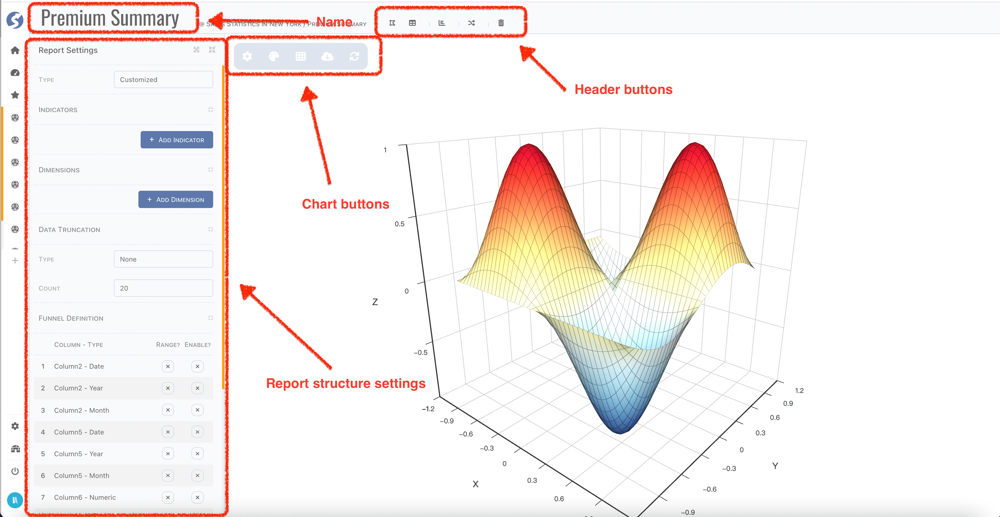

## Header

Report name can be changed by click name part in header. Also, in header bar you can,

- Back to connected-space by click `Catalog`,
- Back to report list by click `Reports`,
- Create a new report by click `New Report`,
- Switch to another report belongs to same subject by click `Switch Report`,
- Delete current one by click `Delete Me`.

## Bottom Tabs

Switching visible of bottom bar by clicking the palette or grid button.

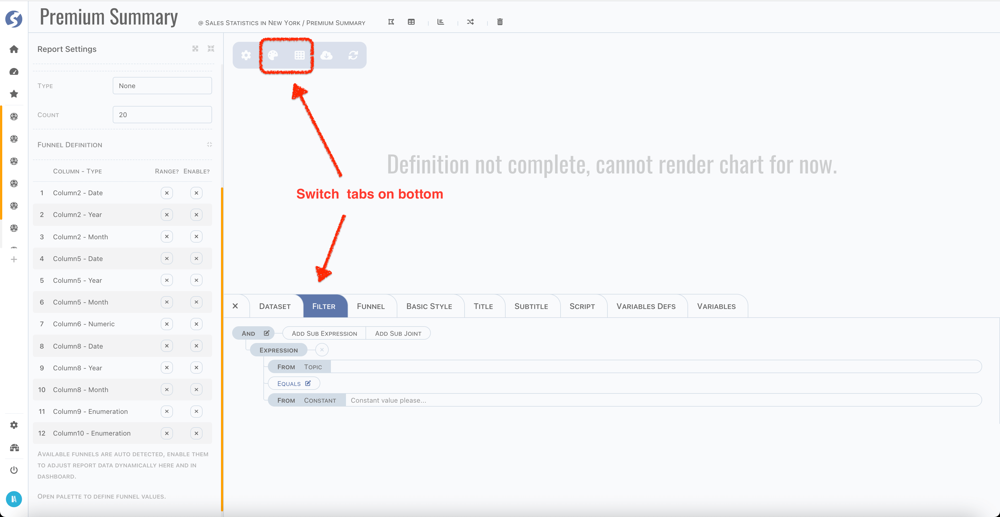

In bottom tabs, you can,

- View dataset,
- Define filter,
- Define funnel,
- Set basic style of chart,
- Set title and subtitle of chart,
- Set specific styles of chart,
- Define script, variables of customized chart.

:::info  
Customizing script and variables of chart by business user is available when `REACT_APP_CHART_SCRIPT_IN_CONSOLE=true` (by default it is not)
.  
Find `REACT_APP_CHART_SCRIPT_IN_CONSOLE` in `.env` file.
:::

## Report Structure

### Report Type {#report-type}

First thing of define a report is deciding the report type, there are several options. We will explain each of them later, now let's have an
overview, they are,

- Single Value,
- Bar,
- Line,
- Scatter,
- Pie,
- Doughnut,
- Nightingale,
- Sunburst,
- Tree,
- Treemap,
- Map,
- Customized.

Report type equates chart type, it determines count of indicators and dimensions.

### Indicators & Dimensions

After type is decided, pick indicators and dimensions which you care about. For each indicator, there are five aggregation arithmetics
available,

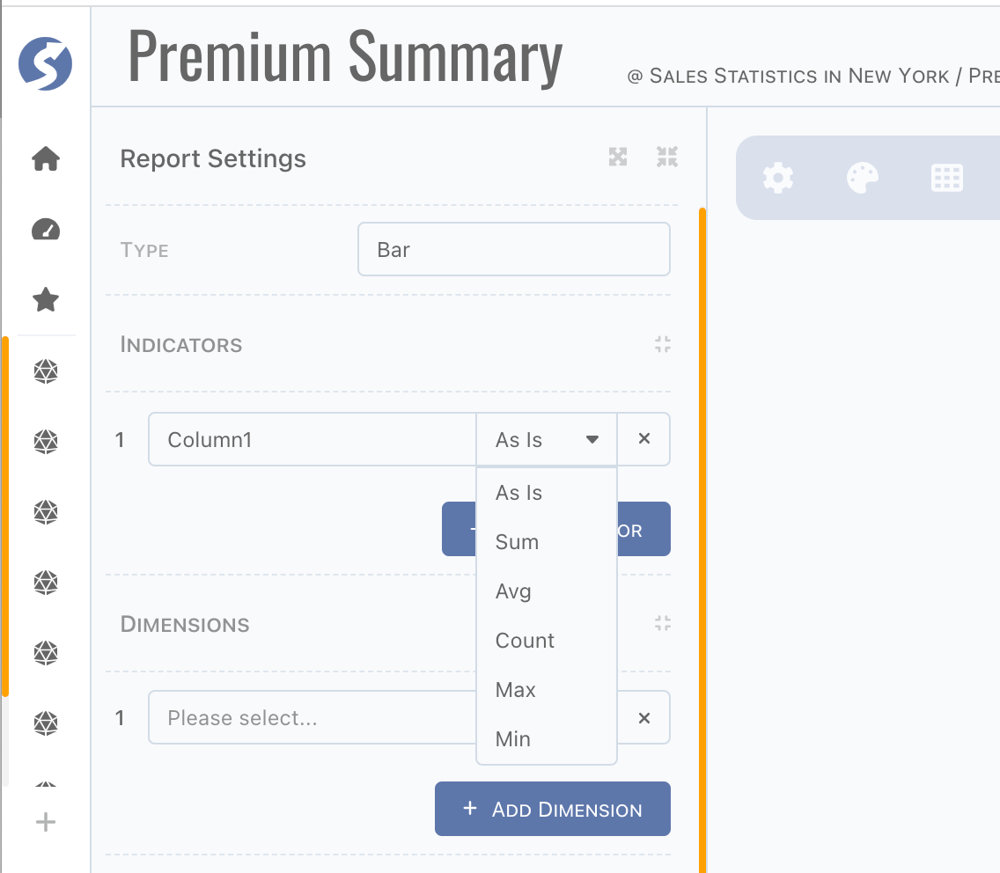

Now select dimensions, they are perspectives of data insight. Also, if there are aggregations defined on indicators, they are aggregated by
dimensions.

### Data Truncate

Sometimes, we don't want to discover the whole picture, we just want to know the outstanding ones. In this case, identify count of data you
want and assign the truncate type by `Top` or `Bottom` instead of `None`.

## Filter and Funnel

Report is built based on subject, in previous chapter, we introduced how to define a subject. Actually, it is just like a SQL query from one
or multiple topics. In report, data can be filtered one more time via filter and funnel.

### Difference between Filter and Funnel

In anutshell, filter is static and funnel is dynamic. In runtime, filter is exactly same as it was defined. But for value of funnel, it can
be passed different for each time. It is very vital in case of changing it on dashboard.

### Filter

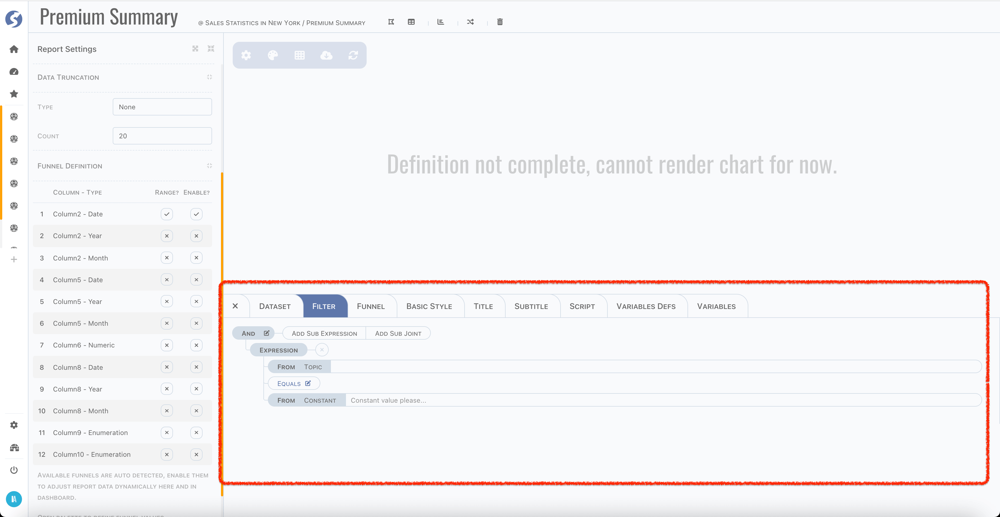

- Define criteria on subject columns here instead of factor in subject because of no topic can be seen here,
- From type of both sides on criteria is fixed, change from type is not available anymore.

:::info  
Report filter is more like a simplified version of subject.
:::

### Funnel

Columns of date, numeric and enumeration will be detected automatically, list in funnel definition part.

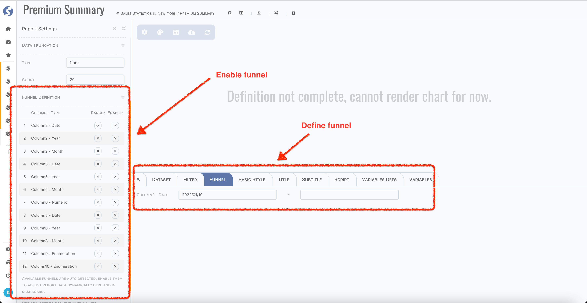

Enabled funnels are shown on bottom tabs to set default funnel values, values will be used to filter data in this page.

And in dashboard, we just have a quick look, funnels are available for accepting dynamic values, as below,

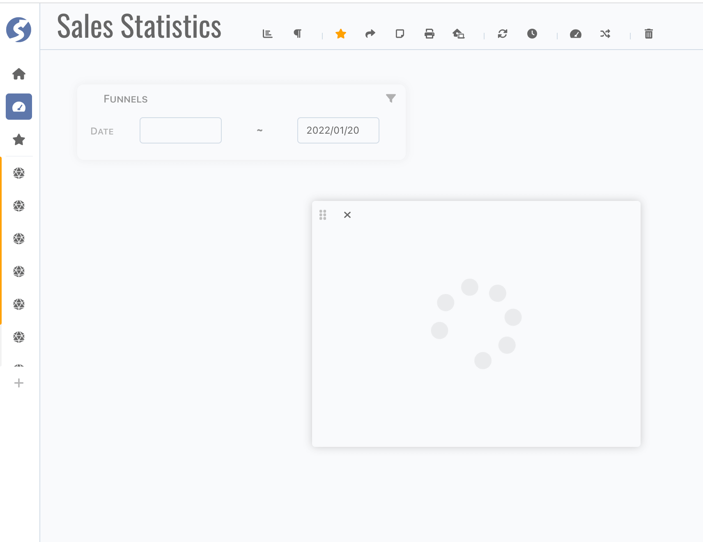

## Dataset

After everything declared, now we can preview dataset to check whether it is as expected or not,


Sometimes, we want to verify the chart by simulated data instead of fetch them from server side. Simply switch on the `Simulate` toggle,
download data template (according to indicators definition), prepare mock data and upload them.

## Basic Style, Title & Subtitle

For each chart, basic style, title and subtitle are available, you can find settings on appropriate tab. There are dozens of settings, we
will not introduce them one by one, just try them in page.

Here are some screenshots,

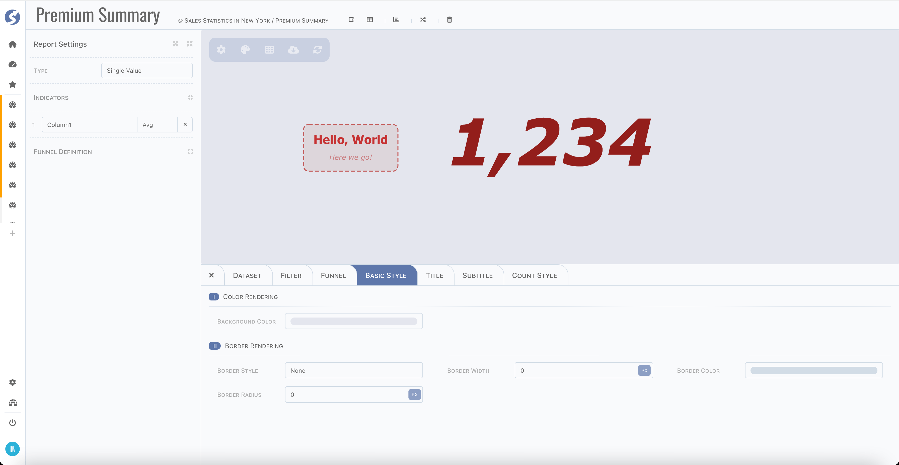

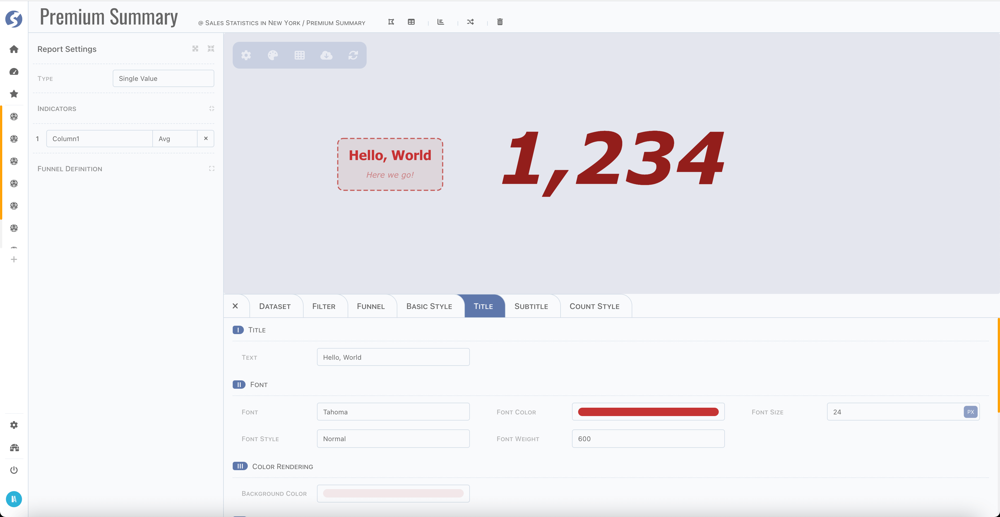

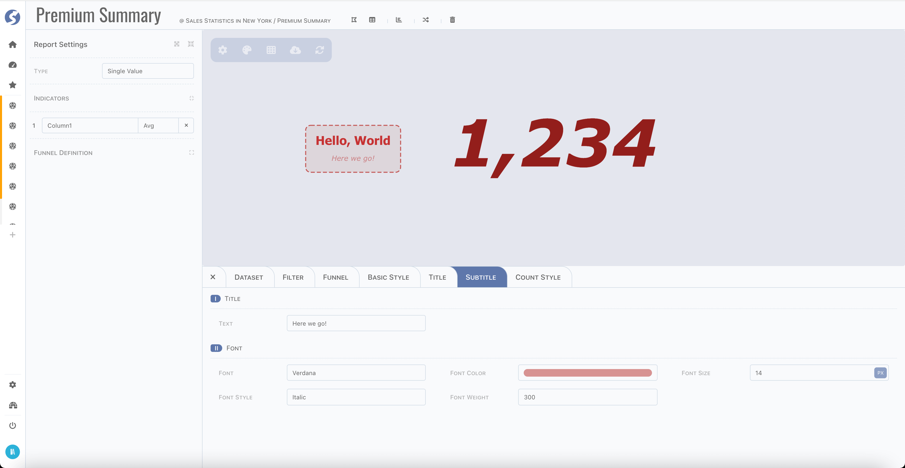

## Charts

### Prebuilt

As we introduced in [report type](#report-type), there are several types of charts built-in. For each type, there is different restriction
for indicators and dimensions and specific style settings are available.

#### Single Value

In previous section, we have seen the common style settings, and for single value chart, there is a peculiarity tab,

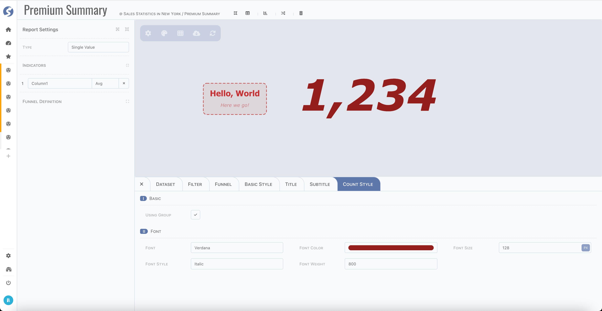

#### Bar

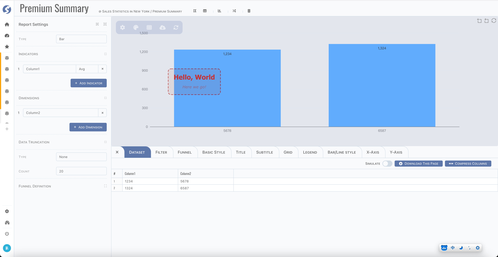

#### Line

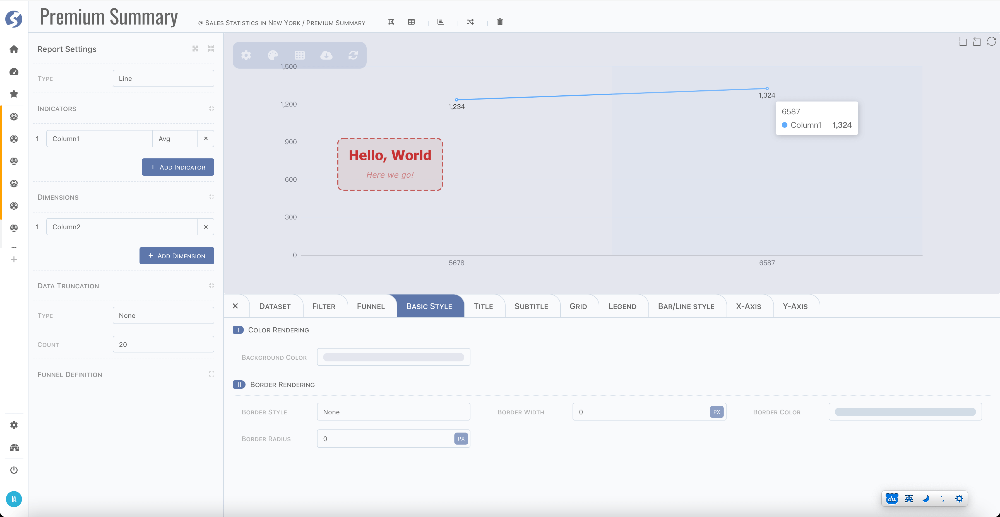

#### Scatter


#### Pie


#### Doughnut

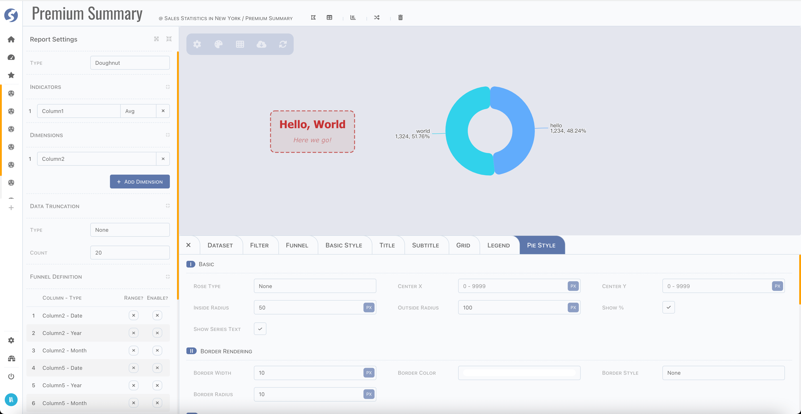

#### Nightingale

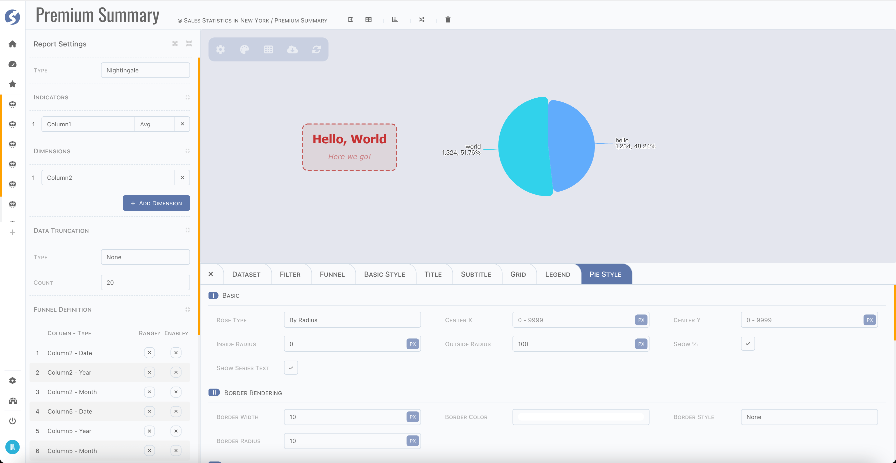

#### Sunburst


#### Tree

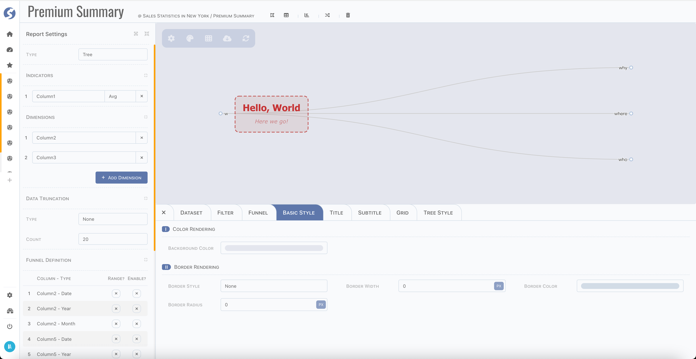

#### Treemap


#### Map

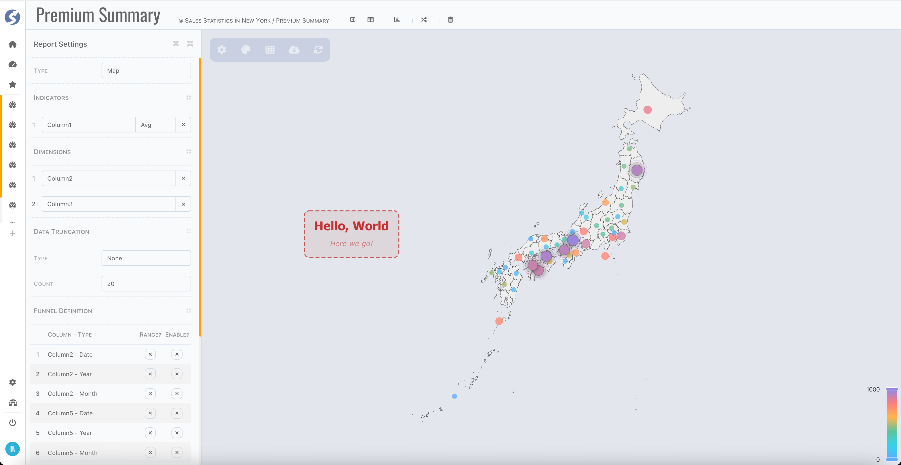

:::info  
Level-1 map (in state/province level): China, Japan, Singapore and USA are built-in.
:::

### Customized

For those charts haven't built-in, could be rendered by customized type, this is tech-orientation and by default not open to business user,
we recommend implementing the complex charts by your technical department and expose them to business users.

#### Data Structure

Follow below steps,

- First, you need to be an administrator, define a space as we introduced [here](../admin/space), make sure it is assigned to yourself and
  business users who will use this customized chart.
- Switch to console workbench, connect this space,
- Create a subject and create a report, simply following the standard process,
- Select report type as `Customized`,
- Select indicators/dimensions/filters/funnels, and set truncate if needed, just as normal,
- Set basic style/title/subtitle, also as normal.

#### Chart Script

Now we have dataset for this report, open bottom bar, find script tab,

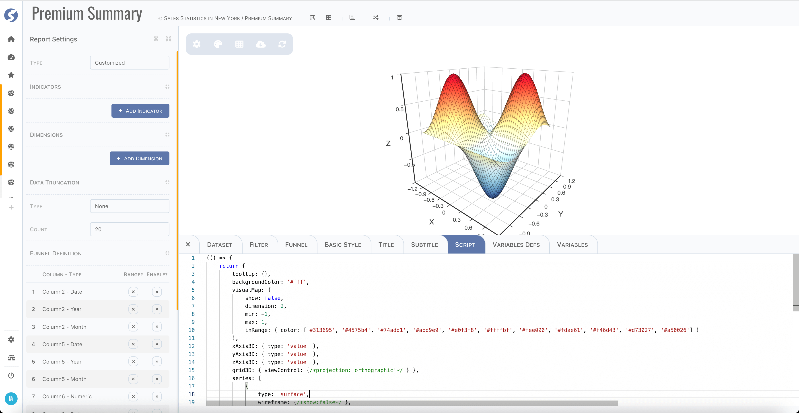

_**Watchmen**_ use [echarts](https://echarts.apache.org/) as chart engine, so in this script, a valid echarts options must be returned.
Since script will be run in browser, which means please strictly follow the javascript syntax supported by your browser version, it can be
found at [CanIUse](https://caniuse.com/).

```javascript
(() => {
	return {              // this is what the echarts needed
		/** ... */
	};
})();
```

:::tip  
For how to use echarts, find their examples [here](https://echarts.apache.org/examples/en/index.html), and configuration
docs [here](https://echarts.apache.org/en/option.html).
:::

To build echarts options in script, there is one more parameter `options` is passed into this function. Typically, structure as below,

```json5
{
	color: [],
	// colors 
	data: [],
	// dataset, 2 dimensions array
	title: {},
	// title defined in title/subtitle tabs
	vars: {}
	// variables
}
```

Use these data to build new options and return to engine to render chart.

#### Define Variables

When defining a customized charts, sometimes there are some dynamic variables want to expose to business users, so they can change the
rendering behavior through giving values of these variables by their own. There is a `Variables Defs` tab to do this,

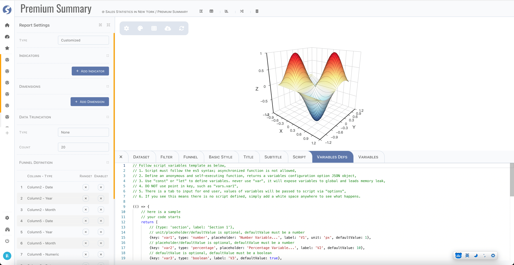

Let's see a complete sample,

```javascript
(() => {
	// your code starts
	return [
		// unit/placeholder/defaultValue is optional, defaultValue must be a number
		{key: 'var1', type: 'number', placeholder: 'Number Variable...', label: 'V1', unit: 'px', defaultValue: 1},
		// placeholder/defaultValue is optional, defaultValue must be a number
		{key: 'var2', type: 'percentage', placeholder: 'Percentage Variable...', label: 'V2', defaultValue: 10},
		// defaultValue is optional, defaultValue must be a boolean
		{key: 'var3', type: 'boolean', label: 'V3', defaultValue: true},
		{type: 'section', label: 'Section 2'},
		// placeholder/defaultValue is optional
		{key: 'var4', type: 'text', placeholder: 'Text Variable...', label: 'V4', defaultValue: 'abc'},
		// defaultValue is optional, defaultValue must be css color
		{key: 'var5', type: 'color', label: 'V5', defaultValue: '#ff0000'},
		// placeholder/defaultValue is optional, defaultValue must match one of options
		{
			key: 'var6',
			type: 'dropdown',
			placeholder: 'Dropdown Variable...',
			label: 'V6',
			defaultValue: '1',
			options: [{value: '1', label: 'Option 1'}, {value: '2', label: 'Option 2'}]
		}
	];
	// your code ends
})();
```

Also, it will be compiled and run on browser side, make sure it is strictly following the javascript syntax supported by your browser
version. There are several types supported, variable declaration contains,

- `key`: make sure it is unique,
- `type`,
	- `number`: numeric value, rendered as an input,
		- `unit`: only for `number`,
	- `percentage`: a numeric value, rendered as an input,
		- `percentage` is a `number` with unit is `%`,
	- `boolean`: a boolean value, rendered as a checkbox,
	- `text`: a string value, rendered as an input,
	- `color`: a color value, rendered as a color picker,
	- `dropdown`: value type according to options, number/string/boolean are supported. It is rendered as a dropdown.
		- `options`: options for dropdown,
- `placeholder`: a string to describe meaning of this variable,
- `label`: variable label,
- `defaultValue`: default value of variable.

#### Variables

Defined variables will be rendered in `Variables` tab as below,

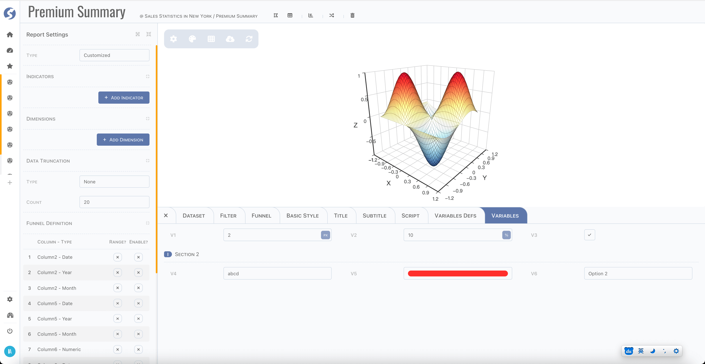

And they will be passed as `options.vars` to chart script, like,

```javascript {2-4}
(() => {
	console.log(options.vars);      
	// in browser console, will see 
	// {var: 1, var2: 10, var3: true, var4: "abc", var5: "rgba(255,0,0,1)", var6: "1"}
	
	return {                        // this is what the echarts needed
		/** ... */
	};
})();
```

#### Summary

`Script` and `Variables Defs` tabs are available for admin only by default, they can be open to business users when build and deploy
by `REACT_APP_CHART_SCRIPT_IN_CONSOLE=true`. It is tech-orientation, and make sure that your business users understanding how to use this
before you decide to open it, they must learn the part of Javascript and echarts, it's easy to a programmer, but not that easy to others.
Another thing is, if script is not open to business users, then they cannot change the structure of report, which means chart type,
indicators and dimensions is immutable, and filter and funnel still can be changed as normal. 