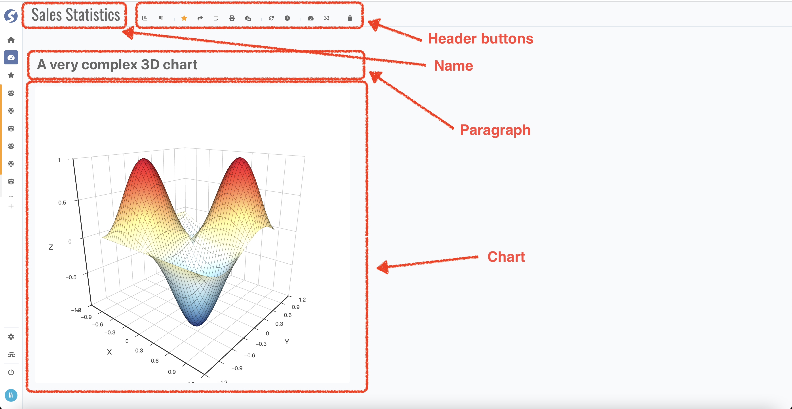

# Dashboard

A dashboard contains charts from reports and paragraphs.

## Header

Dashboard name can be changed by click name part in header. Also, in header bar you can,

- Add an existing chart by click `Add Report`,
- Create a new paragraph by click `Add Paragraph`,
- Add into or remove from favorite by click `Favorite`,
- Create a share link by click `Share`,
- Show page size by click `Show Page Size`,
- Print current dashboard by click `Print`,
- Set current dashboard as your admin home by click `Set as Admin Home`, only available when you are administrator role,
- Refresh data for all charts by click `Refresh`,
- Enable data auto refresh by click `Auto Refresh`, interval is 5 minutes,
- Create a new dashboard by click `Add Dashboard`,
- Switch to another dashboard by click `Switch Dashboard`,
- Delete current one by click `Delete Me`.

## Paragraph

Content of paragraph is rendering by markdown, click the edit button in paragraph header to start editing.

## Chart

No editing for chart in dashboard is available.

### Data Funnel

Data funnel from all charts will be combined and render as funnel panel, change the funnel value will invoke related chart refreshing.