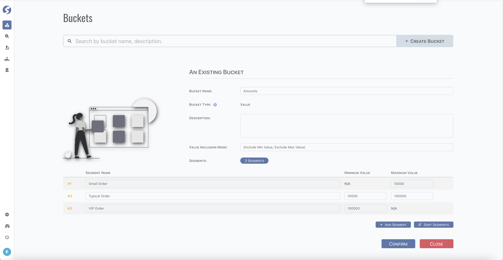
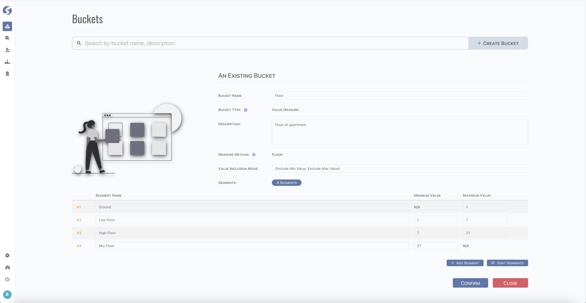
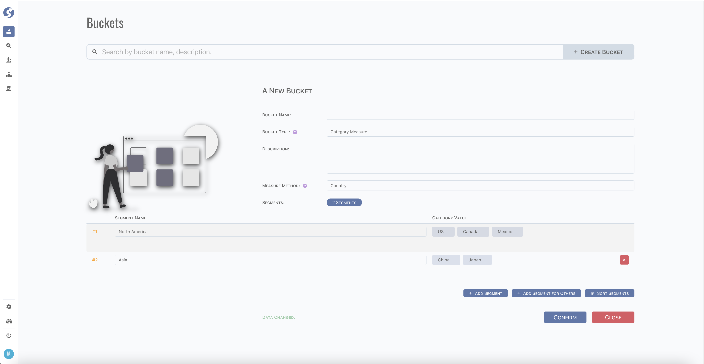
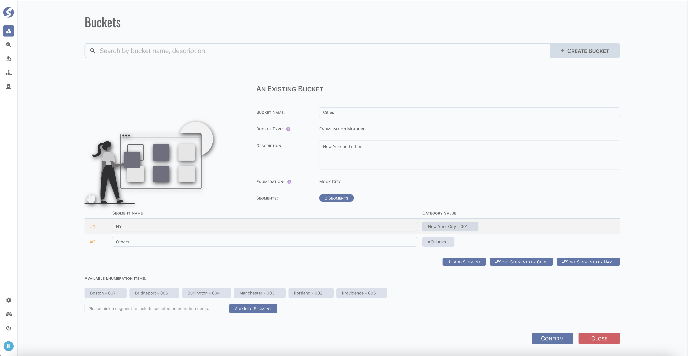

# Bucket

:::info  
Bucket is available for `Admin` only.
:::

Putting data into buckets helps group indicators on ranges. There are several types of buckets, which adapts to different factor types,

- `Value`: for number factors,
- `Value Measure`: for pre-built number factors, such as
	- `Floor`,
	- `Residence Area`,
	- `Age`,
	- `Business Scale`,
- `Category Measure`: for pre-built category factors, such as
	- Geo related: `Continent`, `Region`, `Country`, `Province`, `City` and `District`,
	- Individual related: `Gender`, `Occupation`, `Religion` and `Nationality`,
	- and `Residence Type`, `Business Trade`, `Boolean`,
	- `Enumeration Measure`.

## Value Bucket

Numeric values can be defined into buckets,

:::info  
Value bucket can be applied to any factor which is declared as `NUMBER` or `UNSIGNED`.
:::

## Value Measure Bucket

For pre-defined number type factor, such as `Floor`, can be defined into value measures,

:::info  
Value measure buckets can be adapted to any factor declared with particular type.
:::

## Category Measure Bucket

For pre-defined categorized factor, such as `Country`, can be defined into category measures,

## Enumeration Measure Bucket

For factors which declared as enumeration,

