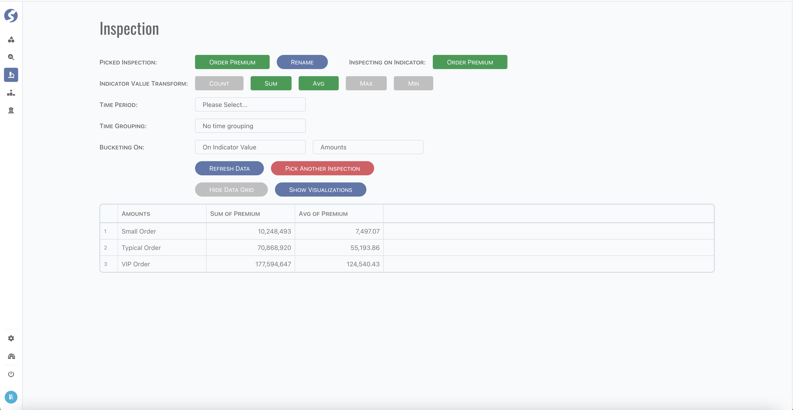
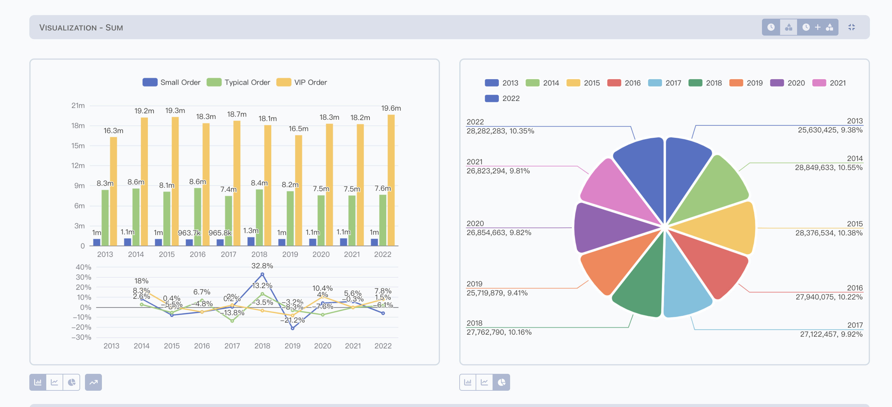

# Inspection

Inspection is based on single indicator.

Currently, indicator data are available to be inspected on given time range, and grouped by time dimensions and/or pre-defined buckets.

Simple visualization also available in this page,

:::tip  
Visualization diagrams are computed according to given time groups and buckets.
:::