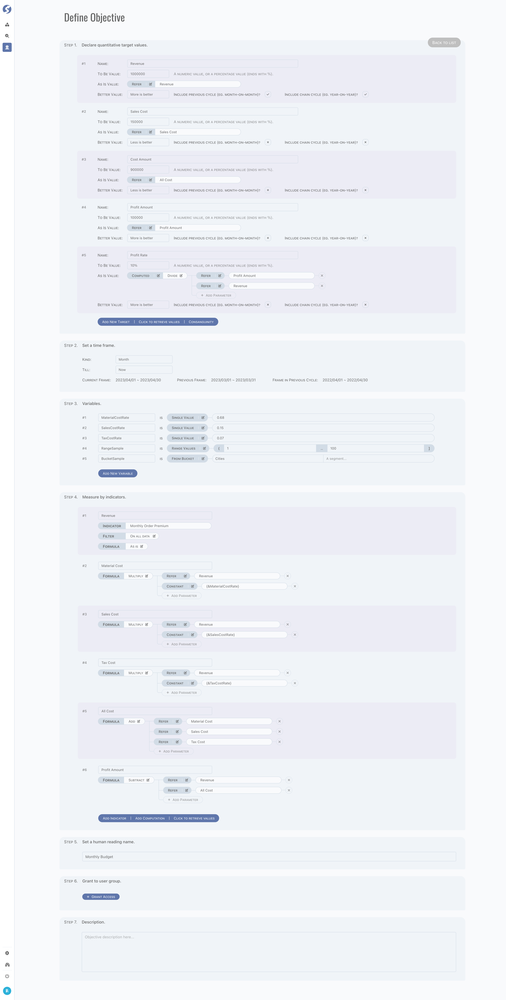

# Objectives

:::info  
Objectives is available for `Admin` only.
:::

Objectives are specific, measurable, time-bound statements that describe what an organization
wants to achieve. These statements are usually created to guide decision-making and ensure that efforts are focused on
achieving desired outcomes. Objectives are often used in strategic planning to provide a clear direction for the organization and to help
stakeholders understand what the organization is trying to achieve. They are also used in performance management to set goals for employees
and to evaluate their progress towards achieving those goals.

Everything is obvious, but of course you need to use the pre-defined base indicators (step #4) to complete the base part of the targets (
step #1).

For more variety of objectives definitions, time frame (step #2) and variables (step #3) have been provided.