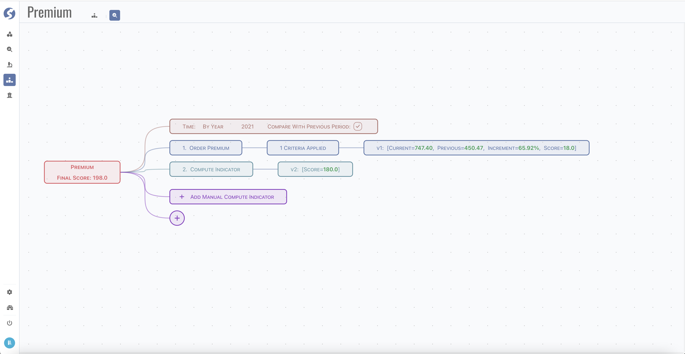
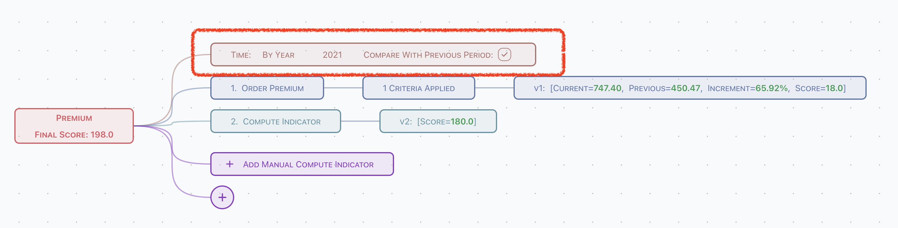
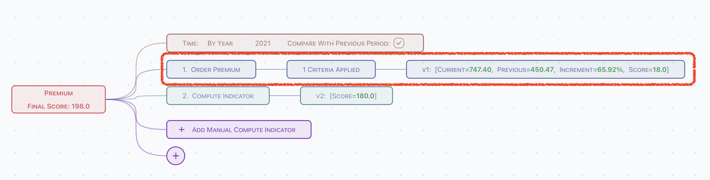
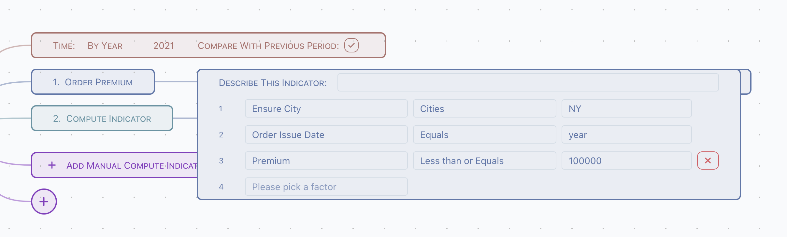
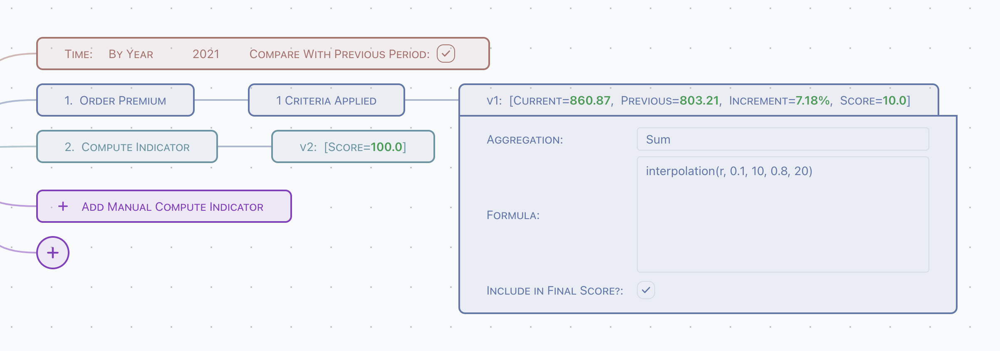

# Achievement

Achievement is based on multiple indicators.



There are 4 parts of an achievement,

- Common time criteria,
- Pre-defined indicators,
- Computed indicators,
- Total score.

## Common Time Criteria



- Define time criteria, which can be referred in pre-defined indicator. By year or By year + month is supported,
- Define whether the previous period data should be applied or not. An increment ratio will be calculated automatically when previous period
  applied.

## Pre-defined Indicator



All indicators pre-defined can be imported into achievement.

### Naming & Criteria Apply



Click the criteria node, to

- Define indicator name in this achievement,
- Apply criteria into indicator,
	- `year` and `month` can be used in criteria value, which defined in common criteria,
	- Use pre-defined bucket to filter, or manually key-in.

### Aggregation & Formula



- Choose aggregation arithmetic,
- Write formula which to compute score of this indicator.

:::info
Currently, formula is a 
:::

#### Supported Variables

Variables are computed before compute score using formula,

- `c`: value of indicator in current time period,
- `p`: value of indicator in previous time period,
- `r`: value of increment ratio.

#### Supported Math Functions

All properties and methods on [Math](https://developer.mozilla.org/en-US/docs/Web/JavaScript/Reference/Global_Objects/Math) are supported.  
For example,

```typescript
let x = abs(c); // assign aboslute value of current indicator value to variable x
```