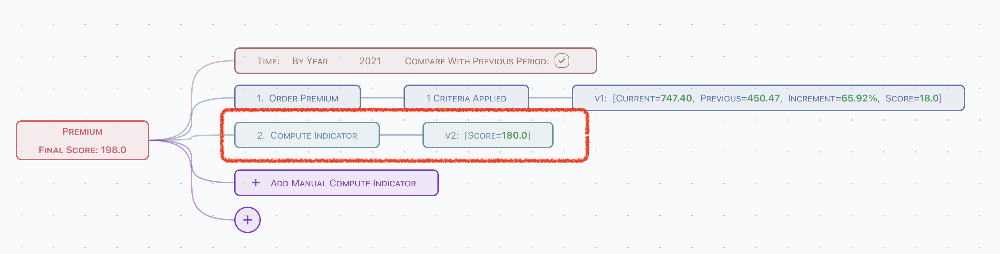
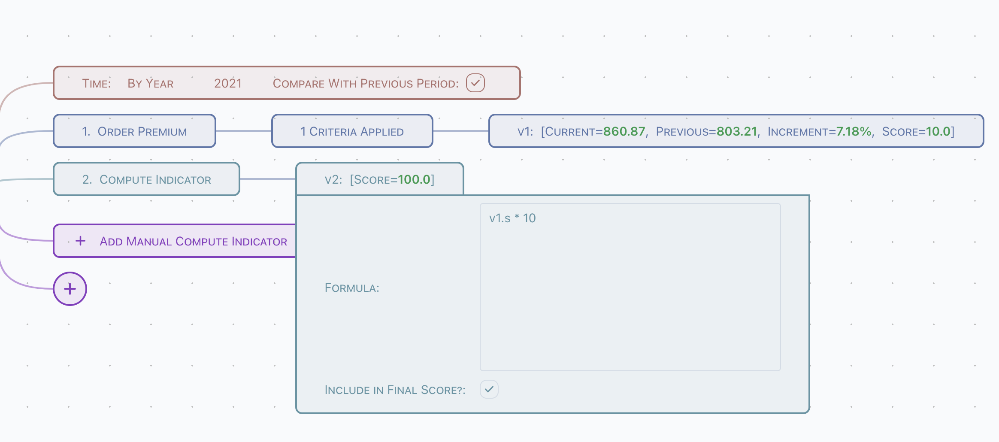
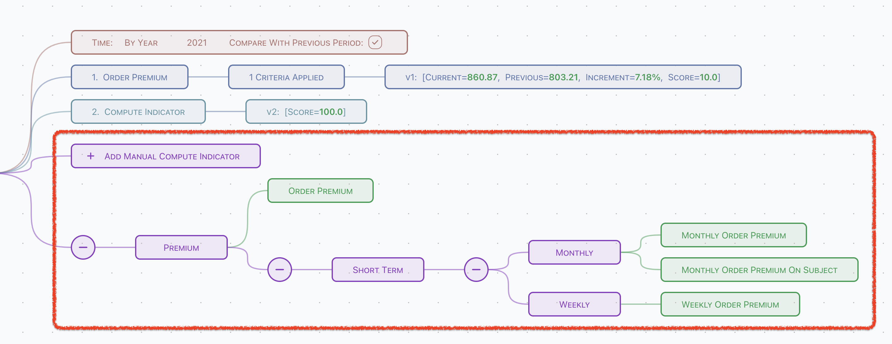
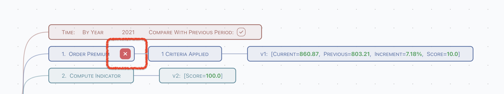
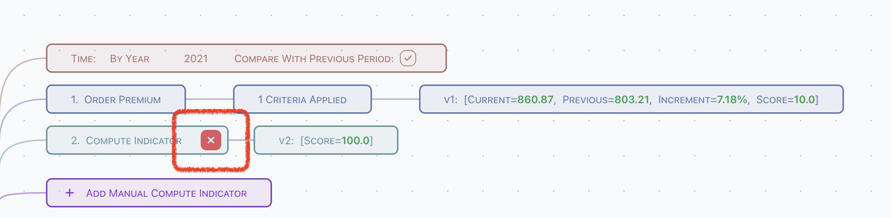
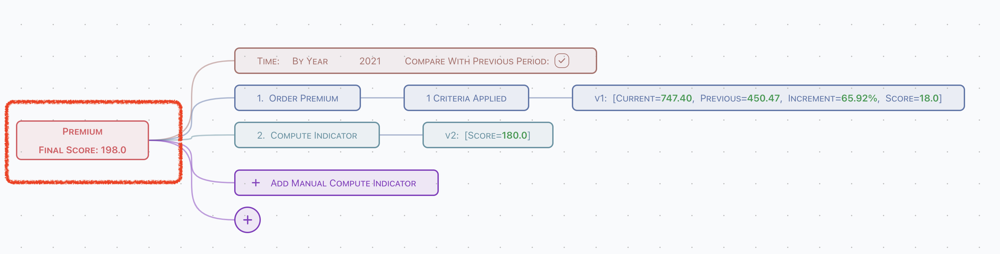

# Achievement

:::info  
Achievement is available for `Admin` only.
:::

Achievement is based on multiple indicators.


There are 4 parts of an achievement,

- Common time criteria,
- Pre-defined indicators,
- Computed indicators,
- Total score.

## Common Time Criteria


- Define time criteria, which can be referred in pre-defined indicator. By year or By year + month is supported,
- Define whether the previous period data should be applied or not. An increment ratio will be calculated automatically when previous period
  applied.

## Pre-defined Indicator


All indicators pre-defined can be imported into achievement.

### Naming & Criteria Apply


Click the criteria node, to

- Define indicator name in this achievement,
- Apply criteria into indicator,
	- `{&year}` and `{&month}` can be used in criteria value, which defined in common criteria,
	- Use pre-defined bucket to filter, or manually key-in.

### Aggregation & Formula


- Choose aggregation arithmetic,
- Write formula which to compute score of this indicator.

:::info
Formula syntax is based on Javascript.
:::

#### Supported Variables

Variables are computed before compute score using formula,

- `c`: value of indicator in current time period,
- `p`: value of indicator in previous time period,
- `r`: value of increment ratio.

#### Supported Math Functions

All properties and methods on [Math](https://developer.mozilla.org/en-US/docs/Web/JavaScript/Reference/Global_Objects/Math) are supported.
For example,

```javascript
let x = abs(c); // assign aboslute value of current indicator value to variable x
```

And additional functions,

```javascript
// when r is less than 0.1, returns 10
// when r is greater than 0.8, returns 50
// when r is between 0.1 and 0.8, returns 10 + (50 - 10) * (r - 0.1) / (0.8 - 0.1)
interpolation(r, 0.1, 10, 0.8, 50); 
```

:::info
`return` keyword is not required when there is only one line of formula, otherwise use `return` to return the computed score.
:::

## Compute Indicator



Compute indicators are designed for do manually calculation base on results of other indicators.

### Formula



Write formula which to compute score of this indicator.

:::info
Formula syntax is based on Javascript.
:::

#### Supported Variables

Variables from other indicators are supported,

- `v1`, `v2`, ..., `vn`: `n` is index of other indicator, can be found at its result node,
- `v1.c`: current value of v1,
- `v1.p`: previous value of v1,
- `v1.r`: increment value of v1,
- `v1.s`: score value of v1,
- and `v2.c`/`v2.p`/`v2.r`/`v2.s` ... `vn.c`/`vn.p`/`vn.r`/`vn.s`

:::caution

Be very careful,

- circle dependencies may cause unpredicted result or error,
- never use itself in formula.

:::

## Append or Remove indicator

- Append compute indicator by click `Add Manual Compute Indicator`,
- Append pre-defined indicator by click leaf node of pre-defined indicators tree.



And, remove existing indicator by hover its first node, and click the remove button,

- Remove pre-defined indicator,
  
- Remove compute indicator,
  

## Total Score

Finally, all computed scores are sum and show at root node of achievement.



:::tip  
Simply remove the check `Include in Final Score` of indicator score node to remove its score value from summary. 
:::