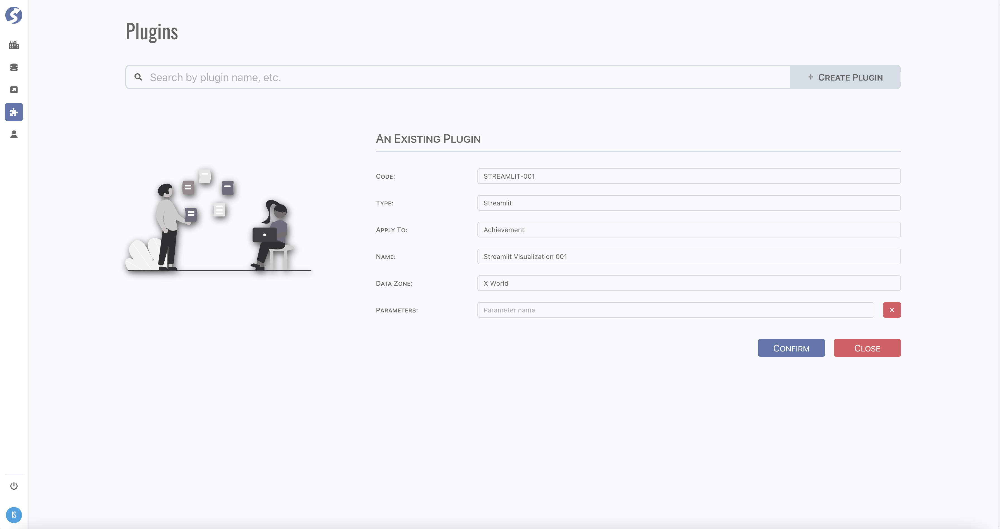

# Plugin

Plugin is used to call external services.

:::info  
Plugin is available for `Super Admin` only.
:::

## Standard Tuple Page

Plugin use [standard tuple page](../standard-tuple-page).

## Form Validation

- Plugin Code: required,
- Plugin Type: required. Currently, 2 types are built-in:
	- [Streamlit](https://streamlit.io),
	- [Jupyter](https://jupyter.org/),
- Apply To: required,
- Name: required,
- Data Zone: required.
