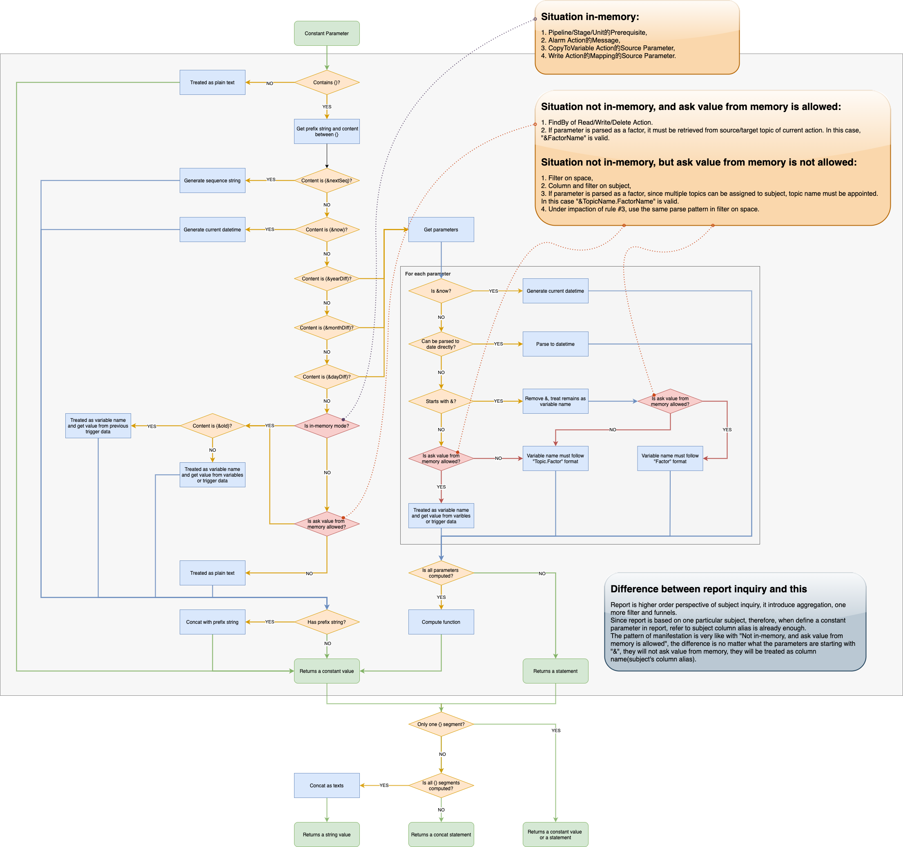

# Pipeline Service

Pipeline service is the core of **_watchmen_**, topic data is processed, transformed and aggregated through pipelines which are predefined.
Before go through the services and rest apis, let's learn about pipeline itself first.

## Pipeline

A pipeline is made up of the following materials:

- A prerequisite to decide current pipeline should be triggered or not,
- A set of stages to process trigger topic data. For each stage, including,
	- A prerequisite to decide current stage should be run or not,
	- A set of units to process data. For each unit, including,
		- A prerequisite to decide current unit should be run or not,
		- A loop variable (from memory variables) to decide current unit is process a list or a single data,
		- A set of actions to process data. There are different types of actions are built-in:
			- Alarm action,
			- Copy to variable action,
			- Read row action,
			- Read rows action,
			- Read factor action,
			- Read factors action,
			- Exists action,
			- Write row action,
			- Insert row action,
			- Insert or merge row action,
			- Write factor action,
			- Delete row action,
			- Delete rows action.

To learn how to define a pipeline, visit **[here](../web-client/admin/pipeline)** for more details.

## Pipeline Kernel and Surface

A set of services and rest apis are provided by pipeline kernel and surface.

### Pipeline Trigger

Trigger a pipeline can be triggered synchronized,

```bash title="synchronized"
curl \
--location \ 
--request POST 'http://host:port/pipeline/data?topic_name=a_topic&tenant_id=1' \
--header 'Authorization: Bearer ...' \
--header 'Content-Type: application/json' \
--data-raw '{
    "code": "a_topic",
    "data": {
      ...
    },
    "triggerType": "insert-or-merge",
    "tenantId": "1",
    "traceId": "1"
}'
```

- `code`: topic name, case sensitive,
- `data`: a JSON object, topic data,
- `triggerType`: type of trigger, `insert`, `merge`, `insert-or-merge` and `delete`
- `tenantId`: required when current user is super admin,
- `traceId`: provide only when client wants to control the trace id, otherwise engine will generate one if it is null or undefined.

Or can be triggered asynchronized,

```bash title="asynchronized"
curl \
--location \ 
--request POST 'http://host:port/pipeline/data/async?topic_name=a_topic&tenant_id=1' \
--header 'Authorization: Bearer ...' \
--header 'Content-Type: application/json' \
--data-raw '{
    "code": "a_topic",
    "data": {
      ...
    },
    "triggerType": "insert-or-merge",
    "tenantId": "1",
    "traceId": "1"
}'
```

### Compiled Pipeline and Cache

For performance consideration, pipeline is compiled on first invoking. Pipeline kernel cache compiled pipeline with same lifecycle with
pipeline itself.

#### Parse Constant Parameter

It is very complex to parse and give the semantic to a constant parameter value string, following graph explains how to parse a constant
parameter in different situations step by step.



### Retry on Insert or Merge Row

If insertion is failed when do `insert-or-merge-row` action, typically it is caused by an unique index conflict exception. Kernel will try
to do modification, and the logic is exactly same as `merge-row`.

### Retry on Aggregation Topic

To avoid aggregation topic resource contention, there is an additional version property for each aggregation topic. In high concurrency
scenarios, version optimistic lock conflict might be occurred. In this case, write action will do modification retrying, and if all retrying
is failed, the last retry will use pessimistic lock to ensure success. Visit **[here](../installation/config#pipeline-kernel)** for more
details about the retry settings.  

## External Writers

There are two built-in external writers:
- Standard Restful Writer,
- Standard Elastic Search Writer.