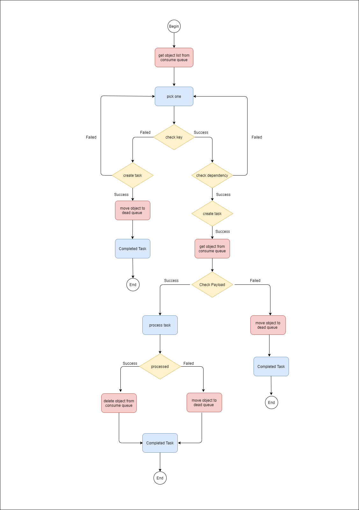

# Collector

S3 Collector is a way of data integration base on S3, Doll pulling data from s3 bucket, and use database to create task for concurrent control. 
the unique task guarantee the data on S3 will be consumed and only consume once. 
Once the consumption completed, the data will be deleted from S3. 
Or if there is any exception, the data will be moved from the folder of consume queue to the folder of dead queue to prevent blocking of consumption.

## Collector Logic

S3 Collector flow chart

## S3 Collector Configuration

Please refer to installation config page for more detail information of configuration.

## housekeeping

The program will periodically clean up the task. 
