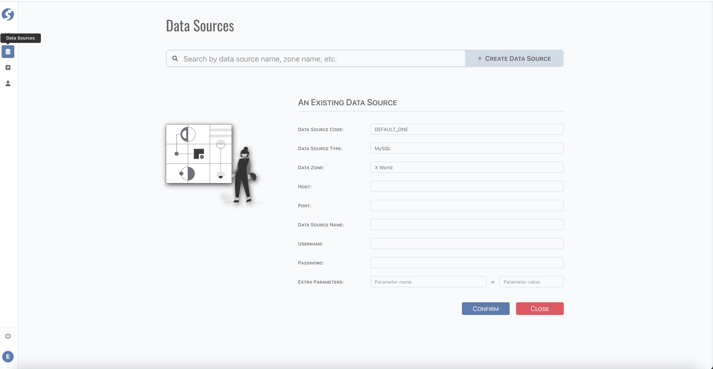

# Data Source

Data sources are defined in data zone, it's a logical concept.  
Topics are stored in appointed data source.

:::caution  
Data source is only available for `Super Admin`.
:::

:::caution  
Centralized definition data source should be configured in deployment, not here.
:::

## Standard Tuple Page

Data source use [standard tuple page](../standard-tuple-page).

Extra parameter pair is added automatically, and will not be removed when name and value are cleared, empty pairs are dropped on saving.

## Form Validation

- Data Source Code: required,
- Data Zone: required,
- Extra Parameter Name: required when value existed.

## Model

Find data source model **[here](../../tuples/data-source)**.
