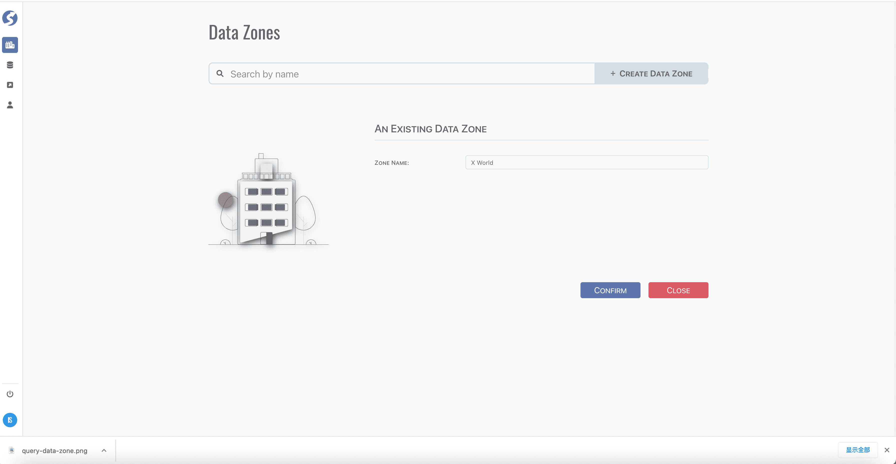

# Data Zone

Data zones allow the logical and/or physical separation of data that keeps the environment secure, organized, and agile. In **_Watchmen_**,
data zone can be created/maintained by super admin only.

:::info  
Data zone is only available for `Super Admin`.
:::

Before create anything, a data zone must be created first, tuples are organized within a data zone.

## Standard Tuple Page

Data zone use [standard tuple page](../standard-tuple-page).

## Form Validation

Only one field `Zone Name` for data zone, it is required, keep it not blank.

## Model
Find data zone model **[here](../../tuples/data-zone)**.
