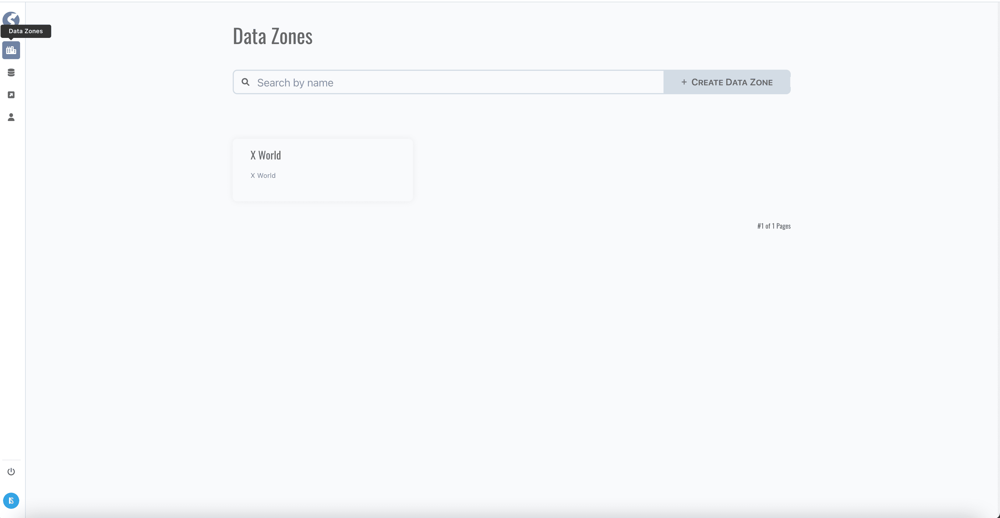
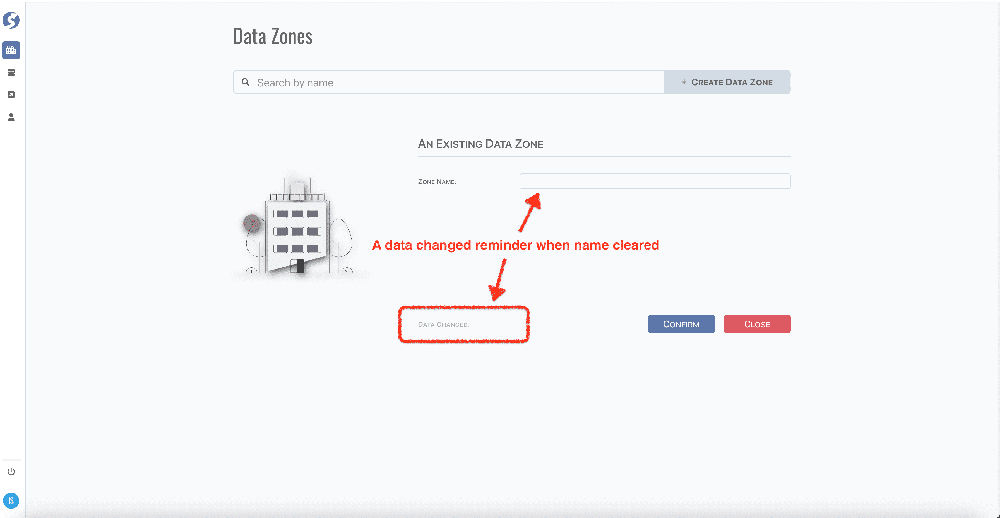
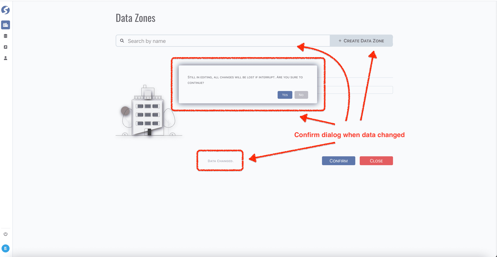
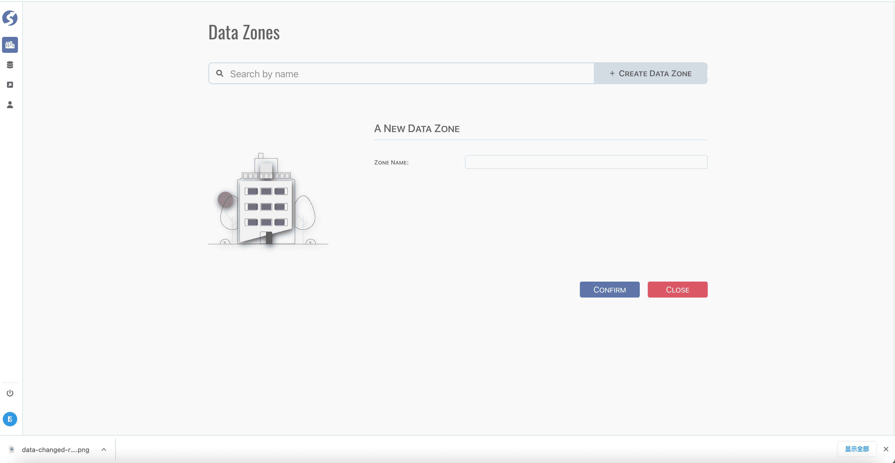

# Data Zone

Data zones allow the logical and/or physical separation of data that keeps the environment secure, organized, and agile. In **_Watchmen_**,
data zone can be created/maintained by super admin only.

:::info  
Data zone is only available for `Super Admin`.
:::

Before create anything, a data zone must be created first, tuples are organized within a data zone.

## Find a Data Zone

Click `Data Zones` menu,

:::tip  
9 cards per page.
:::

## Edit Data Zone

Click the `Data Zone` card,

There is a reminder at the bottom of form when something is changed.

Click `Confirm` button to save your changes, or click `Close` to discard them.

## Create Data Zone

Click the `Create Data Zone` button, a data changed reminder confirm dialog pops up when still in editing and something has been changed,

Click `No` to discard creating, or click `Yes` to discard editing and switch to a new data zone editing,

