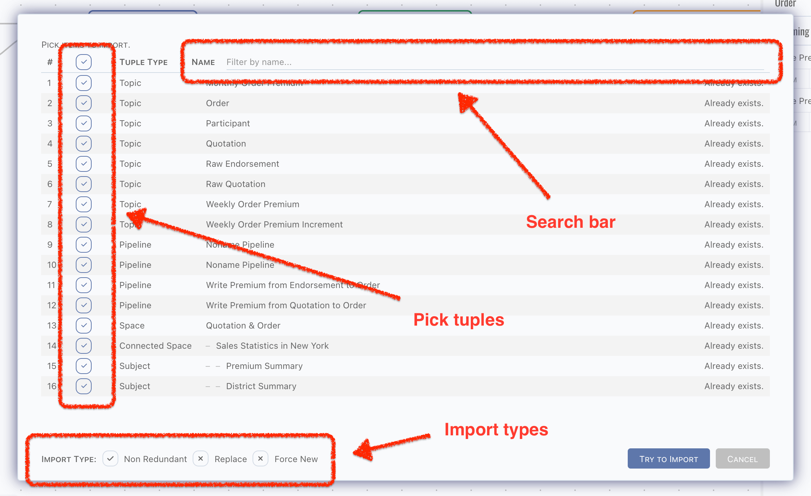
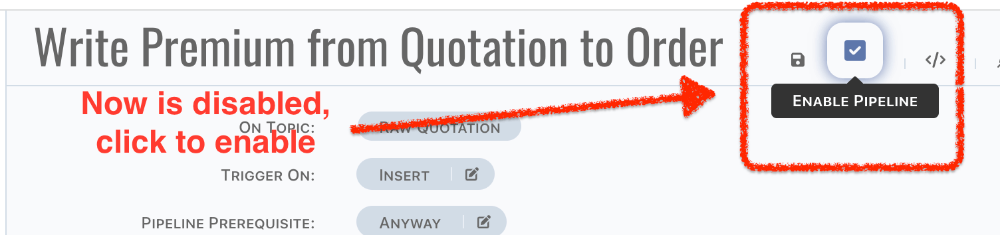
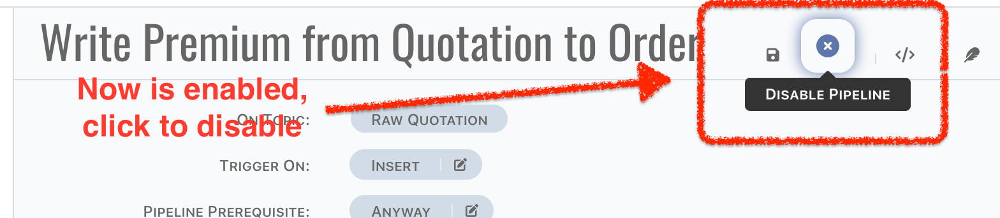
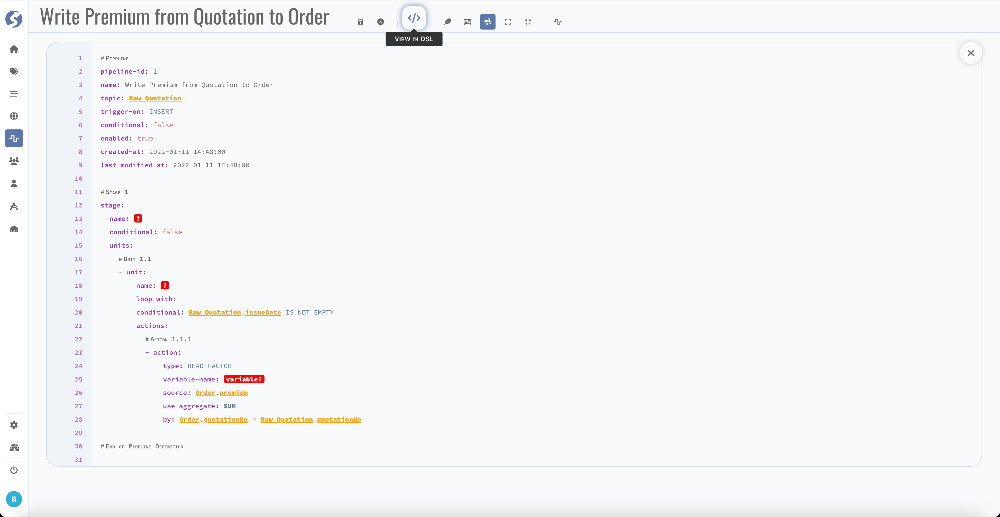
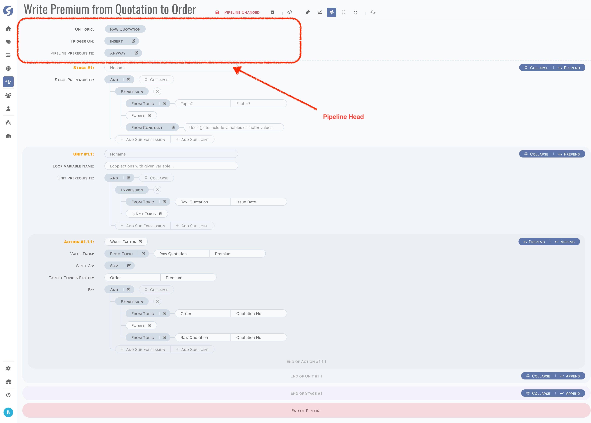

# Pipeline

Pipeline describes the data flow between topics, triggered by topic data inserted or updated.

:::info  
Pipeline is available for `Admin` only.
:::

## Catalog Page


In the very first pipeline catalog page, all existing topics will be displayed and layout automatically.

:::tip

- Topic blocks can be dragged and dropped anywhere,
- If there are many topics cannot be rendered in one page, use thumbnail to move.

:::

Catalog belongs to the user, it is not shared between users. Topics can be organized individually for every administrator, don't worry about
to influence or affected by others.

:::info  
In pipeline catalog, `catalog`/`graphics`/`group` are the same concept: a set of topics, rendering to a graphics.
:::

### Header Buttons

There might many topics, it is too many to show in one graphics, topics can be separated to multiple graphics. Click `New Pipeline Group` in
header buttons to create a new catalog page.


In a new catalog page,

- Pipeline catalog name is auto generated, click name part to change it,

  

- No topic selected in the first, click `Pick Topics` to pick topics which you want to render in this catalog,

  

  

  :::caution  
  If topic are not picked on current catalog, pipelines which triggerred by it or write data to it also will be rendered in this catalog.
  :::

- Click `Delete Me` to delete current catalog,

  

  :::info

	- Topics will not be deleted when delete pipeline catalog,
	- The last catalog cannot be deleted.

  :::

  :::caution  
  Catalog cannot be recovered after deletion.
  :::

- Click `Switch Graphics` to switch to another catalog,

  

  :::info  
  Switching is enabled only when there are more than 1 catalog.
  :::

### Export & Import

Topics, pipelines and other tuples related can be exported as a zip file, by click the `Export` button in header buttons, a dialog shows,


- All topics and spaces are available in export dialog,
- Topics assigned to space will be selected automatically when space is selected,
- Space will be deselected automatically when topic within it is deselected,
- Pipelines will be packed into zip only when,
	- Triggerred topic is selected,
	- Topics receive data from this pipeline are selected,
- Any tuples included by space will be packed into zip according to selected spaces.

There is only one file in this zip,

```
zip root/
└── Pipelines Group.md
```

:::info  
Markdown file cannot be triggered as a file downloading in browser, so we pack it to a zip.
:::

Markdown file is exactly a document for these tuples, it is useful to show the structures. It can be opened by any markdown tool, we
recommend using [VSCode](https://code.visualstudio.com/), with markdown plugins installed. Also, it can be generated to a pdf file, for more
easy to read and spread.

The exported markdown file can be imported again, simply by clicking the `Import`,




:::danger  
DO NOT modify the hyperlink parts in exported markdown file, it contains the data part. Actually we only read these parts in importing.    
Any others are for read only, you can modify them to anything you prefer. But it is not recommended that any modification on not-description
parts, such as factors tables, pipeline DSLs.
:::

:::info  
In markdown, graphics and images are stored by standard HTML tags, they cannot be rendered correctly in GitHub, Gitlab and some other SaaS
services (or private installations). Simply leave them as they are, it is just for security reason. Open it via locally markdown tool, it
can be rendered correctly.
:::

There are 3 ways to import data,

- Non-Redundant: existing data will be ignored, and do creation when not existed,
- Replace: existing data will be replaced, and do creation when not existed,
- Force New: treat all imported data as new ones. Ids of tuples will be reset.

Choose the right import way for your scenario and be careful with the imported tuples. Duplication check is based on the ids of tuples, such
as `topicId` or `pipelineId`, which means even they have the same name, still will be treated as different ones by importation handler. It
depends on the existing and import tuples, we cannot know what exactly the scenario is, all we can say is it occurs in all 3 ways.

:::danger  
Most of tuples will not create physical entities, but not for topic. Topic name equates table/document name in data source, therefore when
topic names are duplicated but have different topic ids, unpredictable exceptions should be raised when do data source objects creation or
modification. **Be very careful with it after importing**.
:::

### Topic Navigator

Click navigator panels to view more details of topic,

- Incoming pipelines: pipelines write data to current topic,
- Outgoing pipelines: pipelines triggerred by current topic,
- External writers: triggerred by current topic only, which means external writers in incoming pipelines will not be displayed,
- Factors.

Click `Open Pipeline` button to edit pipeline,


or click `Create Outgoing Pipeline` button, a new pipeline triggered by this topic will be created,


:::info  
There is no create button for incoming pipeline, since pipeline always needs a trigger.
:::

## Pipeline Page

By click `Open Pipeline` button on topic navigator, page is switched to pipeline edit work area,


### Structure of Pipeline

Before we go through the page, let's take a minute to learn the structure of pipeline.

- Each pipeline is triggered by a topic, or more accurately, by insertion/modification/deletion of a row,
- A pipeline contains multiple stages,
- A stage contains multiple units,
- A unit contains multiple actions,
- Action is the atomic execution cell.

Here is a whole picture of pipeline,


In this pipeline, there are,

- 2 stages,
- 1 unit for each stage,
- 1 action for each unit.

### Header Buttons

In pipeline header,

- Pipeline name is auto generated, click name part to change it,

  

- Style of `Save Pipeline` button is changed when anything change in pipeline, see the difference as below,

  

  

  :::info  
  Name change will not lead the style change of `Save Pipeline` button, it will be saved automatically, which means button style changed is
  caused by content of pipeline changes only.
  :::

- Pipeline can be enabled/disabled, simply click the `Enable Pipeline`/`Disable Pipeline` button,

  

  

  :::caution  
  Enable pipeline doesn't mean it is correct to run, we cannot know precisely it is just staged or launched. We highly recommend disabling
  pipelines until it is tested in simulator, and ready for environment testing.
  :::

  :::info  
  Content of pipeline will also be saved when enablement switching.
  :::

- By click the `Back to Catalog` button, page should be switched to catalog.

  

### Edit Modes

3 edit modes are offered,

- `Focus on Unit`: only one unit is expanded,
- `Focus on Stage`: only on stage is expanded,
- `Free Walk`: free to expand and collapse.

Use first two modes when you are focused on part of pipeline, or use free walk to go through the whole picture.


There are 2 more buttons for free walk mode, to expand/collapse all stages.

### DSL

You also can review the pipeline definition by dsl mode, it's more like a YAML.



:::tip  
Red part means something is incorrect, check that in definition.
:::

## Define a Pipeline

In this chapter, we will introduce each part of pipeline definition.

### Trigger by Topic

A pipeline is triggered by an insertion/modification/deletion of a row in topic, therefore first, a topic and how to trigger must be
defined,



There are 4 trigger types,

- Insert,
- Insert or Merge,
- Merge,
- Delete.

`Insert` is usually for raw topic. For raw topics, typically only insertion occurred, each change of raw data should be recorded. For other
types of topics, `Insert or Merge` is a better choice, there is always a very first row was inserted, and it would be modified (in trigger
type, also known as `Merge`). For both of insertion and modification, the same logic should be applied. But sometimes, logics on insertion
and modification are not the same, they can be handled separately by 2 pipelines, one is triggered by `Insert`, the other is triggered
by `Merge`.  
It is also supported for triggering by `Delete` operation, but deletion means a piece of history was removed physically. In analysis system,
each piece of data should be hold for further use, a deletion might lead a puzzle has one last piece missing, which is not expected any
time. Even it is helpful on rescuing some special situations, triggering a pipeline by deletion is still not recommended.

Sometimes logic of pipeline is very complex, hardly to define them all in one pipeline. It is possible to define multiple pipelines which
triggered by one operation. For example, there is a topic `Order`, an insertion occurred. All pipelines with,

- Triggerred by `Order`,
- Trigger type is one of `Insert` or `Insert or Merge`,

Will be triggerred at the same time. Pipelines will be dispatched to different [Doll](../../doll/doll-index) nodes, they are run
concurrently. Generally, it does not need to be concerned, but in fact, it is highly correlated with how to define pipelines. For example (
not quite fit, just for explanation), we have topics and pipelines as below,


There are several pipelines,

1. Triggered by `Order`,
	1. One writes to `Order Premium`,
	2. The other writes to `Order Item` (assume a set of items in an order),
2. Triggered by `Order Item`, do count aggregation, writes to `Order Item Count`,
3. Triggered by `Order Premium`,
	1. Read count from `Order Item Count`,
	2. Compute average item premium of each order, writes to `Average Item Premium of Order`.

Obviously, step 2 must have been done before step 3. Unfortunately, the order is unknown since pipelines are run concurrently, which means
there might be a zero or null when read count in step 3.i. In this case, follow steps as below to avoid this possible problem,

- Add prerequisite on unit, to avoid the average calculation from incorrect count value,
	- A `Is Not Empty` check to avoid null,
	- A `Not Equals` check to avoid zero,
- Create a new pipeline from `Order Item Count`, do the same logic when count changed,
	- Also do check to avoid null value from order premium.

Now, no matter what value comes first, the computed value in `Average Item Premium of Order` always is correct (or correct at that moment).

## Validation

[//]: # (- Group Name: required,)

## Model

Find pipeline model **[here](../../tuples/pipeline)**.

