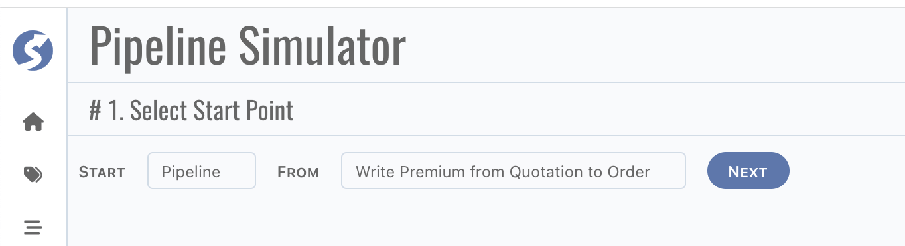
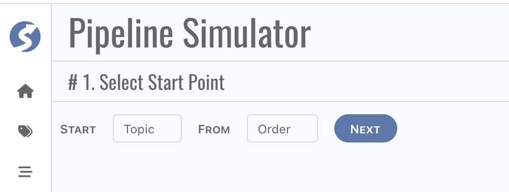
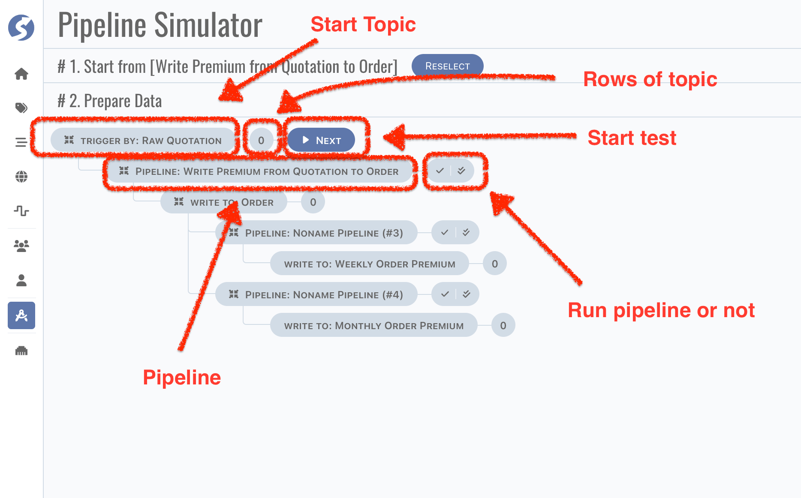
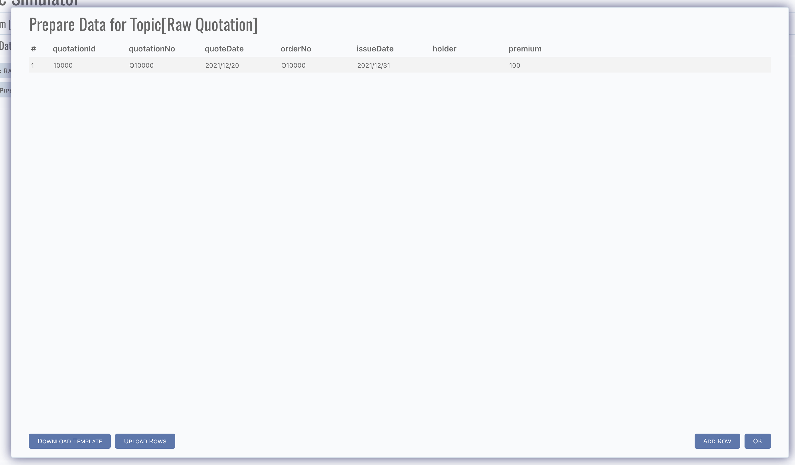
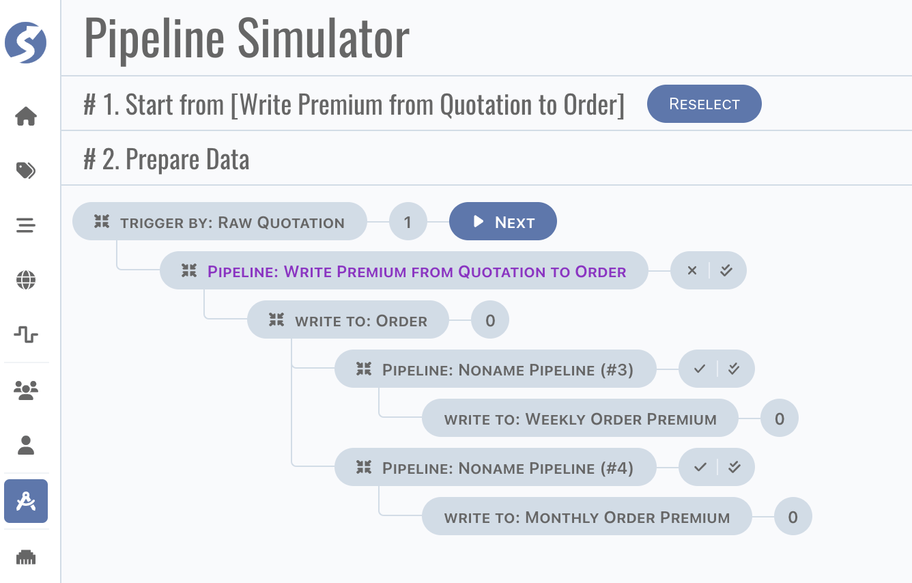
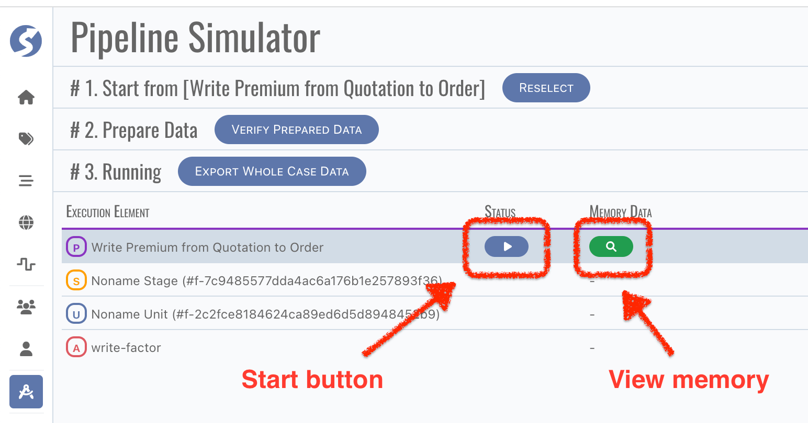
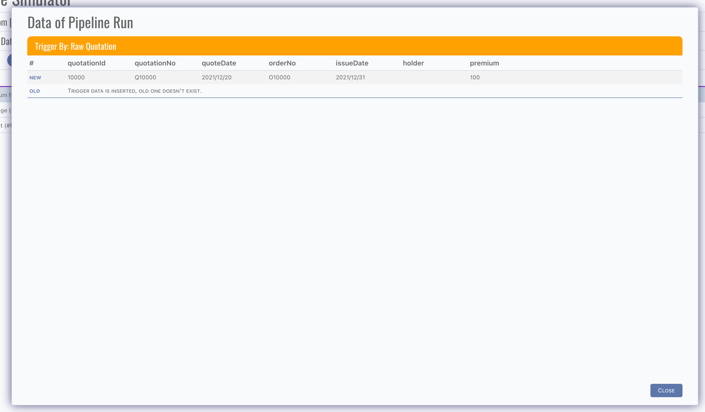
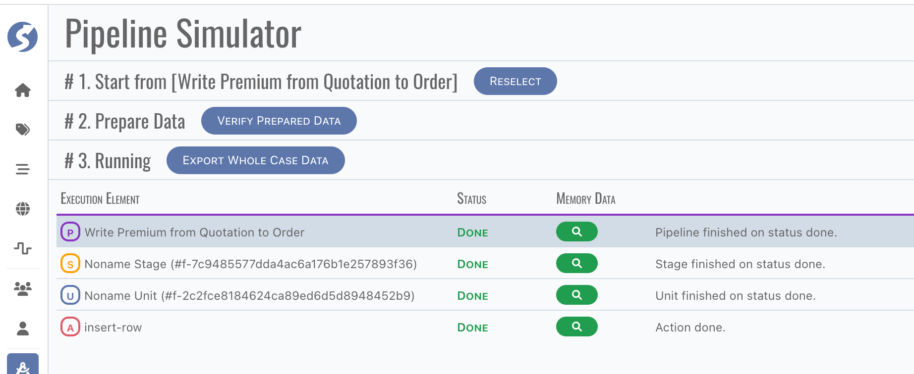
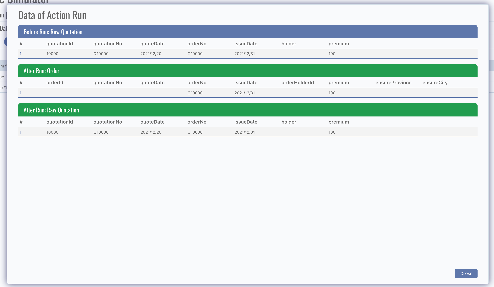

# Pipeline Simulator

Pipeline simulator is designed for verifying pipeline rapidly. It is in frontend only, implemented in Javascript. Limited by Javascript in
browser, simulator runs on single process, which is the only different with doll. Be aware of this is very important, simulator is to test
and verify the pipeline logic, not concurrency.

Now let's learn about how to test pipeline, by a very simple case in simulator. Firstly, select a pipeline where your test case starts from,

Also, test case can be started from a topic,

Click `Next` button, pipelines related are list,

Click the number button of topic, there is a dialog for topic data,

Data can be added row by row, or uploaded by file.

:::tip  
Uploaded rows are appended, don't worry about the existing rows.
:::

:::info  
Object/Array will not be split to factor in topic data preparing, simply describe theme by using `{}` or `[]`, it will be detected
automatically.
:::

Select pipelines to be tested,

In this case, we select one pipeline. You can select any pipeline you want, the only limitation is pipeline cannot be selected when previous
one is not selected.

Click `Next` button, now we are ready to run the test,

Before run the test, click `Memory Data` button to view data in-memory,

Exactly same as we defined before, now click `Play` button,

Everything seems OK, you can click the `Memory Data` button to view data in-memory,

All date changing are list in dialog.

:::tip  
Case data can be exported by click `Export Case Data`, and it can be run by CLI in your CI, we will discuss this part
in [Doll](../../doll/doll-index).
:::

:::info  
You can find more from simulator, and we highly recommend testing every pipeline by simulator before deploy them to environment.
:::
