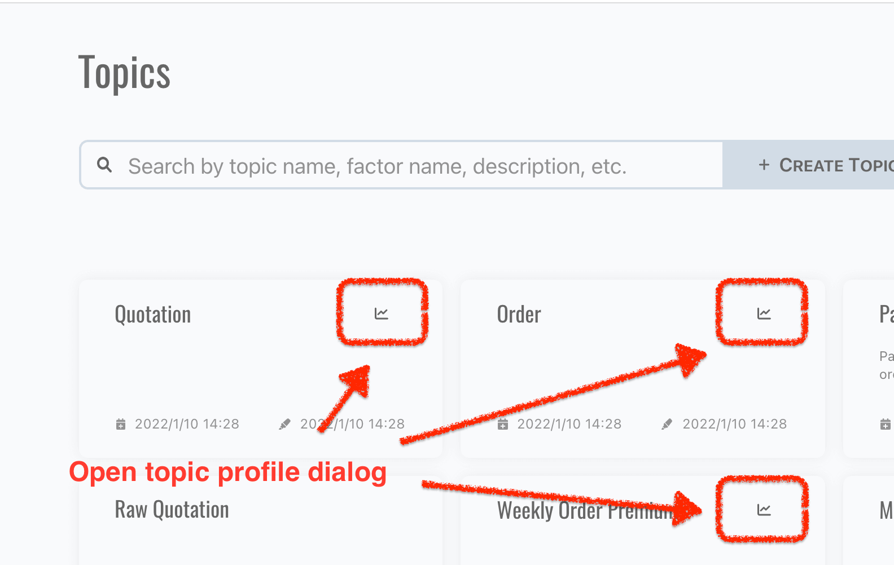
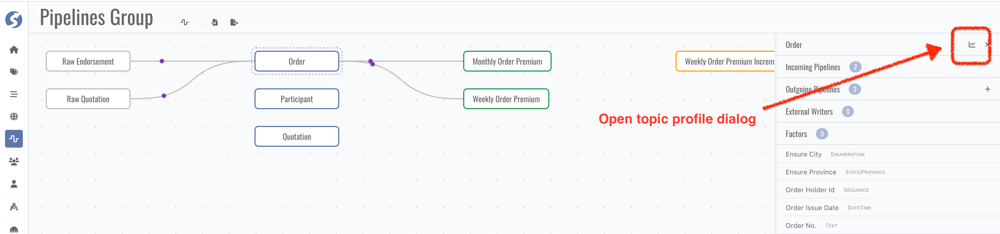
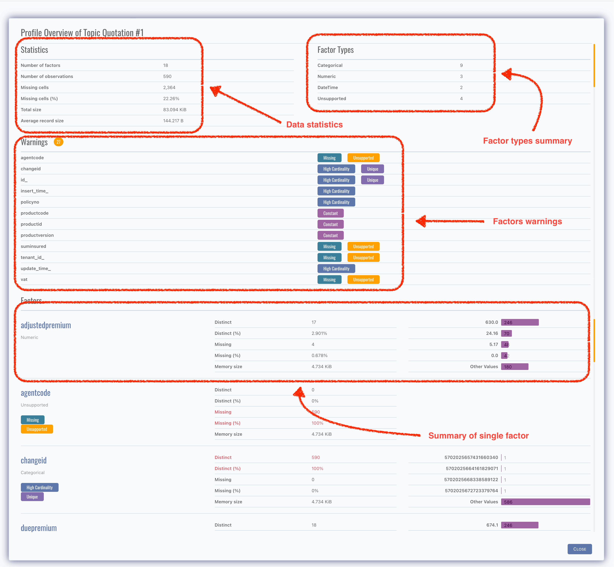

# Topic Profile

Topic data is profiled, it can be found in,

- Topic query page,

  

- And pipeline catalog page.

  

There are 4 parts of profile,

- Data statistics,
- Factor types summary,
- Factor warnings,
- Summary of each single factor.

:::info  
Topic profile is available for non-raw topics only.
:::

We use [Pandas Profiling](https://pandas-profiling.github.io/pandas-profiling/docs/master/rtd/) to analyze data and get profile,
visit [Pandas Profiling](https://pandas-profiling.github.io/pandas-profiling/docs/master/rtd/) for more details.