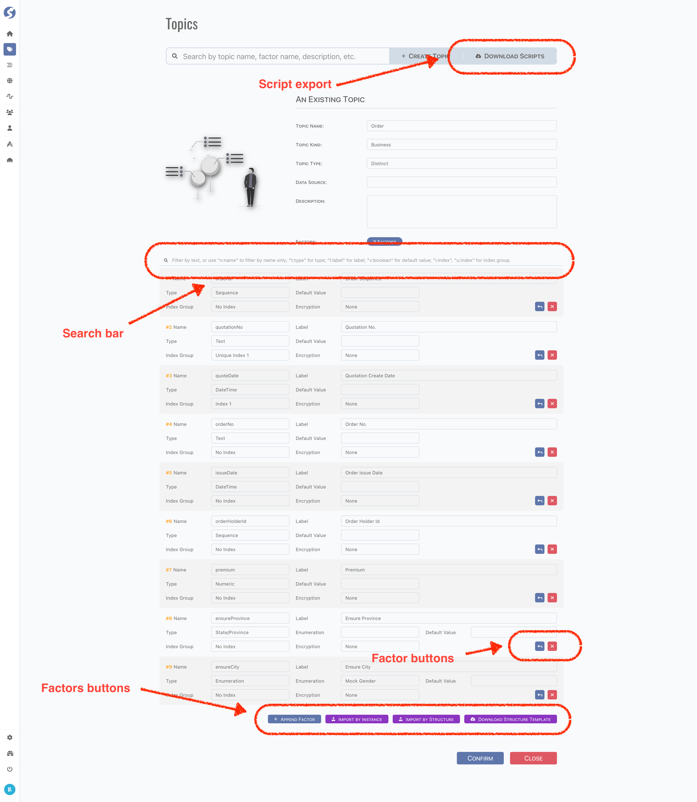
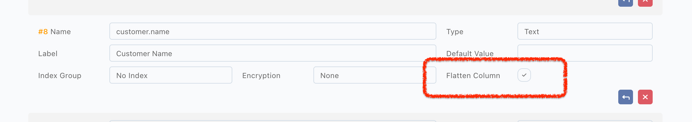
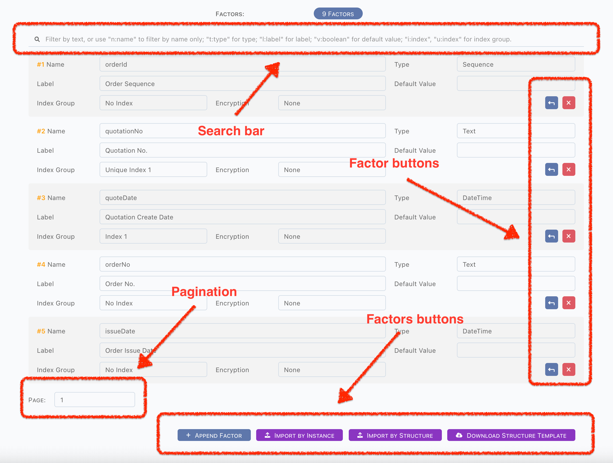
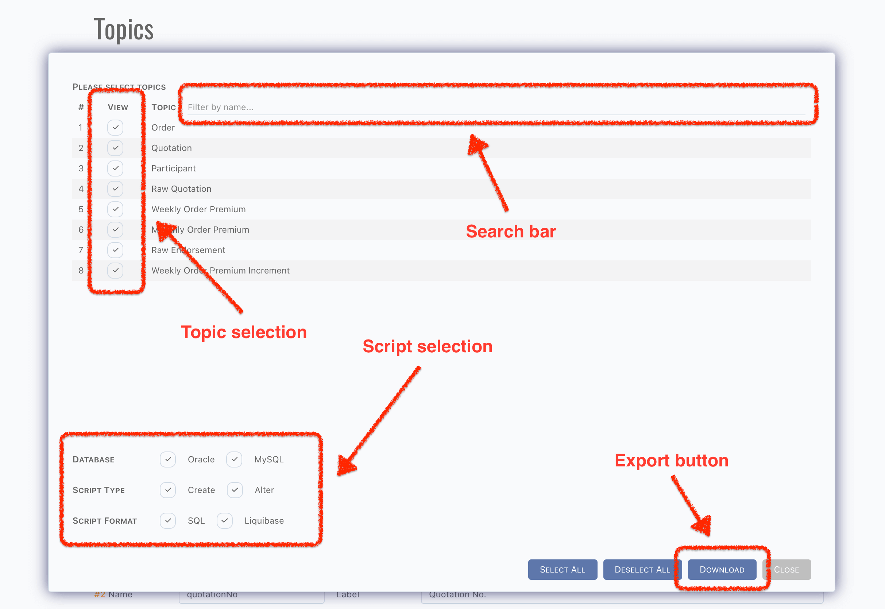

# Topic

Topic is the core concept of **_Watchmen_**,

- Is categorized by kind and type,
- Has a set of factors,
- Attached into a data source
	- In RDS, topic equates table,
	- In NoSQL, topic equates document.

And

- All data are stored in topics,
- Pipelines are run on topics,
- Subjects, datasets, reports are built based on topics.

:::tip  
Topic is available for `Admin` only.
:::

## Standard Tuple Page

Topic use [standard tuple page](../standard-tuple-page).



## Kind

There are 2 kinds of topic,

- System
- Business

For example, topics for business data are `Business`, topics for log data are `System`.

## Type

There are several types of topic.

### Raw

Raw topic is for receiving data from other systems, we use JSON format to store raw data which received via RESTful API. Raw data is
immutable, which means each request will create a new raw data record.  
In some cases, raw data needs to be searched, but as a fairly well known fact, data stored as JSON is not that easy for searching,
especially in RDS, such as Oracle and MySQL. In the latest version of Oracle and MySQL, they both provide the functions to operate JSON
objects, but we offer an easy way, which is factor in hierarchical structure of JSON object can be flattened as a single column.

For example, here is an order JSON,

```json
{
	"orderId": 10000,
	"orderNo": "N10000",
	"amount": 10000,
	"customer": {
		"name": "John Doe",
		"gender": "M"
	}
}
```

Simply tick the `Flatten Column` checkbox, a single table column is created for `customer.name`,



Now, the raw topic can be searched by simple SQL,

```sql
// assume topic name is "customer", then table name will be "TOPIC_CUSTOMER"
SELECT * FROM TOPIC_CUSTOMER WHERE CUSTOMER_NAME = 'John Doe';
```

:::tip

- Index doesn't be applied in above sample. In real world, for search performance, it should be declared,
- Dots(`.`) in factor name are replaced by underscore.

:::

### Meta

Meta topic is for those data is definition, meta, not for instance data. There are several characteristic features of metadata,

- Includes more factors instead of code-label pair in enumeration,
- Immutable or at least slowly changing,
- No writing from other topics,
- Reading by pipelines only.

Subject/dataset will be more descriptive base on a set of well-designed meta topics.

### Distinct

Distinct topic is for instance data, such as order, customer, etc. In transaction system, instance data is changed time by time, every
snapshot should be extracted and send to **_Watchmen_**, store in distinct topic. On the other hand, we also know change logs are very
important part in IT system, for some reason, typically for audit, changes are logged and persisted. From perspective of changes on
timeline, they are also can be treated as distinct data. Let's play that out with an example to make it more apparent.

- Firstly, a raw topic `RAW_ORDER`,

```json
{
	"orderId": 10000,
	"orderNo": "N10000",
	"amount": 10000,
	"customer": {
		"name": "John Doe",
		"gender": "M"
	}
}
```

- Create a distinct topic `ORDER` for instance data, a distinct row will be created when raw data received,

| OrderID | OrderNO | Amount | 
|---------|---------|--------|
| 10000   | N10000  | 10000  | 

- Create another distinct topic `ORDER_AMOUNT_CHANGES` for change logs of order amount, a change row will be created,

| ChangeID            | OrderID | OrderNO | Amount | 
|---------------------|---------|---------|--------|
| 9000000000000000000 | 10000   | N10000  | 10000  |

- Change occurred on order `N10000`, amount is changed from `10000` to `20000`,

```json {4}
{
	"orderId": 10000,
	"orderNo": "N10000",
	"amount": 20000,
	"customer": {
		"name": "John Doe",
		"gender": "M"
	}
}
```

- For topic `ORDER`, change should be merged into order record,

| OrderID | OrderNO | Amount | 
|---------|---------|--------|
| 10000   | N10000  | 20000  | 

- For topic `ORDER_AMOUNT_CHANGES`, a new record is created for change,

| ChangeID            | OrderID | OrderNO | Amount | 
|---------------------|---------|---------|--------|
| 9000000000000000000 | 10000   | N10000  | 10000  |
| 9000000000000000001 | 10000   | N10000  | 20000  |

Now we see the difference between topics `ORDER` and `ORDER_AMOUNT_CHANGES`, they describe one order from different perspectives. From
statistical experience, different perspectives will lead the different conclusions. In this case, we can analyze the consumer behavior of
how much from `ORDER`, and how often changes from `ORDER_AMOUNT_CHANGES`.

:::info  
Values of `ChangeID` are generated by built-in sequence generating function, find it on [pipeline](pipeline).
:::

### Aggregation

**_Watchmen_** offers 3 types of topics to store aggregation data.

- Aggregate
- Time
- Ratio

Types of aggregation topics are designed from the point of view of management. It is suggested to classify aggregation topics to,

- Ratio: has one computed ratio factor at least, for aggregated to a ratio, like increment, decrement, etc.,
- Time: has one time-dimension factor at least, for aggregation on time period, like annually, quarterly, monthly, etc.,
- Aggregate: except ratio and time aggregation, for aggregation on enumeration, meta, etc.

## Factor

Factors are the basic elements of a topic. According to topic stored, factor equates

- A table column when topic is a table in RDS,
- A field when topic is a document in NoSQL.

### Factor Types

**_Watchmen_** offers 50+ types for factor,

| Factor Type      | Comment                                                                          | Purpose              |
|------------------|----------------------------------------------------------------------------------|----------------------|
| Sequence         | Sequence, auto-increment                                                         |                      |
| Number           | Numeric value                                                                    |                      |
| Unsigned         | 0 & Positive numeric value                                                       |                      |
| Text             | String value                                                                     |                      |
| Boolean          | Boolean value                                                                    |                      |
| Address          | String value for address                                                         | Geo related          |
| Continent        | Predefined enumeration, for address                                              | Geo related          |
| Region           | Predefined enumeration, for address                                              | Geo related          |
| Country          | Predefined enumeration, for address                                              | Geo related          |
| Province         | Predefined enumeration, for address                                              | Geo related          |
| City             | Predefined enumeration, for address                                              | Geo related          |
| District         | Predefined enumeration, for address                                              | Geo related          |
| Road             | Predefined enumeration, for address                                              | Geo related          |
| Community        | String value                                                                     |                      |
| Floor            | Numeric value for address                                                        |                      |
| Residence type   | Predefined enumeration                                                           |                      |
| Residential area | Numeric value for house property                                                 |                      |
| Email            | String value for contact                                                         |                      |
| Phone            | String value for contact                                                         |                      |
| Mobile           | String value for contact                                                         |                      |
| Fax              | String value for contact                                                         |                      |
| Datetime         | YYYY-MM-DD HH:mm:ss                                                              | Time related         |
| Full datetime    | YYYY-MM-DD HH:mm:ss.SSS                                                          | Time related         |
| Date             | YYYY-MM-DD                                                                       | Time related         |
| Time             | HH:mm:ss                                                                         | Time related         |
| Year             | 4 digits                                                                         | Time related         |
| Half year        | 1: first half, 2: second half                                                    | Time related         |
| Quarter          | 1 - 4                                                                            | Time related         |
| Month            | 1 - 12                                                                           | Time related         |
| Half month       | 1: first half, 2: second half                                                    | Time related         |
| Ten days         | 1, 2, 3                                                                          | Time related         |
| Week of year     | 0 (the partial week that precedes the first Sunday of the year) - 53 (leap year) | Time related         |
| Week of month    | 0 (the partial week that precedes the first Sunday of the year) - 5              | Time related         |
| Half week        | 1: first half, 2: second half                                                    | Time related         |
| Day of month     | 1 - 31, according to month/year                                                  | Time related         |
| Day of week      | 1 (Sunday) - 7 (Saturday)                                                        | Time related         |
| Day kind         | 1: workday, 2: weekend, 3: holiday                                               | Time related         |
| Hour             | 0 - 23                                                                           | Time related         |
| Hour kind        | 1: work time, 2: off hours, 3: sleeping time                                     | Time related         |
| Minute           | 0 - 59                                                                           | Time related         |
| Second           | 0 - 59                                                                           | Time related         |
| Millisecond      | 0 - 999                                                                          | Time related         |
| Am pm            | 1, 2                                                                             | Time related         |
| Gender           | Predefined enumeration                                                           | Individual related   |
| Occupation       | Predefined enumeration                                                           | Individual related   |
| Date of birth    | YYYY-MM-DD                                                                       | Individual related   |
| Age              | Positive numeric value                                                           | Individual related   |
| ID No.           |                                                                                  | Individual related   |
| Religion         | Predefined enumeration                                                           | Individual related   |
| Nationality      | Predefined enumeration                                                           | Individual related   |
| Biz trade        | Predefined enumeration                                                           | Organization related |
| Biz scale        | Positive numeric value                                                           | Organization related |
| Enum             | Enumerated values, should be defined with `Enumeration`                          |                      |

:::tip  
We highly recommend defining proper type for factor. Type is more readable than name, it can be used to do something in further analysis.
:::

### Special Types for Raw Topic

There are 2 types for raw topic only,

| Factor Type | Comment | Purpose        |
|-------------|---------|----------------|
| Object      |         | Raw topic only |
| Array       |         | Raw topic only |

Because of raw topic store data exactly same as what RESTful received, which is on JSON format, therefore hierarchical structure is
necessary. These 2 types are designed to describe the object and array element. Factors in object or array element need to be declared
explicitly, use dots(`.`) to define the hierarchy.

For example, a raw topic instance data as below,

```json
{
	"orderId": 10000,
	"orderNo": "N10000",
	"amount": 20000,
	"customer": {
		"name": "John Doe",
		"gender": "M",
		"contact": {
			"mobile": "87654321",
			"fax": "12345678"
		},
		"addresses": [
			{
				"city": "New York",
				"district": "Brooklyn",
				"line1": "26 W. Talbot Avenue",
				"line2": ""
			},
			{
				"city": "New York",
				"district": "South Richmond Hill",
				"line1": "7727 Stonybrook St."
			}
		]
	}
}
```

Factors should be defined as below,

| Name                        | Type     | Flatten | Index |
|-----------------------------|----------|:-------:|:-----:|
| orderId                     | Sequence |    ✅    |   ✅   |
| orderNo                     | Text     |    ✅    |   ✅   |
| amount                      | Unsigned |         |       |
| customer                    | Object   |         |       |
| customer.name               | Text     |    ✅    |   ✅   |
| customer.gender             | Gender   |         |       |
| customer.contact            | Object   |         |       |
| customer.contact.mobile     | Mobile   |    ✅    |   ✅   |
| customer.contact.fax        | Fax      |         |       |
| customer.addresses          | Array    |         |       |
| customer.addresses.city     | City     |         |       |
| customer.addresses.district | District |         |       |
| customer.addresses.line1    | Text     |         |       |
| customer.addresses.line2    | Text     |         |       |

:::tip  
Typically, a factor should be indexed when it is flattened.
:::

:::caution  
Factors belong to an array cannot be flattened and indexed.
:::

### Encryption

For security reason, factor can be encrypted. There are several encryption methods built-in,

- AES256 PKCS5 PADDING: reversible,
- MD5: one-way,
- SHA256: one-way,
- MASK MAIL: mask mail,
- MASK CENTER 3: mask 3 characters in the middle,
- MASK CENTER 5: mask 5 characters in the middle,
- MASK LAST 3: mask 3 characters at the end,
- MASK LAST 6: mask 6 characters at the end,
- MASK DAY: mask day in time type,
- MASK MONTH: mask month in time type,
- MASK MONTH DAY: mask month and day in time type.

### Default Value

Default value can be set on factor.

:::caution  
Type of default value will not be validated, keep it compatible with factor type.
:::

### Index & Unique Index

In raw topic, flattened factor should be indexed for searching purpose. For other types of topics, if factor will be used in pipelines as
criteria, and topic is stored in RDS, never forget the index, it improves query performance by avoiding a full table scan.

**_Watchmen_** offers 10 index groups per topic, factors sharing the same index group will be created as a composite index. Use unique index
group instead when instance data of factor are unique, **_Watchmen_** also offers 10 unique index groups per topic. How to group index
depends on the query criteria in pipelines, it is similar with RDS index.

:::caution  
`Sequence` type might be not unique in topic, such as a `orderId` in `ORDER_AMOUNT_CHANGES`, it is a `Sequence`, but not unique.
:::

### Enumeration

When a factor is defined as a `Enum`, relationship with `Enumeration` should be defined as well, system know the range of values by this. It
is important for UI rendering, and also is important for monitoring in `DQC`.

:::info  
See [Enumeration](enumeration) and [DQC](../dqc/dqc-wb-index) for more information.  
:::

### Label & Description

Label is for human reading on UI rendering, description is for more details on system maintaining.

### Factor Operations



#### Search

A search bar is on above, factors will be filtered according to searching text.

- A text: try to match name and label of factor,
- `n:name`: match name only, such as `n:order`,
- `l:label`: match label only, such as `l:seq`,
- `t:type`: match type only, such as `t:text`,
- `i:index`: match index only, such as `i:1`,
- `u:index`: match unique index only, such as `u:1`,
- `v:value`: match default value only,
	- List factors which have default value when `v:true`,
	- List factors which have no default value when it is not `v:true`, for short `v:` also works,
- `e:enum`: match enumerated factors only,
	- List factors which have enumeration when `e:true`,
	- List factors which have no enumeration when it is not `e:true`, for short `e:` also works,
	- Only effective on enumeration factors,
- `f:flatten`: match flattened factors only,
	- List factors which are flattened when `f:true`,
	- List factors which are not flattened when it is not `f:true`, for short `f:` also works,
	- Only effective on raw topic,
- `c:crypt`: match encrypted factors only,
	- List factors which are encrypted when `c:true`,
	- List factors which are not encrypted when it is not `c:true`, for short `c:` also works.

#### Pagination

Factor list is pagination, there are 50 factors per page, switching by pagination dropdown.

:::info  
Pagination is under filter.
:::

#### Add & Delete

Factors are sorted exactly by where they were added, normally it is not a problem, but in sometimes, new factor would be inserted before
existing. Use `Prepend Factor` button in factor buttons to insert factor, or use `Append Factor` button in factors buttons to append factor
at the end.

:::info  
Page will be switched automatically when the appended factor is in next page.
:::

:::caution  
DO NOT prepend/append factor when a filter is applied, new factor might be invisible because it is filtered by search text.
:::

Delete factor by `Delete Factor` in factor buttons.

:::caution  
Deletion cannot be recovered, must be re-added again. Be careful on this.
:::

### Import

Factors can be imported by file, there are several ways to import factors,

- By structure file,
	- TXT or CSV,
	- JSON
- By instance data file,
	- JSON

:::caution Factors will be replaced by imported.
:::

#### Structure

A structure template zip can be downloaded by `Download Structure Template` button.

Files in zip as below,

```
zip root/
├── factor-template.csv
└── factor-template.json
```

Modify the template file simply following guide inside, and import by `Import By Structure` button.

#### Instance Data

For easy to import, instance data file is also supported. A json file including data can be imported and factors are detected automatically.
Make sure data in file is an object array, including the sampling data items. Importer detects factors by following rules:

- First type is better. Using the first detected type, or raise conflict exception,
	- `Text` is compatible with any types excepts `Object`/`Array`,
	- All null values should be detected as `Text`,
- Datetime type first for text value,
	- 23 digits for `Full Datetime`,
	- 19 digits for `DateTime`,
	- 10 digits for `Date`,
	- 8 digits for `Time`,
- `Object`/`Array` is only for raw topic, let topic be raw type before importing.

For example,

```json5
[
	{
		"orderId": 10000,                                   // number detected
		"orderNo": "N10000",                                // text detected
		"amount": null,                                     // null value, suspended for now,
		"enabled": true,                                    // boolean detected
		"customer": {                                       // object detected
			"name": "John Doe",
			"gender": "M",                                  // text detected, not gender
			"contact": {
				"mobile": "87654321",
				"fax": "12345678"
			},
			"addresses": [
				{
					"city": "New York",
					"district": "Brooklyn",
					"line1": "26 W. Talbot Avenue",
					"line2": ""
				},
				null,                                       // ignored when not an object in array
				10000                                       // ignored when not an object in array
			]
		}
	},
	{
		"orderId": "10001",                                 // incorrect, detected as number in first item
		"orderNo": 10001,                                   // correct, text is compatible with number
		"amount": null,                                     // all values are null, detected as text     
		"enabled": null,                                    // null, is compatible with boolean
	}
]
```

## Scripts

Check supported script types by following table,

| Script Purpose | Oracle SQL Script | Oracle Liquibase | MySQL SQL Script | MySQL Liquibase |
|:---------------|:-----------------:|:----------------:|:----------------:|:---------------:|
| Creation       |         ✅         |        ✅         |        ✅         |        ✅        |
| Alteration     |         ✅         |        ✅         |        ✅         |        ✅        |

### How to Export Scripts



- Click `Download Scripts` button,
- Pick topics which need to be exported,
- Pick database types,
- Pick script purposes,
- Pick script formats,
- Click `Download` button.

A zip file is exported. If all checkbox are ticked, folders should be as below,

```
zip root/
├── liquibase
│   └── order.xml
├── oracle
│   ├── alteration
│   │   └── order.sql
│   └── creation
│       └── order.sql
└── mysql
    ├── alteration
    │   └── order.sql
    └── creation
        └── order.sql
```

- Liquibase scripts are combined in one file,
- SQL scripts are separated in different folders.

### How Script Works

#### For Creation

- Table creation will be ignored on liquibase script, but this will not be checked on SQL script,
- SQL for drop table is commented in script file, uncomment it if you need,  
  Note drop table will drop all instance data also,
- Mandatory columns will be created automatically,
- PK column: `id_`,
- Aggregation column: `aggregate_assist_`,
- Version column: `version_`,
- Data zone column: `tenant_id_`,
- Time audit columns: `insert_time_` and `update_time_`,
- Raw data column: `data_`, available for raw topic only,
- Primary key will be created automatically on PK column,
- Indexes will be created automatically,
- On data zone column,
- On time audit columns,
- On indexed factors,
- Unique indexes on factors which appointed,
- this part is shared between liquibase creation and alteration.

#### For Alteration

Alteration is very similar with creation, except columns will be

- Added when not existed,
- Modified when existed.

:::tip  
Read comments in script files for more details about how to choose, modify and execute them.  
:::

:::danger Be very careful on execution of scripts.  
Scripts exported are base version generated by frontend, we have no idea with what exactly is the structure of target data source.  
Therefore, we highly recommend review all script files, modify them to what you need, store and maintain versions by some version control
tool, such as GIT.
:::

## Form Validation

- Topic Name: required,
- Must follow the standard of data source type. For example, in oracle, topic equates a `Table`,
- Snake case or camel case is allowed,
- Topic Kind: required,
- Topic Type: required,
- Data Source: required,
- Description: optional,
- Factors: at least one factor is required,
- Name: required,
- Label: optional. Highly recommend filling it with a human reading text,
- Type: required,
- Default Value: optional,
- Index Group: optional,
- Encryption: optional,
- Enumeration: required when a factor is an enumeration,
- Flatten Column: required when topic is raw and factor name contains at least one dot(`.`).

## Model

Find topic model **[here](../../tuples/topic)**.

