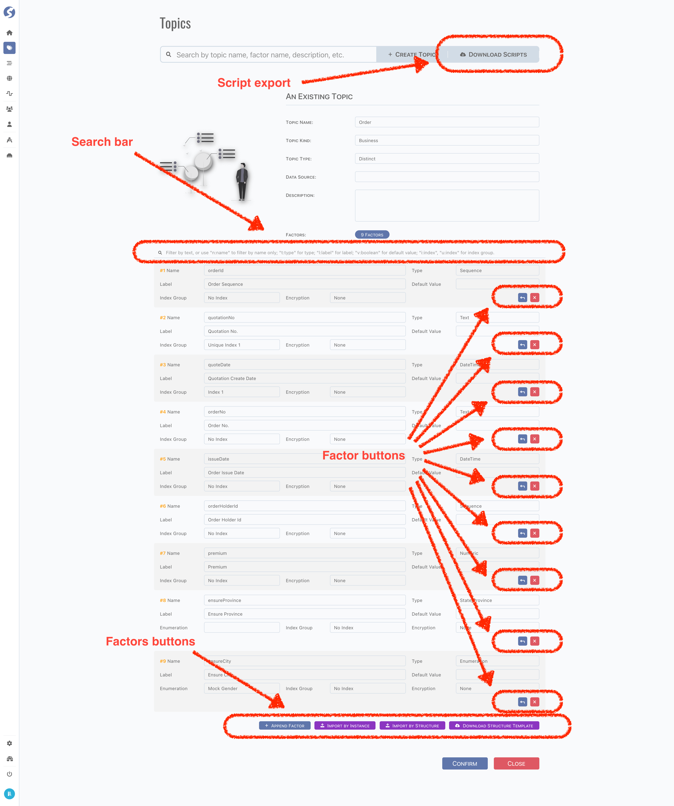

# Topic

Topic is the core concept of **_Watchmen_**,

- Is categorized by kind and type,
- Has a set of factors,
- Attached into a data source.

And

- All data are stored in topics,
- Pipelines run on topics,
- Subjects, datasets, reports are built based on topics.

:::tip  
Topic is available for `Admin` only.
:::

## Standard Tuple Page

Topic use [standard tuple page](../standard-tuple-page).



## Kind

There are 2 kinds of topic,

- System
- Business

For example, topics for business data are `Business`, topics for analysis of monitor logs are `System`.

## Type

There are several types of topic.

### Raw

### Meta

### Distinct

### Aggregation

- Aggregate
- Time
- Ratio

## Factor

## Scripts

Check supported script types by following table,

| Script Purpose | Oracle SQL Script  |  Oracle Liquibase  |  MySQL SQL Script  | MySQL Liquibase |
|:---------------|:------------------:|:------------------:|:------------------:|:------------------:|
| Creation       | ✅ | ✅ | ✅ | ✅ |
| Alteration     | ✅ | ✅ | ✅ | ✅ |

### How to Export Scripts


- Click `Download Scripts` button,
- Pick topics which need to be exported,
- Pick database types,
- Pick script purposes,
- Pick script formats,
- Click `Download` button.

A zip file is exported. If all checkbox are ticked, folders should be as below,

```
zip root/
├── liquibase
│   └── order.xml
├── oracle
│   ├── alteration
│   │   └── order.sql
│   └── creation
│       └── order.sql
└── mysql
    ├── alteration
    │   └── order.sql
    └── creation
        └── order.sql
```

- Liquibase scripts are combined in one file,
- SQL scripts are separated in different folders.

### How Script Works

#### For Creation

- Table creation will be ignored on liquibase script, but this will not be checked on SQL script,
- SQL for drop table is commented in script file, uncomment it if you need,  
  Note drop table will drop all instance data also,
- Mandatory columns will be created automatically,
	- PK column: `id_`,
	- Aggregation column: `aggregate_assist_`,
	- Version column: `version_`,
	- Data zone column: `tenant_id_`,
	- Time audit columns: `insert_time_` and `update_time_`,
	- Raw data column: `data_`, only when raw topic,
- Primary key will be created automatically on PK column,
- Indexes will be created automatically,
	- On data zone column,
	- On time audit columns,
	- On indexed factors,
	- Unique indexes on factors which appointed,
	- this part is shared between liquibase creation and alteration.

#### For Alteration

Alteration is very similar with creation, except columns will be

- Added when not existed,
- Modified when existed.

:::tip  
Read comments in script files for more details about how to choose, modify and execute them.  
:::

:::danger Be very careful on execution of scripts.  
Scripts exported are base version generated by frontend, we have no idea with what the structure of target data source is exactly.  
Thus, we highly recommended going through the script files, modify them to what you need, store and maintain versions by some version
control tool, such as GIT.
:::

## Form Validation

- Topic Name: required,
	- Must follow the standard of data source type. For example, in oracle, topic equates a `Table`,
	- Snake case or camel case is allowed,
- Topic Kind: required,
- Topic Type: required,
- Data Source: required,
- Description: optional,
- Factors: at least one factor is required,
	- Name: required,
	- Label: optional. Highly recommend filling it with a human reading text,
	- Type: required,
	- Default Value: optional,
	- Index Group: optional,
	- Encryption: optional,
	- Enumeration: required when a factor is an enumeration,
	- Flatten Column: required when topic is raw and factor name contains at least one dot(`.`).

## Model

Find topic model **[here](../../tuples/topic)**.

