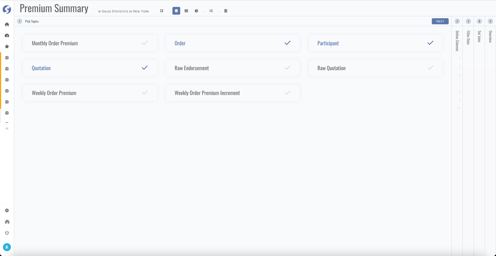
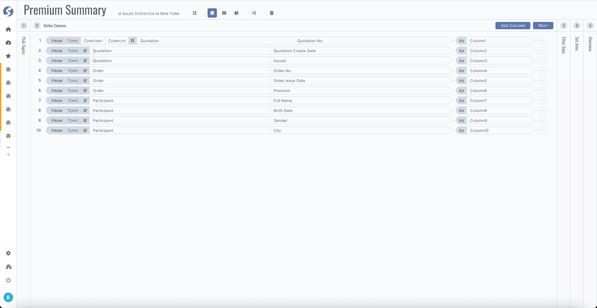
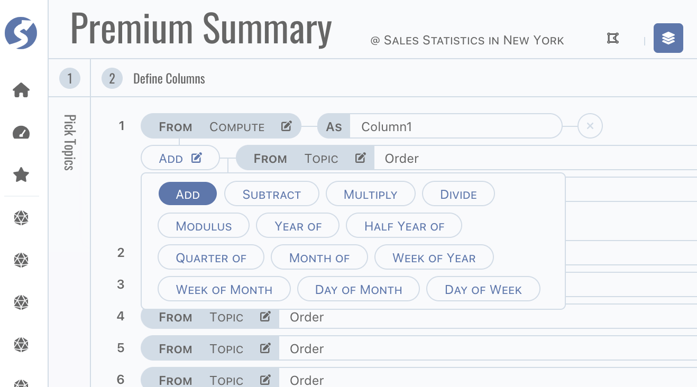
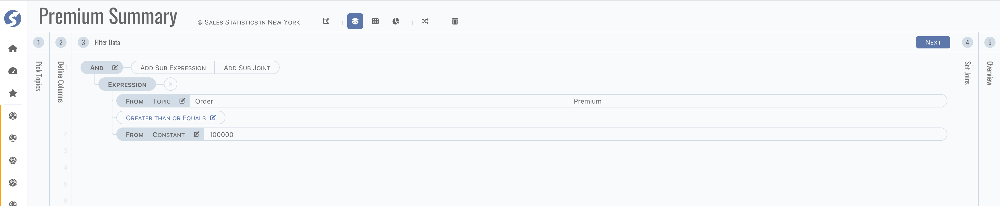
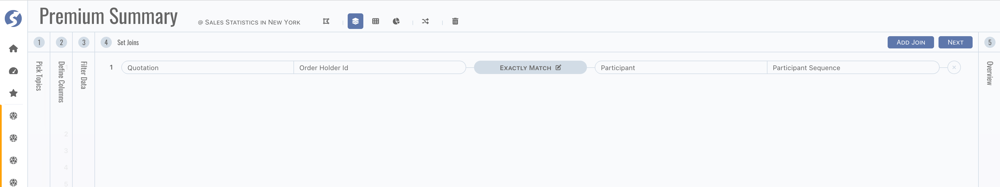
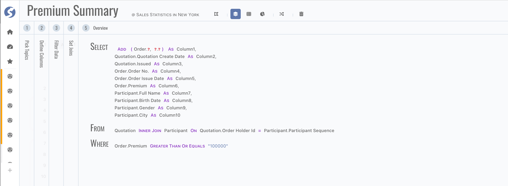
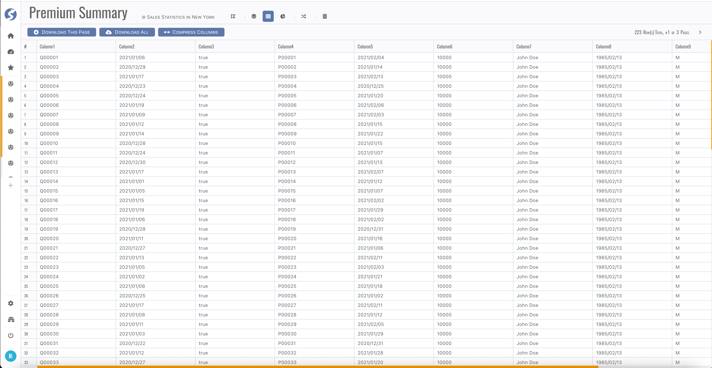
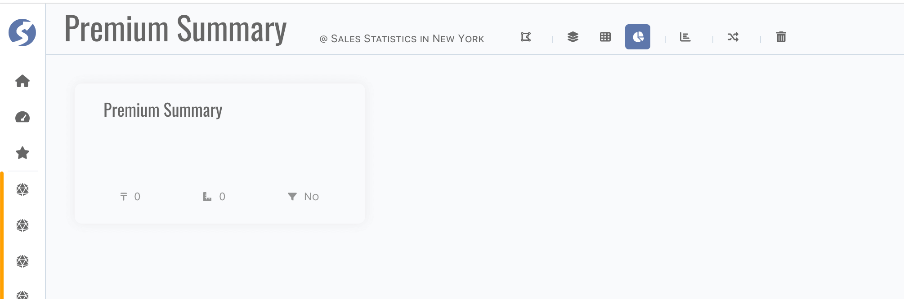

# Subject

Subject is the base of data analysis on certain perspective, let's follow this chapter to build a subject.

## Structure

Firstly, define structure of subject. Topics included in connected-space are available here, simply follow the wizard,

- Step 1, pick topics,

  

- Step 2, define columns,

  

  Column can be from a topic directly, or a constant value, or computed by functions. There are several functions are supported here,

  

  :::tip  
  Give a friendly name to each column.
  :::

- Step 3, define filters,

  

  :::tip  
  Filters are applied for each report in this subject.
  :::

- Step 4, define joins when two or more topics included,

  

  :::tip  
  Joins are not needed when only one topic is used in subject.
  :::

  Depending on type of join, data searched out contains
	- Intersection of both sides when it is `Exactly Match`,
	- Left side and right side in intersection when `Left Side Prioritized`,
	- Right side and left side in intersection when `Right Side Prioritized`.

- Finally, view definition dsl,

  

  :::tip  
  Red question mark means something incorrect.
  :::

## Dataset

After structure defined, move to dataset page,

It is a pagination grid, page switcher is on top-right corner. Check data, make sure they are what you imaged.

:::info  
There is a count limitation for download all data, check [Doll](../../doll/doll-index) for more details.
:::

:::tip  
Columns can be resized, sorted, drag-and-dropped and locked to left.
:::

## Reports

Everything is OK now, let's goto reports page,

