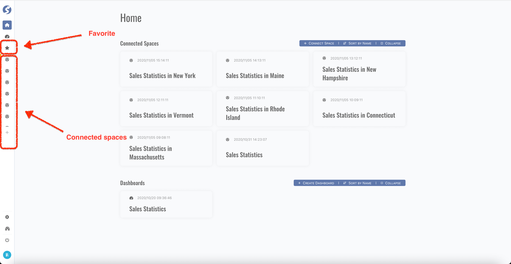
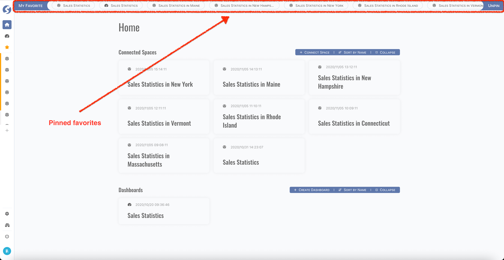
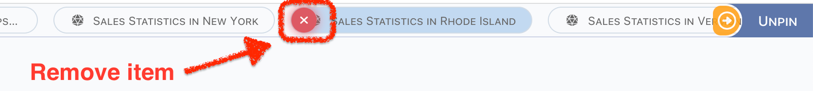
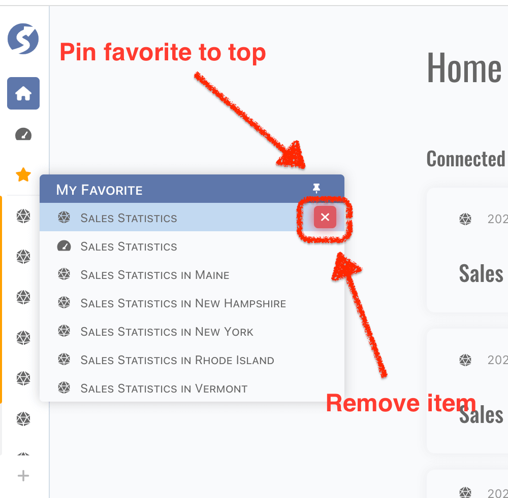

# Console Workbench

Console workbench is for business user to surf the data which are organized by space. Basically, console have two parts, one is connected
space/subject/report, the other is dashboard. In this chapter, we will learn how to use it step by step.

If you are a business user, the first page after you signed in will be as below,

The connected-spaces are listed at menu bar, simply click it to open.

## Favorites

Connected-spaces and dashboards can be collected to favorite, they can be pinned to the top of page,

In this favorite bar, you can

- Click item to open,
- Mouse hover item, click red button to remove,
- Click yellow arrow to find more items,
- Click `Unpin` button to remove the favorite bar from page.

Also, click the favorite menu in menu bar when top favorite bar is not pinned, the following also can do the same thing as it at top,

:::info  
Top favorite bar is for every page in console workbench.
:::