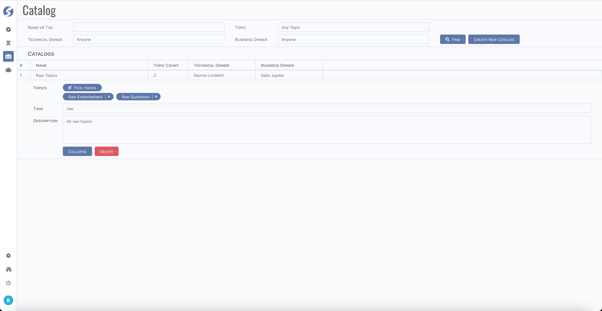

# Catalog

Tuples must be well-organized, thus, we categorize topics by kinds and types, factors by types, create enumeration to save code tables, etc.
But besides all of it, ownership of each tuple is very important, especially it reaches a certain number.

:::info  
Catalog is available for `Admin` only.
:::

## Page

Find or create catalog by criteria.

Click row to edit details.

- Change name by click name cell,
- Change technical and business owner,
- Pick topics which belong to this catalog,
- Add tags (split by whitespace),
- Add description for this catalog.

:::info  
Currently, we haven't offered many features on catalog, but that's an important part of management. We will keep developing in next
versions, check our [blog](/blog) for updating please.
:::