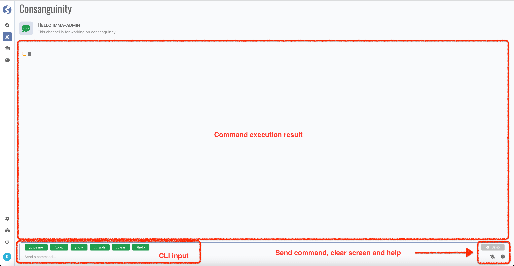
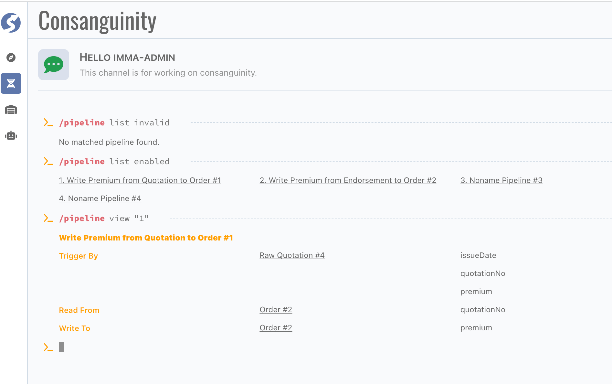
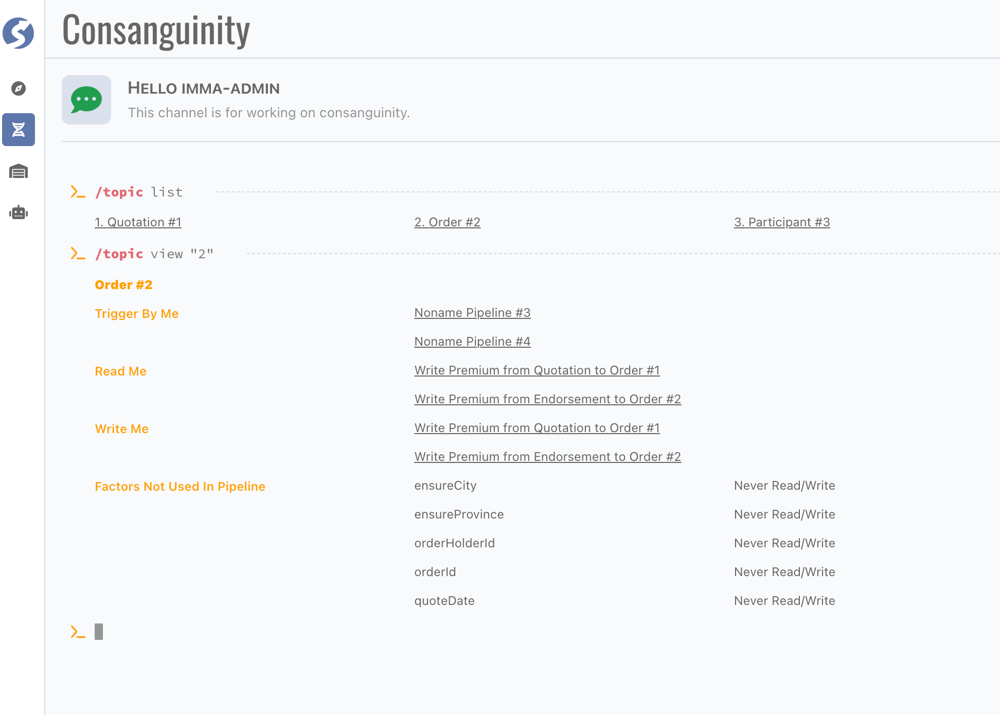
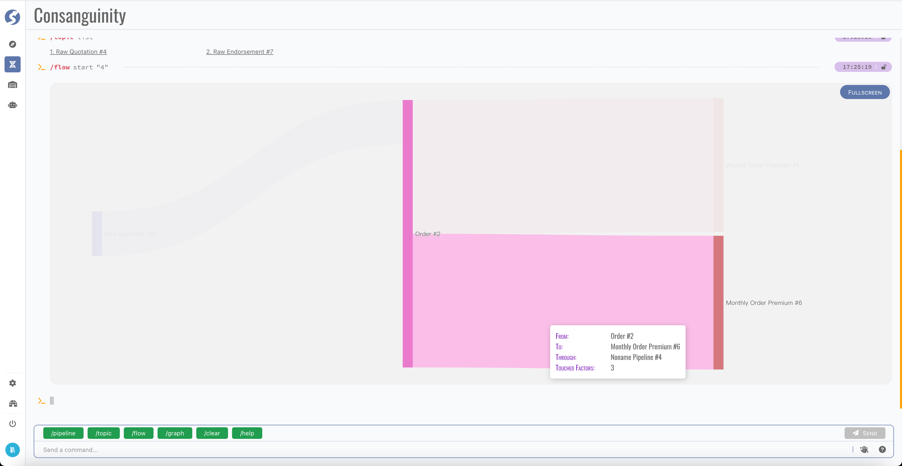
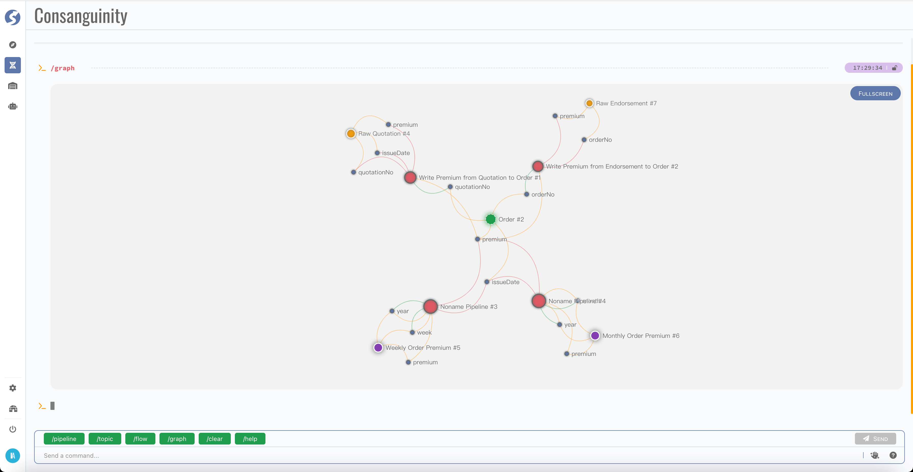
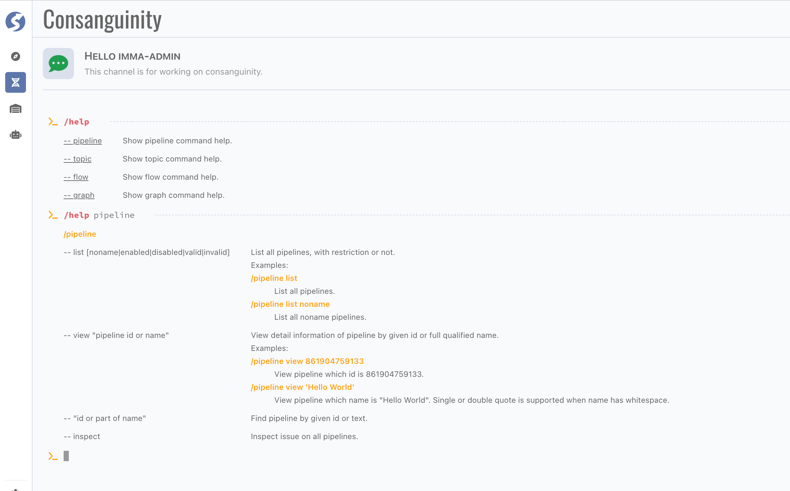

# Consanguinity

Consanguinity is for find relationships between tuples. This page is designed as a cli window, because we think it is more effective than
traditional GUI.

:::info  
Consanguinity is available for `Admin` only.
:::

## Page

There are 3 parts of page,

- Command line input (CLI),
- Shortcut buttons,
- Command execution result area.

### Pipeline

You can list and view pipeline for overview,

We don't care about the detail logic here, just for get usages of topic and factor in pipeline.

:::tip  
It's useful with command option `--inspect`, try it by yourself.
:::

### Topic

Same as on pipeline, here is the overview of topic,

:::tip  
We can discover the factors not used anywhere.
:::

### Flow

Also, we can find and review the flow,

The key information of flow also can be discovered when mouse hover it.

### Graphic

There are 2 types of graphics offered, on topic level,

And on factor level,

## CLI Help

Usages of commands can be found in help command, click `Help` button or key in `/help` for more details.

