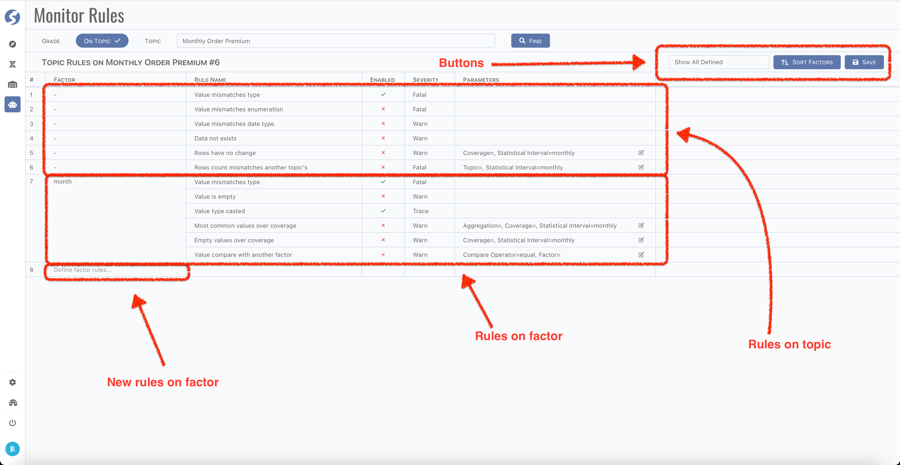

# Define Monitor Rules

There are a set of monitor rules built-in, before introducing what they monitored, let's have a look on how to attach them onto topic and
factor.

## Page

Open monitor rules page, pick a topic and click `Find` button, monitor rules defined will be shown,

:::tip  
There might be too many factors, you can focus on rules on one factor or topic level only by filter them.
:::

There are 2 parts of rules, one is on topic level only, another is on factor; and for each factor, it has its own rules. Factor with no rule
will not be shown at the first place, pick it from `Define factor rules...` cell, then all rules suited for picked factor will be added into
grid.

All rules are disabled by first, it needs to be enabled, and set the severity.

:::info  
Severity of rule is designed for alarming, we have no default implementation for reporting yet. To integrate with your own alarming servers,
find more details **[here](../../dqc/dqc-index)**.
:::

Some rules need parameters, click edit cell to pass the parameter values.

:::caution  
Monitor rule will not change the behavior of runtime. It monitors data to find where needs to be focused on, and report them.
:::

## Topic Level Rules

### RAW_MISMATCH_STRUCTURE

Instance data cannot match the structure of definition.

:::info  
Only available on raw topic.
:::

### FACTOR_MISMATCH_TYPE

Factor value cannot match the type of definition. Monitors every factor when it is declared on topic level.

### FACTOR_MISMATCH_ENUM

Factor value cannot match the enumeration value of definition. Monitors every `enum` factor when it is declared on topic level.

### FACTOR_MISMATCH_DATE_TYPE

Factor value cannot match the date type of definition. Monitors every date factor when it is declared on topic level.

Factor types monitored by this rule as below,

- Date,
- Datetime,
- Full datetime,
- Time,
- Date of birth.

### ROWS_NOT_EXISTS

No data in topic.

### ROWS_NO_CHANGE

Data changes of topic detected in a particular period cannot meet the given coverage. There are 2 parameters,

- Coverage rate,
- Statistical interval.

### ROWS_COUNT_MISMATCH_AND_ANOTHER

Row count of topic cannot match the given another one's. There are 2 parameters,

- Another topic,
- Statistical interval.

:::info  
Only available on non-raw topic.
:::

## Factor Level Rules

### FACTOR_MISMATCH_TYPE

### FACTOR_MISMATCH_ENUM

### FACTOR_MISMATCH_DATE_TYPE

### FACTOR_IS_EMPTY

### FACTOR_USE_CAST

### FACTOR_COMMON_VALUE_OVER_COVERAGE

### FACTOR_EMPTY_OVER_COVERAGE

### FACTOR_BREAKS_MONOTONE_INCREASING

### FACTOR_BREAKS_MONOTONE_DECREASING

### FACTOR_NOT_IN_RANGE

### FACTOR_MAX_NOT_IN_RANGE

### FACTOR_MIN_NOT_IN_RANGE

### FACTOR_AVG_NOT_IN_RANGE

### FACTOR_MEDIAN_NOT_IN_RANGE

### FACTOR_QUANTILE_NOT_IN_RANGE

### FACTOR_STDEV_NOT_IN_RANGE

### FACTOR_COMMON_VALUE_NOT_IN_RANGE

### FACTOR_IS_BLANK

### FACTOR_STRING_LENGTH_MISMATCH

### FACTOR_STRING_LENGTH_NOT_IN_RANGE

### FACTOR_MATCH_REGEXP

### FACTOR_MISMATCH_REGEXP

### FACTOR_AND_ANOTHER

## Statistical Interval

Statistical interval means the frequency of data scanning. There are 3 interval types,

- Daily,
- Weekly,
- Monthly.

They all start at the end of previous cycle.