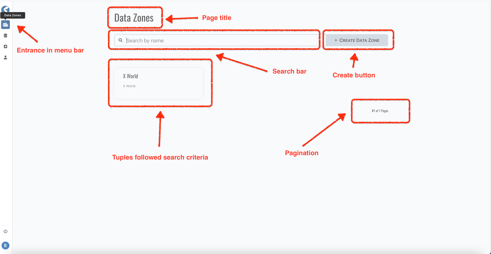
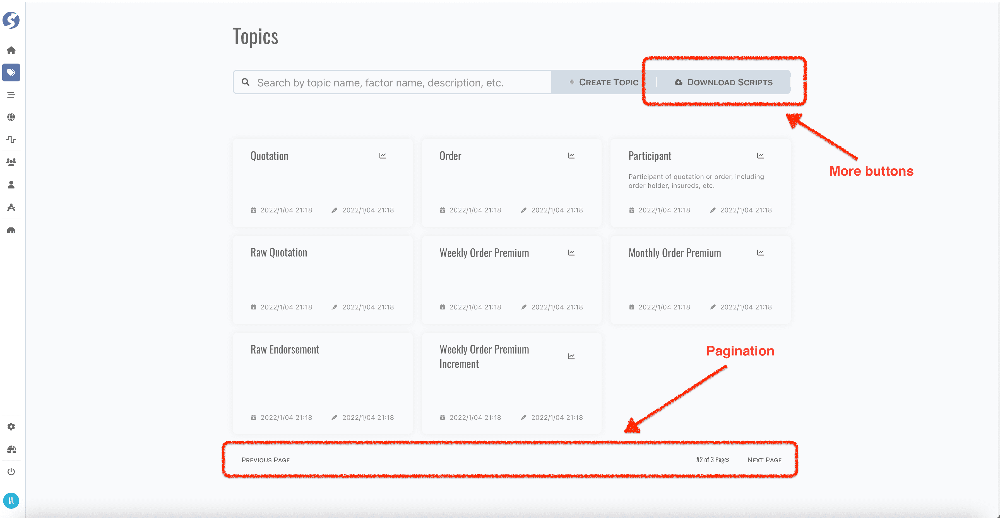
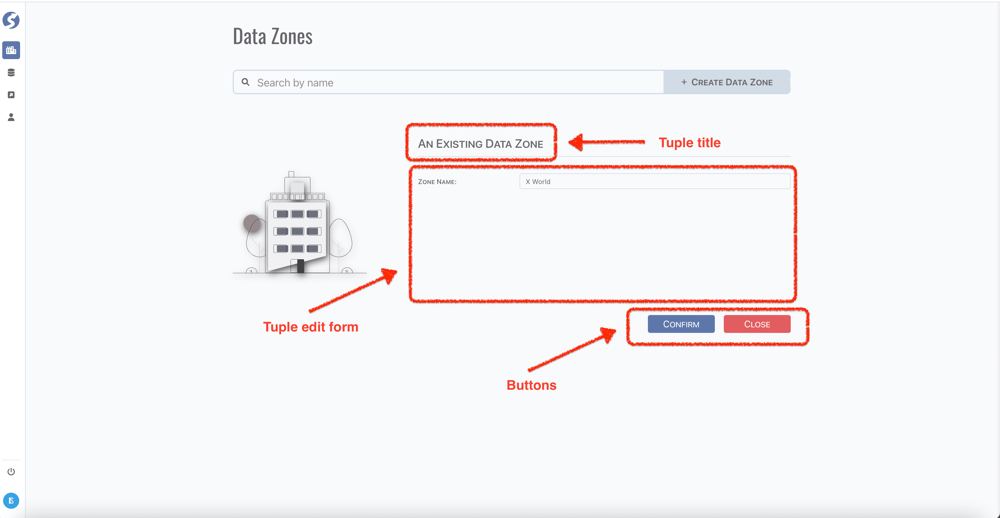
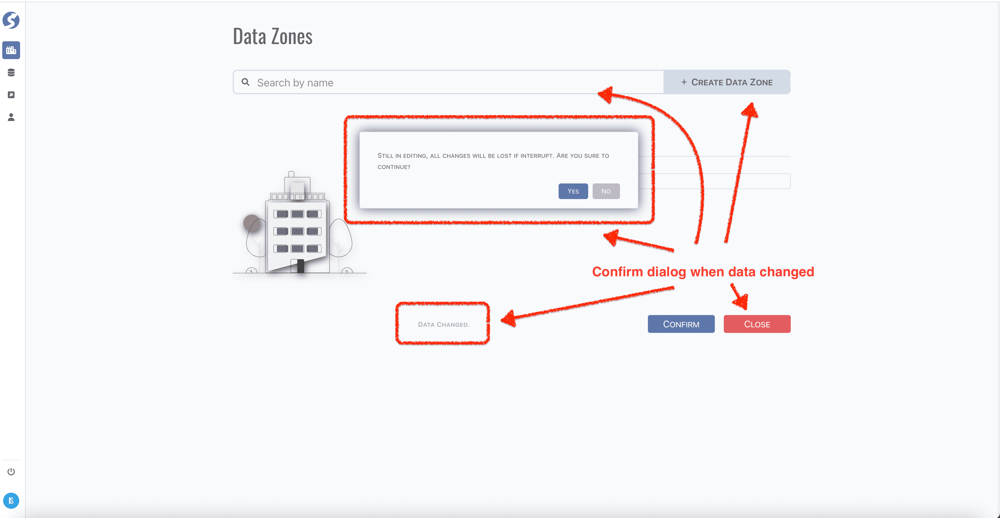
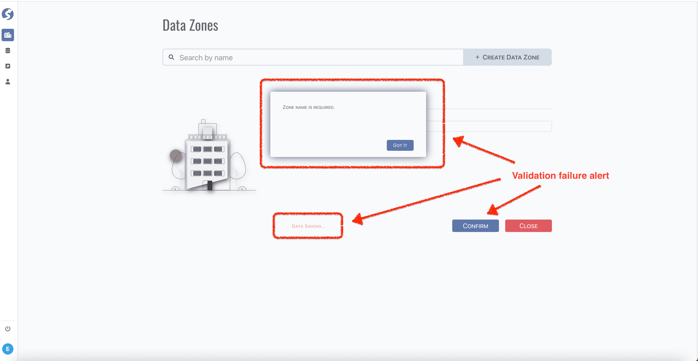
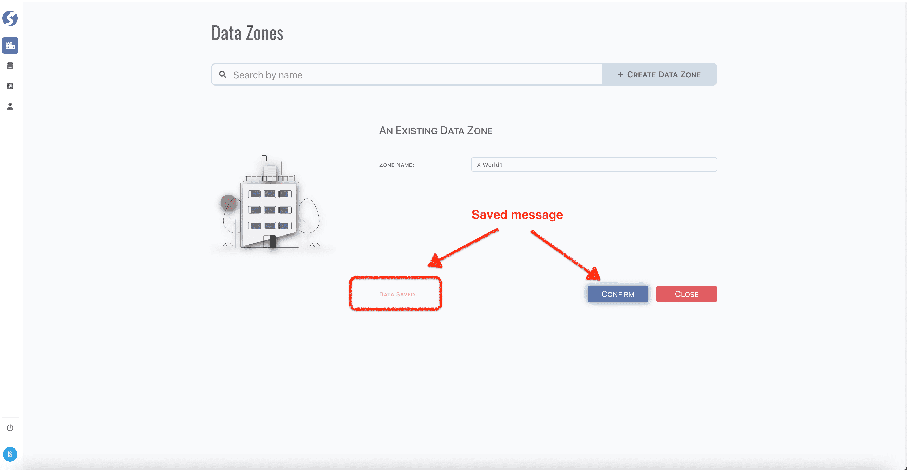

# Standard Tuple Page

In **_Watchmen_**, definition objects are called as `Tuple`,

- [Data Zone](admin/data-zone)
- [Data Source](admin/data-source)
- [External Writer](admin/external-writer)
- [User Group](admin/user-group)
- [User](admin/user)
- [Topic](admin/topic)
- [Enumeration](admin/enumeration)
- [Pipeline](admin/pipeline)
- [Space](admin/space)

They all following the same interface `Tuple`, you can find the whole list and base model **[here](../tuples/tuples-index)**.  
Most of them are using standard tuple page for finding, editing and creating.

## Query

Click entrance menu in menu bar,

There are 5 parts in this page,

- Page title,
- Search bar, key in search keyword and press enter to fire a search,
- Buttons, typically contains a `create` button,
- Tuples searched out by given criteria,
- Pagination.

:::tip  
9 cards per page.
:::

In multiple pages,

- Using `Previous page` and `Next page` to switch page,
- Sometimes there are special buttons.

## Edit/Create

Click `create` button to create new tuple, or click tuple card to edit existing tuple.

- Create

  

- Edit

  

Generally, forms are same on creating and editing.

:::tip  
Note the title of tuple form, they are different when do creating or editing.
:::

### Confirm Dialog on Query or Switch Tuple

A confirm dialog pops up on fire a new query or create a new tuple when current form data is changed,

### Alert Dialog on Form Data Validation

An alert dialog pops up when failed on form data validation,

### Tuple Saved 
A saved message will be shown about 5 seconds with an animation,

## Exception Case
:::caution    
Page for `Pipeline` is not a standard page, **[here](admin/pipeline)** for learn more.
:::