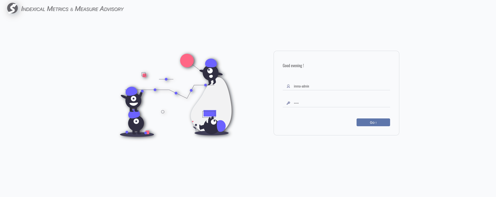

# Overview

**_Watchmen_** Web Client is a browser based client, built on [CRA](https://create-react-app.dev/).

:::tip We highly recommend using the latest version of Google Chrome to have the best experience.
:::

## Roles

There are 3 roles,

- Super Admin
- Admin
- Business User

Role-based authorization is built-in.

## Login

First, open web client in browser, and login,

:::tip Ask an account from your administrator if you don't have one yet.
:::

After login successfully, web client redirects to workbench homepage automatically according to the role of your account.

## Workbenches

**_Watchmen_** web client provides multiple workbenches for different roles,

- [Admin Workbench](admin/workbench-index.md) for IT developers,
- [Console Workbench](console/workbench-index.md) for business users,
- [DQC Workbench](dqc/workbench-index.md) for IT maintainers.

In **_Watchmen_**, IT developers and maintainers are treated as administrators. Typically, it's recommend that maintainers also acquire
basic knowledge of the topics and pipelines which are developed by developers, it's helpful on monitoring, finding and locating problems.
Therefore, if you are an IT, let's start from [Admin Workbench](admin/workbench-index.md), or starts
from [Console Workbench](console/workbench-index.md) if you are a business user.
