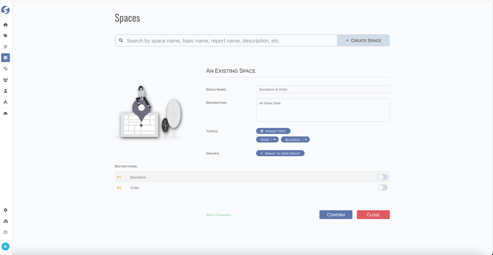
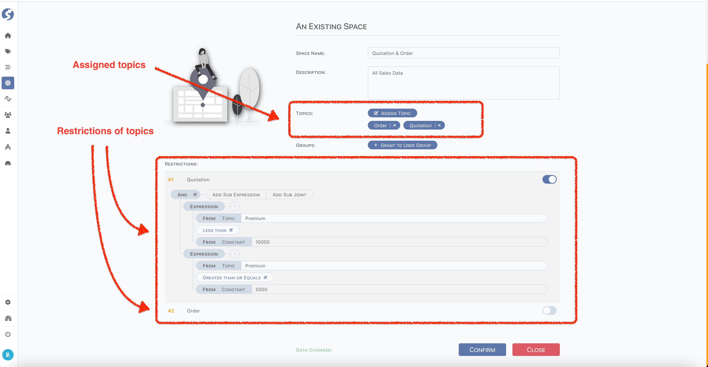

# Space

Space is a set of topics. When space is assigned to user groups, that is to say, users in groups can connect to space in console workbench.

:::info  
Space is available for `Admin` only.
:::

## Standard Tuple Page

Space use [standard tuple page](../standard-tuple-page).

## Restrictions

When topics are assigned to space, restrictions can be added, as below,

For restrictions on topics,

- Is a filter of topic's data, equates a `SQL Where`,
- Can only be aligned on single topic, joint filter between topics is not allowed,
- Enabled only when toggle is on.

Radically different from coarse-grained data access rights, which is on topic and by included into different spaces and assign to different
user groups, we also need to define fine-grained data access control even on one topic for different users.

For example,

- `User A` can visit orders which amount < 10,000,
- `User B` can visit orders which amount >= 10,000,

For `User A` and `User B`, they both can visit a subset of topic `orders` rather than all rows. In this scenario, clearly space restriction
provides more ability to control data access on topic rows level on the basis of topics access control provided by space itself.

## Form Validation

- Space Name: required,
- Description: optional,
- Topics: optional,
- Groups: optional,
- Restrictions: optional.

