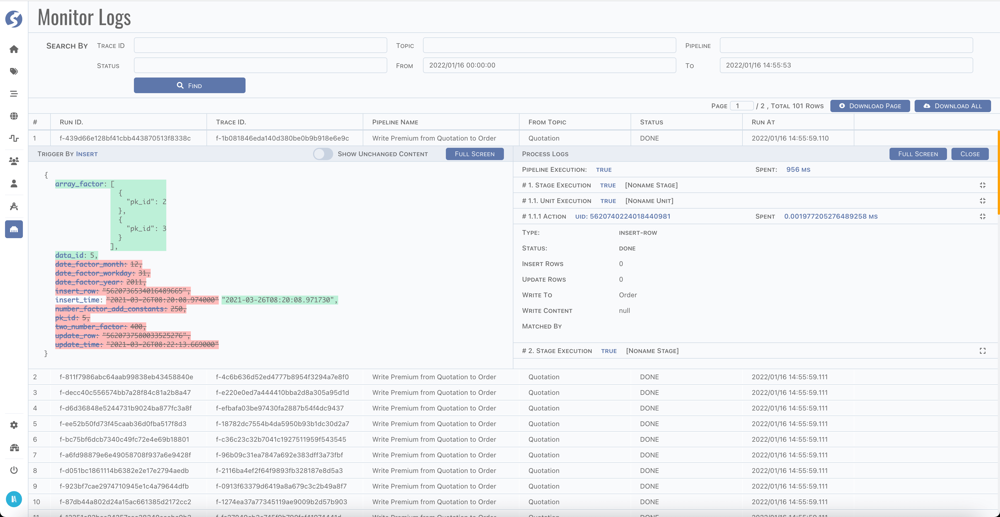

# Monitor Logs

A simple page for search and review the logs created by pipeline running.

:::info  
Monitor logs is available for `Admin` only.
:::

## Page

You can search logs by

- Trace ID,
- Topic,
- Pipeline,
- Status
- Time range

And view data at that moment, such as,

- Trigger data before/after change,
- Execution log for stages/units/actions.

It is helpful to find and locate problems and exceptions on runtime.