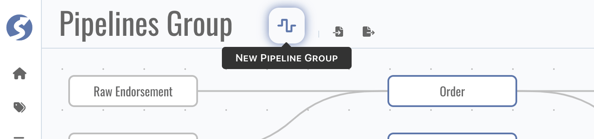
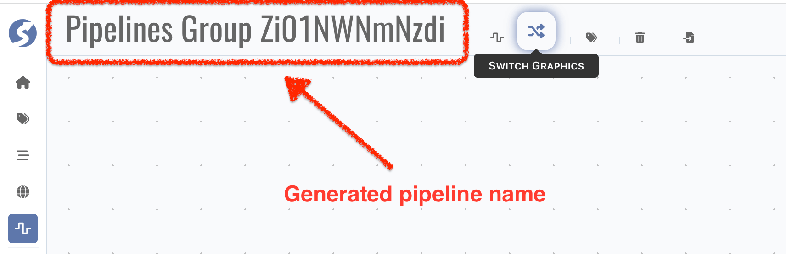
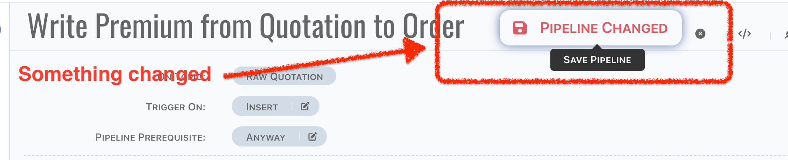
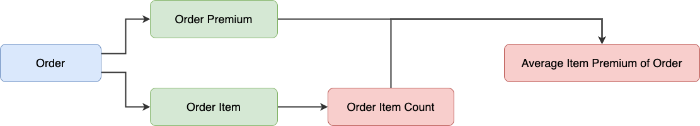

# Pipeline

Pipeline describes the data flow between topics, triggered by topic data inserted or updated.

:::info  
Pipeline is available for `Admin` only.
:::

## Catalog Page


In the very first pipeline catalog page, all existing topics will be displayed and layout automatically.

:::tip

- Topic blocks can be dragged and dropped anywhere,
- If there are many topics cannot be rendered in one page, use thumbnail to move.

:::

Catalog belongs to the user, it is not shared between users. Topics can be organized individually for every administrator, don't worry about
to influence or affected by others.

:::info  
In pipeline catalog, `catalog`/`graphics`/`group` are the same concept: a set of topics, rendering to a graphics.
:::

### Header Buttons

There might many topics, it is too many to show in one graphics, topics can be separated to multiple graphics. Click `New Pipeline Group` in
header buttons to create a new catalog page.



In a new catalog page,

- Pipeline catalog name is auto generated, click name part to change it,

  

- No topic selected in the first, click `Pick Topics` to pick topics which you want to render in this catalog,

  

  

  :::caution  
  If topic are not picked on current catalog, pipelines which triggerred by it or write data to it also will be rendered in this catalog.
  :::

- Click `Delete Me` to delete current catalog,

  

  :::info

	- Topics will not be deleted when delete pipeline catalog,
	- The last catalog cannot be deleted.

  :::

  :::caution  
  Catalog cannot be recovered after deletion.
  :::

- Click `Switch Graphics` to switch to another catalog,

  

  :::info  
  Switching is enabled only when there are more than 1 catalog.
  :::

### Export & Import

Topics, pipelines and other tuples related can be exported as a zip file, by click the `Export` button in header buttons, a dialog shows,


- All topics and spaces are available in export dialog,
- Topics assigned to space will be selected automatically when space is selected,
- Topic not selected will not be packed into zip,
	- Or topics relevant will be packed when `Export Selection Only` is unpicked,
- Monitor rules on selected topics will be packed into zip,
	- Rules use another topic, and the related topic is not included, will be excluded,
- Space will be deselected automatically when topic within it is deselected,
- Any tuples included by space will be packed into zip according to selected spaces.
- Pipelines will be packed into zip only when,
	- Triggerred topic is selected,
	- Topics receive data from this pipeline are selected.

There is only one file in this zip,

```
zip root/
└── Pipelines Group.md
```

:::info  
Markdown file cannot be triggered as a file downloading in browser, so we pack it to a zip.
:::

Markdown file is exactly a document for these tuples, it is useful to show the structures. It can be opened by any markdown tool, we
recommend using [VSCode](https://code.visualstudio.com/), with markdown plugins installed. Also, it can be generated to a pdf file, for more
easy to read and spread.

The exported markdown file can be imported again, simply by clicking the `Import`,


:::danger  
DO NOT modify the hyperlink parts in exported markdown file, it contains the data part. Actually we only read these parts in importing.    
Any others are for read only, you can modify them to anything you prefer. But it is not recommended that any modification on not-description
parts, such as factors tables, pipeline DSLs.
:::

:::info  
In markdown, graphics and images are stored by standard HTML tags, they cannot be rendered correctly in GitHub, Gitlab and some other SaaS
services (or private installations). Simply leave them as they are, it is just for security reason. Open it via locally markdown tool, it
can be rendered correctly.
:::

There are 3 ways to import data,

- Non-Redundant: existing data will be ignored, and do creation when not existed,
- Replace: existing data will be replaced, and do creation when not existed,
- Force New: treat all imported data as new ones. Ids of tuples will be reset.

Choose the right import way for your scenario and be careful with the imported tuples. Duplication check is based on the ids of tuples, such
as `topicId` or `pipelineId`, which means even they have the same name, still will be treated as different ones by importation handler. It
depends on the existing and import tuples, we cannot know what exactly the scenario is, all we can say is it occurs in all 3 ways.

:::danger  
Most of tuples will not create physical entities, but not for topic. Topic name equates table/document name in data source, therefore when
topic names are duplicated but have different topic ids, unpredictable exceptions should be raised when do data source objects creation or
modification. **Be very careful with it after importing**.
:::

### Topic Navigator

Click navigator panels to view more details of topic,

- Incoming pipelines: pipelines write data to current topic,
- Outgoing pipelines: pipelines triggerred by current topic,
- External writers: triggerred by current topic only, which means external writers in incoming pipelines will not be displayed,
- Factors.

Click `Open Pipeline` button to edit pipeline,


or click `Create Outgoing Pipeline` button, a new pipeline triggered by this topic will be created,


:::info  
There is no create button for incoming pipeline, since pipeline always needs a trigger.
:::

## Pipeline Page

By click `Open Pipeline` button on topic navigator, page is switched to pipeline edit work area,


### Structure of Pipeline

Before we go through the page, let's take a minute to learn the structure of pipeline.

- Each pipeline is triggered by a topic, or more accurately, by insertion/modification/deletion of a row,
- A pipeline contains multiple stages,
- A stage contains multiple units,
- A unit contains multiple actions,
- Action is the atomic execution cell.

Here is a whole picture of pipeline,


In this pipeline, there are,

- 2 stages,
- 1 unit for each stage,
- 1 action for each unit.

### Header Buttons

In pipeline header,

- Pipeline name is auto generated, click name part to change it,

  

- Style of `Save Pipeline` button is changed when anything change in pipeline, see the difference as below,

  

  

  :::info  
  Name change will not lead the style change of `Save Pipeline` button, it will be saved automatically, which means button style changed is
  caused by content of pipeline changes only.
  :::

- Pipeline can be enabled/disabled, simply click the `Enable Pipeline`/`Disable Pipeline` button,

  

  

  :::caution  
  Enable pipeline doesn't mean it is correct to run, we cannot know precisely it is just staged or launched. We highly recommend disabling
  pipelines until it is tested in simulator, and ready for environment testing.
  :::

  :::info  
  Content of pipeline will also be saved when enablement switching.
  :::

- By click the `Back to Catalog` button, page should be switched to catalog.

  

### Edit Modes

3 edit modes are offered,

- `Focus on Unit`: only one unit is expanded,
- `Focus on Stage`: only on stage is expanded,
- `Free Walk`: free to expand and collapse.

Use first two modes when you are focused on part of pipeline, or use free walk to go through the whole picture.


There are 2 more buttons for free walk mode, to expand/collapse all stages.

### DSL

You also can review the pipeline definition by dsl mode, it's more like a YAML.


:::tip  
Red part means something is incorrect, check that in definition.
:::

## Define a Pipeline

In this chapter, we will introduce each part of pipeline definition.

### Trigger by Topic

A pipeline is triggered by an insertion/modification/deletion of a row in topic, therefore first, a topic and how to trigger must be
defined,


There are 4 trigger types,

- Insert,
- Insert or Merge,
- Merge,
- Delete.

`Insert` is usually for raw topic. For raw topics, typically only insertion occurred, each change of raw data should be recorded. For other
types of topics, `Insert or Merge` is a better choice, there is always a very first row was inserted, and it would be modified (in trigger
type, also known as `Merge`). For both of insertion and modification, the same logic should be applied. But sometimes, logics on insertion
and modification are not the same, they can be handled separately by 2 pipelines, one is triggered by `Insert`, the other is triggered
by `Merge`.  
It is also supported for triggering by `Delete` operation, but deletion means a piece of history was removed physically. In analysis system,
each piece of data should be hold for further use, a deletion might lead a puzzle has one last piece missing, which is not expected any
time. Even it is helpful on rescuing some special situations, triggering a pipeline by deletion is still not recommended.

Sometimes logic of pipeline is very complex, hardly to define them all in one pipeline. It is possible to define multiple pipelines which
triggered by one operation. For example, there is a topic `Order`, an insertion occurred. All pipelines with,

- Triggerred by `Order`,
- Trigger type is one of `Insert` or `Insert or Merge`,

Will be triggerred at the same time. Pipelines will be dispatched to different [Doll](../../doll/doll-index) nodes, they are run
concurrently. Generally, it does not need to be concerned, but in fact, it is highly correlated with how to define pipelines. For example (
not quite fit, just for explanation), we have topics and pipelines as below,



There are several pipelines,

1. Triggered by `Order`,
	1. One writes to `Order Premium`,
	2. The other writes to `Order Item` (assume a set of items in an order),
2. Triggered by `Order Item`, do count aggregation, writes to `Order Item Count`,
3. Triggered by `Order Premium`,
	1. Read count from `Order Item Count`,
	2. Compute average item premium of each order, writes to `Average Item Premium of Order`.

Obviously, step 2 must have been done before step 3. Unfortunately, the order is unknown since pipelines are run concurrently, which means
there might be a zero or null when read count in step 3.i. In this case, follow steps as below to avoid this possible problem,

- Add prerequisite on unit, to avoid the average calculation from incorrect count value,
	- A `Is Not Empty` check to avoid null,
	- A `Not Equals` check to avoid zero,
- Create a new pipeline from `Order Item Count`, do the same logic when count changed,
	- Also do check to avoid null value from order premium.

Now, no matter what value comes first, the computed value in `Average Item Premium of Order` always is correct (or correct at that moment).

Sometimes, pipeline is defined to be performed in specific cases. For example, triggered by `Order` modification, according to the status of
order,

- Write to `Order Premium` in normal case,
- Set premium to zero in `Order Premium` when status is `Cancelled`.

Logics can be separated to 2 pipelines, and for each pipeline, performed on its prerequisite,

- For normal case, let prerequisite be `Status is not Cancelled`,
- For cancelled case, let prerequisite be `Status is Cancelled`.

In pipeline prerequisite definition, only topic data which triggerred this pipeline can be used.

:::tip  
In following chapters, we will discuss how to use the old copy of trigger row. Find more details
on [Parameter Definition > Constant > Functions](#constant-parameter-functions).
:::

### Stage

Pipeline includes a group of stages, stages run sequentially.


For each stage,

- Can be named,
- Has a prerequisite,
- a group of units.

In fact, stage is a group of units.

:::info At least one stage for a pipeline.
:::

### Unit

Stage includes a group of units, units run sequentially.


Unit is a group of actions. Normally, it is similar with stage to units, for each unit,

- Can be named,
- Has a prerequisite,
- a group of actions.

And there is a `Loop Variable Name`, in case of a variable is an array or a list, fill this input with variable name, then unit will run for
each element of this variable. It can be simply understood as a loop, likes a `for each`. Variable must be defined in previous stages or
units, otherwise runtime exception will be raised. Typically, array/list variables are from raw topic or action `Read Rows`/`Read Factors`,
and when in loop, there is a small difference with regular process, for example, we have an `items` variable, which got from `Read Rows` (
let's just ignore the read part, will discuss in actions chapter),

- Define `items` in `Loop Variable Name`, so this unit will do a loop based on given `items` data,
- Obviously, element of `items` should be visit in actions of this unit, simply use `{items.premium}` in constant parameter.

Like this,


### Action

Action is the atomic part of pipeline, there are several types of action are offered for operating data or something else.

All action types as below,


They can be categorized as three,

- System: in-memory operations,
- Read: read data from a topic,
- Write: write data to a topic,
- Delete: delete data from a topic.

Now let's go through the actions one by one.

### In-Memory Actions

#### Alarm

`Alarm` is an in-memory operation, which,

- Has a prerequisite,
- A severity to categorize alarm priority,
- A message which including variables.


:::info  
For alarm action, now there is a log message only, find [Doll](../../doll/pipeline-service#alarm-action) for more details.
:::

#### Copy to Variable

`Copy to Variable` is an in-memory operation, a simple example as below,


It can be used to copy

- Property value from trigger data,
- Constant value from previous variables,
- Mix above two through computed value,

to a new variable. It is helpful on preparing the data in memory before doing r/w operations, makes logic more clearly.

:::info  
Only trigger topic is available in this action.
:::

#### Write to External

`Write to External` is an in-memory operation, it is designed to write trigger data to external system.


Simply choose the external writer, and assign an event code.

:::tip  
**[Here](./external-writer)** to find how to define external writers.
:::

:::caution  
Pipeline engine treats external writing as a synchronous operation, any exception raised will break the pipeline. If you don't care about
the status of external writing, provides an asynchronous external writer by yourself and choose it in
action. **[Here](../../doll/pipeline-service#extend-external-writer)** to find for details about how to extend external writers.
:::

### Read-Data Actions

#### Exists

`Exists` is a read operation. In some cases, existing or not is the only thing we want to know instead of the exact value. `Exists` is
exactly designed for these situations.


In above case, it can be understood as a simple SQL as below,

```sql
SELECT COUNT(1) FROM TOPIC_QUOTATION WHERE TOPIC_QUOTATION.QUOTATION_NO = ?; 
```

`Order` is trigger topic, thus, `Order.QuotationNo` is in-memory, and will be passed to above sql as parameter binding value.

:::info  
`Exists` checks count of search result, returns `true` when not zero, otherwise `false` instead.
:::

#### Read Factor

To know the exact value of a factor, use `Read Factor`. `Read Factor` is a read operation.


It is similar with `Exists`, except value will be read to variable. You can see the difference between these two actions, in `Read Factor`
action,

- A factor must be chosen,
- An aggregation arithmetic can be applied.

In above case, it also can be understood as a SQL as below,

```sql
SELECT TQ.QUOTATION_CREATE_DATE FROM TOPIC_QUOTATION TQ WHERE TQ.QUOTATION_NO = ?;
```

We use `As Is` in this statement, which means don't do anything more on read value, just read as what it is. But in some cases, we use
criteria to read a set of values and want to know the aggregation value of them, that's why we offer three more aggregation arithmetics
here, they are,

- SUM
- COUNT
- AVG

If `COUNT` is picked in above case, in SQL, it will be,

```sql
SELECT COUNT(TQ.QUOTATION_CREATE_DATE) FROM TOPIC_QUOTATION TQ WHERE TQ.QUOTATION_NO = ?;
```

:::caution  
Make sure there is one and only one row which fulfills the given criteria when aggregation is `As Is`, otherwise unpredicted exception might
be raised in runtime.  
In watchmen, it is very important to ensure behaviour of runtime is predictable, the above situation implies uncertainty because read engine
cannot ensure the order of data, it must be swept away.
:::

#### Read Factors

`Read Factors` is a read operation to retrieve a set of factor values.


The only difference from `Read Factor` is no aggregation arithmetic here. Values will be read as a list into variable, and it can be used to
do a loop in next units.

:::info  
Variable is a list even there is only one factor value read.
:::

#### Read Row

`Read Row` is a read operation. Difference to `Read Factor` is read a row to a memory object instead of a factor value.


Obviously, factor and aggregation arithmetic is not needed here.

:::caution  
Same as `As Is` in read factor, `one and only one` assertion is very important here, we have to remove uncertainty in the first place.
:::

#### Read Rows

`Read Rows` is a read operation, rows matched by given criteria will be read into memory. Usually, it is used to do a loop in next unit.


### Write-Data Actions

#### Write Factor

`Write Factor` is a write operation.


It is used to write a value to appointed factor by

- A factor of trigger data,
- A constant might contain variables,
- Mix above two through computing,

on given criteria. And when from value is a value list, it should be aggregated by aggregation arithmetic, same as `Read Factor`, supported
aggregation arithmetics are

- `SUM`
- `COUNT`
- `AVG`

#### Insert Row

`Insert Row` is a write operation.


A new row will be created on appointed topic, target factors are written by appointed mapping. Each factor can be mapped independently, and
aggregation is provided as well.

:::caution  
Any conflict causes insertion failure breaks `Insert Row` action, so make sure insertion can be done correctly.
:::

#### Merge Row

`Merge Row` is a write operation.


This action always do a modification on data matched by given criteria on target topic. Other parts, is the same as `Insert Row`.

:::caution  
Runtime exception raised when no data found by given criteria, so make sure data can be found.
:::

#### Insert or Merge Row

`Insert or Merge Row` is a write operation. Actually it is a mixed version of `Insert Row` and `Merge Row`, following steps are applied in
this action,

- Find row by given criteria,
- Do a modification when found,
- Do an insertion when not found,
	- Do a modification when conflict exception raised on insertion.

### Delete-Data Actions

#### Delete Row

`Delete Row` is a delete operation.


:::caution  
Runtime exception raised when no data found by given criteria, so make sure data can be found.
:::

#### Delete Rows

`Delete Rows` is a delete operation for bulk data.


This action reads data by given criteria, and delete them one by one.

:::caution  
Runtime exception raised when data not found on deletion, and bulk operation is stopped.
:::

## Variables In Pipeline

Variable is a special concept in pipeline, it is designed to put some data into memory temporary. Once it is declared, it can be used in
each pipeline part following. Variable value will be replaced when another declaration by same variable name, and there is no type check for
variable, which means on first declaration, it can be an object, and might be a number on second declaration. Besides the replacement
strategy, variable is immutable, there is no way to change variable value in memory except re-declaring.

:::tip  
It is much more alike with variables in RUST, immutable and explicit declaring.
:::

Variable is visited by name, for example, visit a variable via name `premium`, pipeline runtime engine find value by following,

- Find the explicit declaration in previous, it is
	- Declared by read actions,
	- Declared by copy to variable action,
- Or find property of trigger topic when it is not found in step one.

In constant parameter, variables are declared between `{}`, and use `.` to visit sub property.

## Parameter Definition

Parameter is used in

- Prerequisite of pipeline/stage/unit,
- Prerequisite of `Alarm` action,
- By of read/write actions,
- Mapping of write actions.

And also, the followings can be considered as another form of parameter,

- Message of `Alarm` action,
- Value from of `Copy to Variable` action,
- Value from of `Write Factor` action.

There are 3 types of parameter for different purposes.

### From Topic

Read from/write to topic, topics available for parameter depend on situation where parameter is. For example,

- In pipeline prerequisite, only trigger topic is available,
- In by criteria of write actions, only trigger topic and target topic are available.

### Constant

Constant parameter is more flexible than topic parameter, it can be used to

- Simply define a constant value, such as a number `100`, a string `Hello World`,
- Retrieve data from variables by `{}`,
- Call built-in functions.

We already learned how to retrieve data from variables in actions chapters. And to define primitive constant value is just enter them in
constant input, it's too simple and not worth going to detail about. Now we are going to learn the built-in functions.

#### Functions {#constant-parameter-functions}

Functions always starts from a character `&`, and also there are several categories for functions. In the following part, we will learn to
call these functions in constant parameter.

##### System

- `{&nextSeq}`, to generate a sequence value,
- `{&now}`, to generate current date time,
- `{&old.x}`, to get `x` value of old data of trigger one,
	- Be carefully, it might be a null if pipeline is triggerred on `Insert` or `Insert or Merge`,
	- `x` is property name of trigger topic.

##### Ask a Value of Something

- `{x.&count}`, to get element count of variable `x`,
	- or by `{x.y.&count}`, to get count of `x.y`,
	- `x` is a variable,
	- Count is available when value is a list or an array,
- `{x.&length}`, to get length of variable `x`,
	- or by `{x.y.&count}`, to get length of `x.y`,
	- `x` is a variable,
	- Length is available when value is a string,
- `{x.&sum}`, to get sum value of variable `x`,
	- Same as `&count`, but ask sum value.
	- Null or empty value is summed as zero,
	- Other non-numeric value leads runtime exception.

##### Compute Functions

- `{&dayDiff(end_date, start_date)}`, compute the days between given date `end_date` and `start_date`,
- `{&monthDiff(end_date, start_date)}`, compute the months between given date `end_date` and `start_date`,
- `{&yearDiff(end_date, start_date)}`, compute the years between given date `end_date` and `start_date`,

In above cases, `end_date`/`start_date` are variables. In another hand, `&now` also can be one of the parameter.

- `{&fmtDate(date, format)}`, format the given date `date`. The following table describes the format specifiers:  

    | Specifier | Description                           |
    |:---------:|---------------------------------------|
    |     Y     | Year, numeric, four digits            |
    |     y     | Year, numeric (two digits)            |
    |     M     | Month, numeric (01 .. 12)             |
    |     D     | Day of the month, numeric (01 .. 31)  |
    |     h     | Hour (00 .. 23)                       |
    |     H     | Hour (01 .. 12)                       |
    |     m     | Minutes, numeric (00 .. 59)           |
    |     s     | Seconds (00 .. 59)                    |
    |     W     | Weekday name (Sunday .. Saturday)     |
    |     w     | Abbreviated weekday name (Sun .. Sat) |
    |     B     | Month name (January .. December)      |
    |     b     | Abbreviated month name (Jan .. Dec)   |
    |     p     | AM or PM                              |
  

:::tip  
`&factor_name` is also available in above functions, in find by definition only, factor must be defined on source or target topic.
:::

### Computed

Computed parameter is mixed version of constant and topic parameter. In the meantime, it also can be part of another computed one. There are
several built-in functions,

- Math: `Add`, `Subtract`, `Multiply`, `Divide` and `Modulus`,
- Date: `Year Of`, `Half Year Of`, `Quarter Of`, `Month Of`, `Week of Year`, `Week of Month`, `Day of Month` and `Day of Week`,
- Case When, which also is known as
	- A `switch` in Typescript,
	- A `pattern match` in Python,
	- Or a `if, else if, else` in Java,
	- etc.

## Validation

We try to do a full validation with pipeline, but since many of them are based runtime data, which means they cannot be validated on design
time. According to this, we do not list the validation rules here. Pass the validation is a beginning of pipeline definition, it is highly
recommended that check the defined logic carefully, and test it in simulator before applied it to environment.

