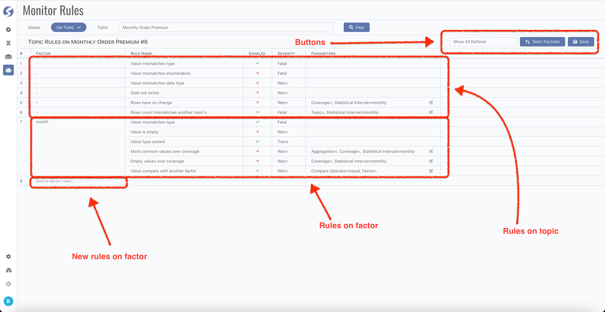

# Define Monitor Rules

There are a set of monitor rules built-in, before introducing what they monitored, let's have a look on how to attach them onto topic and
factor.

:::info  
Define monitor rules is available for `Admin` only.
:::

## Page

Open monitor rules page, pick a topic and click `Find` button, monitor rules defined will be shown,

:::tip  
There might be too many factors, you can focus on rules on one factor or topic level only by filter them.
:::

There are 2 parts of rules, one is on topic level only, another is on factor; and for each factor, it has its own rules. Factor with no rule
will not be shown at the first place, pick it from `Define factor rules...` cell, then all rules suited for picked factor will be added into
grid.

All rules are disabled by first, it needs to be enabled, and set the severity.

:::info  
Severity of rule is designed for alarming, we have no default implementation for alarming yet. To integrate with your own alarming servers,
find more details **[here](../../dqc/dqc-index)**.
:::

Some rules need parameters, click edit cell to pass the parameter values.

:::caution  
Monitor rule will not change the behavior of runtime. It monitors data to find where needs to be focused on, and report them.
:::

After learning how to declare rules on topic and factor, let's go through the built-in monitor rules.

## Topic Level Rules

[//]: # (### RAW_MISMATCH_STRUCTURE)

[//]: # (Instance data cannot match the structure of definition.)

[//]: # (:::info  )

[//]: # (Only available on raw topic.)

[//]: # (:::)

### FACTOR_MISMATCH_TYPE {#topic-factor-mismatch-type}

Factor value cannot match the type of definition. Monitors every factor when it is declared on topic level.

### FACTOR_MISMATCH_ENUM {#topic-factor-mismatch-enum}

Factor value cannot match the enumeration value of definition. Monitors every `enum` factor when it is declared on topic level.

[//]: # (### FACTOR_MISMATCH_DATE_TYPE {#topic-factor-mismatch-datetype})

[//]: # (Factor value cannot match the date type of definition. Monitors every date factor when it is declared on topic level.)

[//]: # (Factor types monitored by this rule as below,)

[//]: # (- Date,)

[//]: # (- Datetime,)

[//]: # (- Full datetime,)

[//]: # (- Time,)

[//]: # (- Date of birth.)

### ROWS_NOT_EXISTS

No data in topic.

### ROWS_NO_CHANGE

Data changes of topic detected in a particular period cannot meet the given coverage. There are 2 parameters,

- Coverage rate,
- Statistical interval.

### ROWS_COUNT_MISMATCH_AND_ANOTHER

Row count of topic cannot match the given another one's. There are 2 parameters,

- Another topic,
- Statistical interval.

:::info  
Only available on non-raw topic.
:::

## Factor Level Rules

### FACTOR_MISMATCH_TYPE

Same as on [topic level](#topic-factor-mismatch-type), but only works on appointed factor.

### FACTOR_MISMATCH_ENUM

Same as on [topic level](#topic-factor-mismatch-enum), but only works on appointed factor.

### FACTOR_MISMATCH_DATE_TYPE

Same as on [topic level](#topic-factor-mismatch-datetype), but only works on appointed factor.

### FACTOR_IS_EMPTY

Empty factor value detected.

[//]: # (### FACTOR_USE_CAST)

[//]: # (Casting used on factor value, for receiving by topic.)

### FACTOR_COMMON_VALUE_OVER_COVERAGE

The most common values of factor overs given coverage. There are 3 parameters,

- Aggregation rate, to define what is `the most common values`,
- Coverage rate,
- Statistical interval.

### FACTOR_EMPTY_OVER_COVERAGE

Empty value overs given coverage. There are 2 parameters,

- Coverage rate,
- Statistical interval.

[//]: # (### FACTOR_BREAKS_MONOTONE_INCREASING)

[//]: # (Value breaks the monotone increasing.)

[//]: # (:::info  )

[//]: # (Only available on `Number` and `Unsigned` factor.)

[//]: # (:::)

[//]: # (### FACTOR_BREAKS_MONOTONE_DECREASING)

[//]: # (Value breaks the monotone decreasing.)

[//]: # (:::info  )

[//]: # (Only available on `Number` and `Unsigned` factor.)

[//]: # (:::)

### FACTOR_NOT_IN_RANGE

Value is not in given range. There are 2 parameters,

- Max number,
- Min number.

:::info  
Only available on `Number` and `Unsigned` factor.
:::

### FACTOR_MAX_NOT_IN_RANGE

Maximum value is not in given range. There are 2 parameters,

- Max number,
- Min number.

:::info  
Only available on `Number` and `Unsigned` factor.
:::

### FACTOR_MIN_NOT_IN_RANGE

Min value is not in given range. There are 2 parameters,

- Max number,
- Min number.

:::info  
Only available on `Number` and `Unsigned` factor.
:::

### FACTOR_AVG_NOT_IN_RANGE

Avg value is not in given range. There are 3 parameters,

- Max number,
- Min number,
- Statistical interval.

:::info  
Only available on `Number` and `Unsigned` factor.
:::

### FACTOR_MEDIAN_NOT_IN_RANGE

Median value is not in given range. There are 3 parameters,

- Max number,
- Min number,
- Statistical interval.

:::info  
Only available on `Number` and `Unsigned` factor.
:::

### FACTOR_QUANTILE_NOT_IN_RANGE

Quantile value is not in given range. There are 3 parameters,

- Max number,
- Min number,
- Statistical interval.

:::info  
Only available on `Number` and `Unsigned` factor.
:::

### FACTOR_STDEV_NOT_IN_RANGE

Standard deviation is not in given range. There are 3 parameters,

- Max number,
- Min number,
- Statistical interval.

:::info  
Only available on `Number` and `Unsigned` factor.
:::

### FACTOR_COMMON_VALUE_NOT_IN_RANGE

The most common values of factor are not in given range. There are 4 parameters,

- Aggregation rate, to define what is `the most common values`,
- Max number,
- Min number,
- Statistical interval.

:::info  
Only available on `Number` and `Unsigned` factor.
:::

### FACTOR_IS_BLANK

Value is blank (not empty).

:::info  
Only available on `Text` factor.
:::

### FACTOR_STRING_LENGTH_MISMATCH

Length of value cannot match. There are 1 parameter,

- Length.

:::info  
Only available on `Text` factor.
:::

### FACTOR_STRING_LENGTH_NOT_IN_RANGE

Length of value is not in given range. There are 2 parameter,

- Max length,
- Min length.

:::info  
Only available on `Text` factor.
:::

### FACTOR_MATCH_REGEXP

Value cannot match given regexp. There are 1 parameter,

- Regexp.

:::info  
Only available on `Text` factor.
:::

### FACTOR_MISMATCH_REGEXP

Value matches given regexp. There are 1 parameter,

- Regexp.

:::info  
Only available on `Text` factor.
:::

### FACTOR_AND_ANOTHER

Cannot match value to another one. There are 2 parameters,

- Comparator,
	- Equals,
	- Less than,
	- Less than or equals,
	- Greater than,
	- Greater than or equals,
- Another factor on same row.

## Statistical Interval

Statistical interval means the frequency of data scanning. There are 3 interval types,

- Daily,
- Weekly,
- Monthly.

They all start at the end of previous cycle.

:::caution  
Again, we have no default implementation for alarming yet. To integrate with your own alarming servers, find more
details **[here](../../dqc/dqc-index)**.
:::
