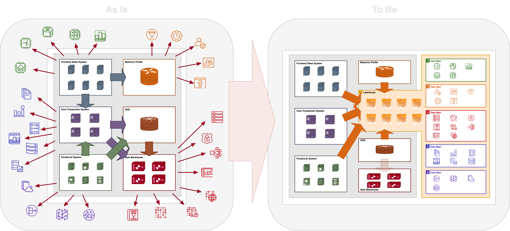

# What Expected

Enterprises built systems time by time to fulfill the requirement of growing business, accumulated a large amount of data. An important
subject is how to collect, analyze and use them. It is a difficult and high-cost work, basing on this reason, we designed _**Watchmen**_ to
do this, help data can be collected easily, analyzed agilely and producing more competitive indicators which helpful to business.

