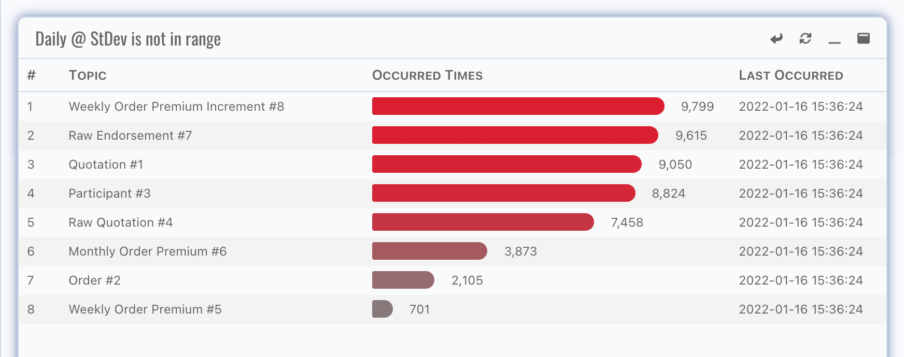
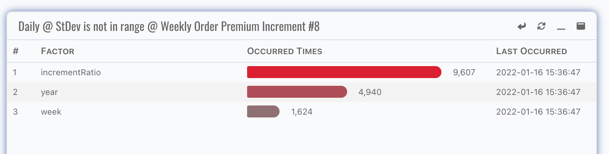
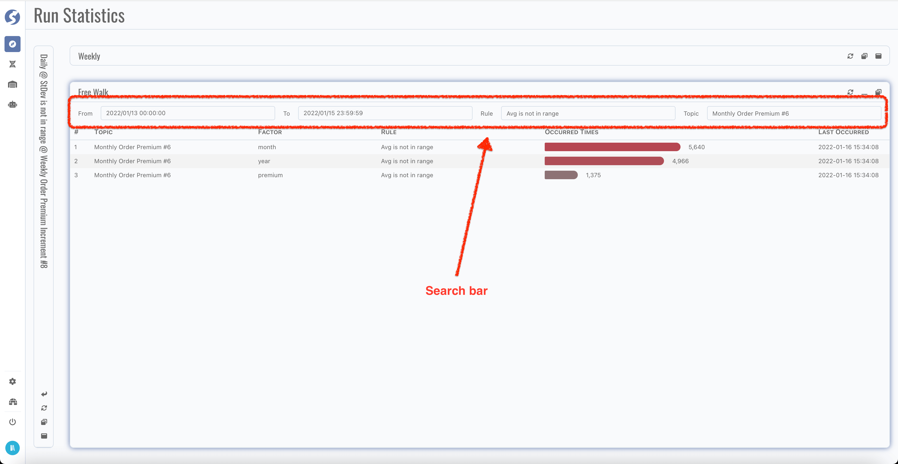

# Runtime Statistics

:::info  
Runtime statistics is available for `Admin` only.
:::

## Page

We offer daily, weekly and free walk statistics panels for review the runtime,

For each panel, expand/collapse/restore buttons are offered.

### Detail Mining

For daily/weekly panel, more details on monitor rule can be discovered by click rule cell,

And by click topic cell, details on factor can be discovered as well,

### Free Walk

Typically, daily and weekly data is enough. But sometimes, we might want to review on some special criteria. In this case, simply expand the
free walk panel, change search criteria to find them.

By now, we have learned to review the runtime statistics of monitor rules. In next chapter, we will learn to define monitor rules, it's the
base of monitoring.