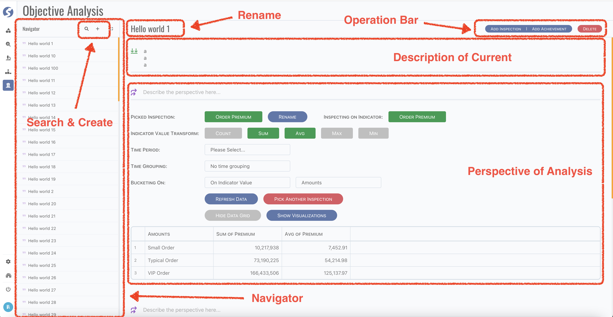

# Objective Analysis

Objective analysis is combination instrument of inspections and achievements.

There are several parts of this page,

- Navigator of analysis list,
	- All analysis are loaded when open this page, browse each one by click item of navigator,
	- Click `search` button to open name filter,
	- Click `create` button to create new analysis.
- Once an analysis is opened,
    - Click the name part to rename it,
    - Click operation bar to,
        - Append inspection or achievement,
        - Delete current analysis,
    - Edit and view related inspection and achievement.

# Question and Answers

Logical, an analysis is led by a question. Therefore, describe the question in the head. And answer this question by several
perspectives, each perspective has its own comment to describe why/how/what answer the question. In the meantime, an existing inspection or
achievement can be imported, or simply create a new one.
