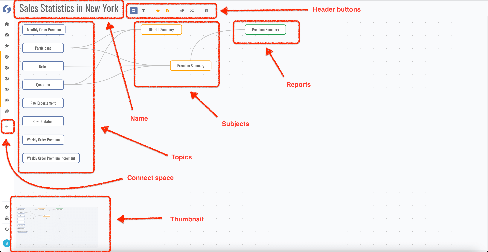

# Connected-Space

Spaces are defined by administrator, can be connected when authorized. Once space is connected, topics which included by this are connected,
subjects and reports can be built on this. Here is a typical connected-space like following,

In above space, we have 8 topics, 2 subjects and 1 report. We can do the following in this page,

- Create new connected-space,
- Switch to another connected-space,
- Delete this connected-space,
	- Subjects and reports belongs to me will be deleted,
- Add/remove this connected-space to/from favorite,
- Set this connected-space as a template,
	- Template connected-space setting is available for `Admin`, template connected-spaces can be exported as assets,
- View factors of topic,
- Create new subject,
- View summary of subject,
- Switch subject page,
- Switch to report page.

:::tip  
Even for one space, can be connected multiple times. Through building subjects by different topics or conditions, different datasets can be
built and analyzed on different perspectives, there is no bounds.
:::

:::tip  
Connected-space is an organizer, we recommend organizing subjects and reports for same purpose to one connected-space.
:::