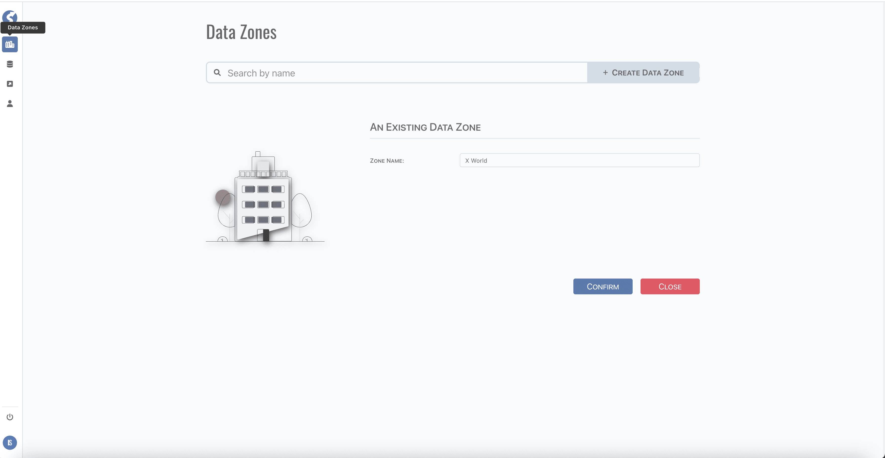

# Data Zone

Data zones allow the logical and/or physical separation of data that keeps the environment secure, organized, and agile.

:::info  
Data zone is available for `Super Admin` only.
:::

Before create anything, a data zone must be created first, tuples are organized within a data zone.

## Standard Tuple Page

Data zone use [standard tuple page](../standard-tuple-page).

## Form Validation

Only one field `Zone Name` for data zone, it is required, keep it not blank.
