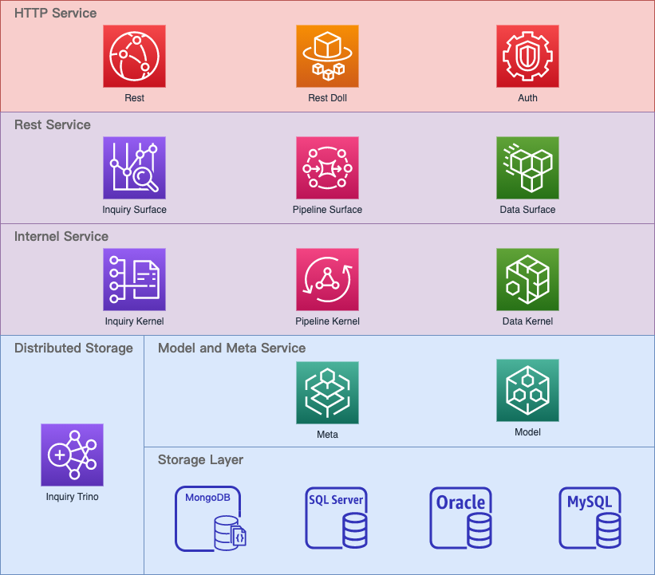

# Overview

Doll has several modules,

- [Utilities](https://github.com/Indexical-Metrics-Measure-Advisory/watchmen/tree/main/packages/watchmen-utilities)
- [Model](https://github.com/Indexical-Metrics-Measure-Advisory/watchmen/tree/main/packages/watchmen-model)
- [Auth](https://github.com/Indexical-Metrics-Measure-Advisory/watchmen/tree/main/packages/watchmen-auth)
- [Storage](https://github.com/Indexical-Metrics-Measure-Advisory/watchmen/tree/main/packages/watchmen-storage)
  - [MySQL](https://github.com/Indexical-Metrics-Measure-Advisory/watchmen/tree/main/packages/watchmen-storage-mysql)
  - [Oracle](https://github.com/Indexical-Metrics-Measure-Advisory/watchmen/tree/main/packages/watchmen-storage-oracle)
  - [MongoDB](https://github.com/Indexical-Metrics-Measure-Advisory/watchmen/tree/main/packages/watchmen-storage-mongodb)
  - [MSSQL](https://github.com/Indexical-Metrics-Measure-Advisory/watchmen/tree/main/packages/watchmen-storage-mssql)
- [Rest](https://github.com/Indexical-Metrics-Measure-Advisory/watchmen/tree/main/packages/watchmen-rest)
- [Meta](https://github.com/Indexical-Metrics-Measure-Advisory/watchmen/tree/main/packages/watchmen-meta)
- [Data Kernel](https://github.com/Indexical-Metrics-Measure-Advisory/watchmen/tree/main/packages/watchmen-data-kernel)
- [Data Surface](https://github.com/Indexical-Metrics-Measure-Advisory/watchmen/tree/main/packages/watchmen-data-surface)
- [Pipeline Kernel](https://github.com/Indexical-Metrics-Measure-Advisory/watchmen/tree/main/packages/watchmen-pipeline-kernel)
- [Pipeline Surface](https://github.com/Indexical-Metrics-Measure-Advisory/watchmen/tree/main/packages/watchmen-pipeline-surface)
- [Collector Kernel](https://github.com/Indexical-Metrics-Measure-Advisory/watchmen/tree/main/packages/watchmen-collector-kernel)  
- [Inquiry Kernel](https://github.com/Indexical-Metrics-Measure-Advisory/watchmen/tree/main/packages/watchmen-inquiry-kernel)
- [Inquiry Trino](https://github.com/Indexical-Metrics-Measure-Advisory/watchmen/tree/main/packages/watchmen-inquiry-trino)
- [Inquiry Surface](https://github.com/Indexical-Metrics-Measure-Advisory/watchmen/tree/main/packages/watchmen-inquiry-surface)
- [Rest Doll](https://github.com/Indexical-Metrics-Measure-Advisory/watchmen/tree/main/packages/watchmen-rest-doll)

Layers of a doll server should be:

